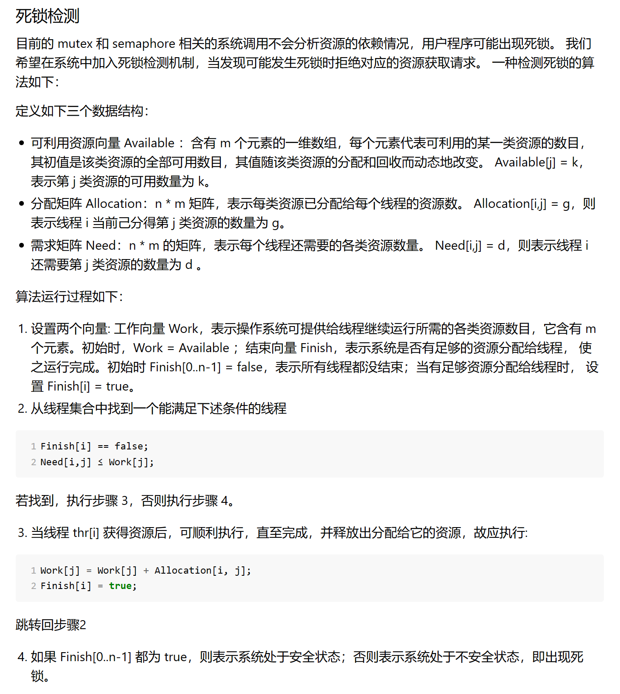

2024.5.18更新：考虑到[荣誉准则](https://learningos.cn/rCore-Tutorial-Guide-2024S/honorcode.html)的相关内容，博客中部分代码已被我隐藏。

---

这是完成rCoreLab的学习笔记，详细的记录了我完成rCore的思路和具体实现代码。实验指导手册：[rCore-Tutorial-Guide-2024S 文档 (learningos.cn)](https://learningos.cn/rCore-Tutorial-Guide-2024S/)

ch1和2没有lab，所以实验从ch3开始，我在中间穿插了一些我完成的习题。在实验开始前，我已经完整阅读了[rCore-Tutorial-Book 第三版](https://rcore-os.cn/rCore-Tutorial-Book-v3/chapter0/index.html)直到ch6的内容以及代码，因此在代码理解上没有很大的障碍。

## Chapter2

### 习题实现

#### 实现裸机程序，打印调用栈

在项目目录下的.cargo/config里可以设置让编译器对所有函数调用都保存栈指针,创建并修改.cargo/config能对Cargo工具在当前目录下的行为进行调整。

```
# os/.cargo/config
[build]
target = "riscv64gc-unknown-none-elf"

[target.riscv64gc-unknown-none-elf]
rustflags = [
    "-Clink-arg=-Tsrc/linker.ld","-Cforce-frame-pointers=yes" //强制启用帧指针
]
```

然后我们就可以从x8/s0/fp寄存器追溯调用栈。

在栈中，栈帧上保存的返回地址和保存的上一个 frame pointer与当前栈帧的相对位置是固定的，如图：


即当前fp的前8个字节为ra，前16个字节位置为上一个frame pointer。所以我们只要获取当前栈帧地址就能回溯之前的返回地址和frame pointer。

```rust
while frame_pointer != ptr::null() {
    let saved_ra = *frame_pointer.sub(1);//指针前移一位8字节的内容
    let saved_fp = *frame_pointer.sub(2);
}
```

最后将完成的打印函数引用到panic函数即可

#### 扩展内核，统计执行异常的程序的异常情况（主要是各种特权级涉及的异常），能够打印异常程序的出错的地址和指令等信息

trap_handler已完成大部分工作，只需要加上打印stval内容即可。stval是RISC-V的特权级寄存器，它保存了发生异常的地址，类似的还有scause，保存了异常发生的原因。

## Chapter3 实现`sys_task_info`系统调用

### 代码部分：

该系统调用要求获取任务控制块相关信息（任务状态）、任务使用的系统调用及调用次数、系统调用时刻距离任务第一次被调度时刻的时长（单位ms）。

```rust
struct TaskInfo {
    status: TaskStatus,
    syscall_times: [u32; MAX_SYSCALL_NUM],
    time: usize
}
```

由于获取的是当前任务，因此状态一定为`Running`，下面着重分析统计系统调用次数和计时的实现。

首先是统计并获取系统调用次数，我采取的方法是在TCB中维护系统调用次数，然后为`TaskManager`实现对应方法维护并获取。

```rust



//os/src/task/task.rs

pub struct TaskControlBlock {
    /// The task status in it's lifecycle
    pub task_status: TaskStatus,
    /// The task context
    pub task_cx: TaskContext,
    /// the syscall times
    pub syscall_times: [u32; MAX_SYSCALL_NUM],
}

出于荣誉准则的考虑, 此处代码已被隐藏
```

```rust

//os/src/task/mod.rs impl TaskManager

///update syscall times and get syscall times
fn count_syscall_times(&self, id: usize) -> [u32; MAX_SYSCALL_NUM] {
	let mut inner = self.inner.exclusive_access();
	let current = inner.current_task;
	if id <= MAX_SYSCALL_NUM {
		inner.tasks[current].syscall_times[id] += 1;
	}
	inner.tasks[current].syscall_times
}

出于荣誉准则的考虑, 此处代码已被隐藏
```

最后在`Traphandler`中系统调用的入口处调用该方法实现系统调用计数，并在syscall中调用方法查询计数。在syscall函数里的方法调用传入了一个越界的数，这样就不会修改系统调用的计数，仅返回查询到的结果。

```rust

//os/src/trap/mod.rs

pub fn trap_handler(cx: &mut TrapContext) -> &mut TrapContext {
    let scause = scause::read(); // get trap cause
    let stval = stval::read(); // get extra value
                               // trace!("into {:?}", scause.cause());
    match scause.cause() {
        Trap::Exception(Exception::UserEnvCall) => {
            let syscall_id = cx.x[17];
             //count syscall times
             count_syscall_times_from_current(syscall_id);
            // jump to next instruction anyway
            cx.sepc += 4;
            // get system call return value
            cx.x[10] = syscall(cx.x[17], [cx.x[10], cx.x[11], cx.x[12]]) as usize;
        }
        ...
    }
}

出于荣誉准则的考虑, 此处代码已被隐藏
```

值得注意的是，上述实现方法并不好，TCB作为一个经常需要被复制和移动的资源应该尽可能简洁，只存放进程本身需要的数据，这样的写法会影响性能且耦合度高，更优的写法是在`TaskManager`中统一管理各个进程的syscall次数。当然更优只针对ch3的代码，在后续我们对进程的操作和管理趋于复杂时，`TaskManager`里存放的数据也应该和对应进程的生命周期同步销毁，需要额外花精力去维护。

在实现获取进程运行时间时，我一开始误解了题意，排除了并发的影响，维护了进程实际运行时间。我借鉴了练习题中统计应用完成时间的设计，在TCB中维护了进程在内核态和用户态的执行时间，这样虽然避免了并发带来的影响，但是题意要求的是计算**包含并发调度开销在内**的总时长。下图是打印出的调试信息，可以看到实际时间和计算并发后的时间相差了接近一倍。

修改实现思路后，我在TaskManager里为所有进程维护了第一次调度时间`task_start_time`，并在`run_first_task` `run_next_task`方法中更新，这样只要在查询时间时，用`get_time_ms`获取当前时间作差即可

```rust

//os/src/task/mod.rs

pub struct TaskManagerInner {
    /// task list
    tasks: [TaskControlBlock; MAX_APP_NUM],
    /// id of current `Running` task
    current_task: usize,
    last_stop_time: usize,
    task_start_time: [usize; MAX_APP_NUM],
}

impl TaskManagerInner{
    fn run_first_task(&self) -> ! {
        ...
        //开始计时
        inner.task_start_time[0] = get_time_ms();
        inner.refresh_last_stop_time();
        ...
    }

    fn run_next_task(&self) {
        if let Some(next) = self.find_next_task() {
            ...
            //如果是第一次调用，维护第一次调度时间
            if inner.task_start_time[next] == 0 {
                inner.task_start_time[next] = get_time_ms();
            }
            ...
        } else {
            panic!("All applications completed!");
        }
    }
    ///在内核态获取运行时间
    fn count_task_time(&self) -> usize {
        let inner = self.inner.exclusive_access();
        let current = inner.current_task;
        let total_time = get_time_ms() - inner.task_start_time[current];
        total_time
    }
}

///get task process time
pub fn count_current_task_time() -> usize {
    TASK_MANAGER.count_task_time()
}

出于荣誉准则的考虑, 此处代码已被隐藏
```

最后将各个接口打包成syscall函数，chapter3的lab代码部分就完成了

```rust

pub fn sys_task_info(_ti: *mut TaskInfo) -> isize {
    trace!("kernel: sys_task_info");
    //id设置为超过上限的数表示查询
    let syscall_times = count_syscall_times_from_current(MAX_SYSCALL_NUM + 1);
    let time = count_current_task_time();
    unsafe{
       (*_ti) = TaskInfo{
        status: TaskStatus::Running,
        syscall_times,
        time,
        };
    }
    0
}

出于荣誉准则的考虑, 此处代码已被隐藏
```

### Chapter3 习题实现

#### 扩展内核，显示任务切换过程

在` mark_current_suspended()`函数、`mark_current_exited()`函数和`run_next_task()` 函数里设置task状态前添加println就行，打印current task id或next task id

#### 扩展内核，统计每个应用完成时间

需要注意，这里的实现与lab要求的实现不同，这里的实现基本完全排除并发影响，计算的是真-运行时间。

首先为TCB添加user_time和kernel_time记录时间

```rust
#[derive(Copy, Clone)]
pub struct TaskControlBlock {
    pub task_status: TaskStatus,
    pub task_cx: TaskContext,
    pub user_time: usize,
    pub kernel_time: usize,
}
```

然后为TaskManagerInner实现计时方法,使用get_time_ms获取时间，并设置time_cnt控制位，每次更新time_cnt并获取与上一次更新之间的时间间隔来完成计时

```rust
impl TaskManagerInner {
    fn time_count(&mut self) -> usize {
        let last_time = self.time_cnt;
        self.time_cnt = get_time_ms();
        return self.time_cnt - last_time;
    }
}
```

最后为外部调用进行封装，并在taskmanager的方法中和trap处理中进行计时

```rust
//impl TaskManager
fn user_time_start(&self) {
    let mut inner = self.inner.exclusive_access();
    let current = inner.current_task;
    inner.tasks[current].kernel_time += inner.time_count();
}

fn user_time_end(&self) {
    let mut inner = self.inner.exclusive_access();
    let current = inner.current_task;
    inner.tasks[current].user_time += inner.time_count();
}
```

```rust
pub fn user_time_start(){
    TASK_MANAGER.user_time_start();
}

pub fn user_time_end() {
    TASK_MANAGER.user_time_end();
}
```

#### 编写浮点应用程序A，并扩展内核，支持面向浮点数的正常切换和抢占

难点在于需要在trap时记录浮点寄存器组

非常抽象，写了至少两个多小时

首先需要知道处理浮点数指令之前需要设置sstatus的fs段为非零值,以下为手册原文：

> The FS, VS, and XS fields use the same status encoding as shown in Table 3.3, with the four possible status values being Off, Initial, Clean, and Dirty.
>
> | Status | FS and VS Meaning | XS Meaning                   |
> | ------ | ----------------- | ---------------------------- |
> | 0      | Off               | off                          |
> | 1      | Initial           | None dirty or clean, some on |
> | 2      | Clean             | None dirty, some clean       |
> | 3      | Dirty             | Some dirty                   |
>
> <center><h5>Encoding of FS[1:0], VS[1:0], and XS[1:0] status fields.</h5></center>
>
> If the F extension is implemented, the FS field shall not be read-only zero. If neither the F extension nor S-mode is implemented, then FS is read-only zero. If S-mode is implemented but the F extension is not, FS may optionally be read-only zero.

可以看到fs段如果为0，浮点数指令将被关闭，使用就会报错。（多看手册是好文明）所以我们需要在使用浮点数指令之前手动修改sstatus.fs的值。fs在sstatus的第13，14位，我们可以使用CSRW或CSRS来修改特权寄存器的值：

```assembly
    csrr t2, sscratch
    li t0, 0x00003000  #给t0载入一个立即数
    csrs sstatus, t0  #把对应位置置1
    fsd f0, 34*8(sp)
    fsd f1, 35*8(sp)
    fsd f2, 36*8(sp)
```

```assembly
    li t0, 0x00003000
    csrs sstatus, t0 #注意在load前也要设置
    fld f0, 34*8(sp)
    fld f1, 35*8(sp)
    fld f2, 36*8(sp)
    fld f3, 37*8(sp)
    fld f4, 38*8(sp)
```

以下是指令介绍：

1. `CSRRW`（CSR Read and Write）指令：
   - 用途：用于读取 CSR 的当前值，并将一个新的值写入 CSR。
   - 语法：`CSRRW rd, csr, rs`
   - 功能：将 CSR 的当前值读取到目标寄存器 `rd` 中，然后将寄存器 `rs` 的值写入 CSR。
   - 示例：`csrrw x3, sstatus, x4`
2. `CSRRS`（CSR Read and Set）指令：
   - 用途：用于读取 CSR 的当前值，并将 CSR 的某些位设置为 1。
   - 语法：`CSRRS rd, csr, rs`
   - 功能：将 CSR 的当前值读取到目标寄存器 `rd` 中，然后将寄存器 `rs` 中的位设置为 1，结果写入 CSR。
   - 示例：`csrrs x3, sstatus, x4`
3. `CSRRC`（CSR Read and Clear）指令：
   - 用途：用于读取 CSR 的当前值，并将 CSR 的某些位清零。
   - 语法：`CSRRC rd, csr, rs`
   - 功能：将 CSR 的当前值读取到目标寄存器 `rd` 中，然后将寄存器 `rs` 中的位清零，结果写入 CSR。
   - 示例：`csrrc x3, sstatus, x4`
4. `CSRW`（CSR Write）指令：
   - 用途：用于将一个值直接写入 CSR，而不需要读取 CSR 的当前值。
   - 语法：`CSRW csr, rs`
   - 功能：将寄存器 `rs` 的值直接写入 CSR。
   - 示例：`csrw sstatus, x3`

为了保险起见我存储了全部的32个浮点数寄存器，具体需要存储哪几个有待学习。

虽然这样的代码在rCore/os里可以运行，但是在我自己的os里仍然报错：(rCore也报错但是正常运行)

```bash
error: <inline asm>:37:5: instruction requires the following: 'D' (Double-Precision Floating-Point)
    fsd f0, 34*8(sp)
    ^
```

经过查询资料，这个问题可能来自global_asm!的一个bug或者llvm的bug。在汇编代码的开头加上`.attribute arch, "rv64gc"`就可以解决这个bug。这个方法来自github/rust下面的一个issue：[`global_asm!` macro causes non-fatal errors to be printed during compilation for some RISC-V extension instructions when targeting the GC extensions](https://github.com/rust-lang/rust/issues/80608#top)#80608。目前完全不清楚原理。

#### 扩展内核，支持统计任务开销

因为切换任务开销非常小，所以我们先实现一个统计单位为微秒的计时方法，就是对time::read()的重新封装。然后我们对\_\_\_switch进行二次封装，加入计时方法，并设置两个静态变量用于存储时间，最后我们封装静态变量，在run_next_task中所有应用结束后，调用方法并打印开销

#### 扩展内核，支持在内核态响应中断

sstatus的sie位可以用来屏蔽S级中断，spp位可以分辨中断的来源，我们可以通过这两个特殊位来实现内核态响应中断。首先我们需要重写trap_handler，拆分为user和kernel两个版本，并通过match语句进行匹配。通过对sstatus寄存器的spp位进行判断来确定是U级中断还是S级中断：

```rust
#[no_mangle]
pub fn trap_handler(cx: &mut TrapContext) -> &mut TrapContext {
    match sstatus::read().spp() {
        sstatus::SPP::Supervisor => kernel_trap_handler(cx),
        sstatus::SPP::User => user_trap_handler(cx),
    }
}


pub fn user_trap_handler(cx: &mut TrapContext) -> &mut TrapContext {
    user_time_end();
    let scause = scause::read();
    let stval = stval::read();
    match scause.cause() {
        ·······
    }
    user_time_start();
    return cx;
}

pub fn kernel_trap_handler(cx: &mut TrapContext) -> &mut TrapContext {
    let scause = scause::read();
    let stval = stval::read();
    match scause.cause() {
        Trap::Interrupt(Interrupt::SupervisorTimer) => {
            // 内核中断来自一个时钟中断
            kernel_msg!("kernel interrupt: from timer");
            // 标记一下触发了中断
            mark_kernel_interrupt();
            set_next_trigger();
        }
        Trap::Exception(Exception::StoreFault) | Trap::Exception(Exception::StorePageFault) => {
            panic!("[kernel] PageFault in kernel, bad addr = {:#x}, bad instruction = {:#x}, kernel killed it.", stval, cx.sepc);
        }

        //异常待补充

        _ => {
            // 其他的内核异常/中断
            panic!("unknown kernel exception or interrupt");
        }
    }
    return cx;
}
```

然后我们简单封装一个静态变量来指示内核中断是否触发过，在main里调用并打印出一些提示语句：

```rust
trap/mod.rs
static mut KERNEL_INTERRUPT_TRIGGERED: bool = false;

pub fn check_kernel_interrupt() -> bool {
    unsafe { (addr_of_mut!(KERNEL_INTERRRUPT_TRIGGERED) as *mut bool).read_volatile() }
}
pub fn mark_kernel_interrupt() {
    unsafe{
        (addr_of_mut!(KERNEL_INTERRRUPT_TRIGGERED) as *mut bool).write_volatile(true);
    }
}
```

这里要注意参考答案的`&mut KERNEL_INTERRUPT_TRIGGERED as *mut bool`需要写成`addr_of_mut！(KERNEL_INTERRRUPT_TRIGGERED) as *mut bool`，否则则会报错，rust提示参考答案的写法可能导致未定义行为。

接下来在main里添加一段测试程序：

```rust
    timer::set_next_trigger();

    use riscv::register::sstatus;
    unsafe { sstatus::set_sie() }; // 打开内核态中断
    loop {
        if trap::check_kernel_interrupt() {
            println!("kernel interrupt returned.");
            break;
        }
    }
    unsafe { sstatus::clear_sie() }; // 关闭内核态中断
    task::run_first_task();
```

- 在函数中不使用`clear_sie / set_sie`来开关中断的原因是：RISC-V会自动在中断触发时关闭SIE，sret返回时打开SIE，而若打开中断的时机不恰当可能造成严重bug，如死锁等。

最后我们要对trap.S的代码进行处理，因为这里才是中断的实际入口。主要是需要处理是否换栈的问题：用户中断需要换栈，而内核中断不需要。下面的代码省略了浮点数寄存器。

```
#trap/trap.S
__alltraps:
    csrr tp, sstatus
    andi tp, tp, 0x100
    beqz tp, __user_trap_start
    j __real_trap_entry

__user_trap_start:
    csrrw sp, sscratch, sp

__real_trap_entry:
    # now sp->kernel stack, sscratch->user stack
    # allocate a TrapContext on kernel stack
    addi sp, sp, -34*8
    ......

__restore:
    # now sp->kernel stack(after allocated), sscratch->user stack
    # restore sstatus/sepc
    ld t0, 32*8(sp)
    ld t1, 33*8(sp)
    ld t2, 2*8(sp)
    csrw sstatus, t0
    csrw sepc, t1
    csrw sscratch, t2
    # get SPP
    andi t0, t0, 0x100
    bnez t0, __kernel_trap_end

__user_trap_end:
    # restore general-purpuse registers except sp/tp
    ld x1, 1*8(sp)
    ld x3, 3*8(sp)
    .set n, 5
    .rept 27
        LOAD_GP %n
        .set n, n+1
    .endr
    # release TrapContext on kernel stack
    addi sp, sp, 34*8
    # now sp->kernel stack, sscratch->user stack
    csrrw sp, sscratch, sp
    sret

__kernel_trap_end:
    # restore general-purpuse registers except sp/tp
    ld x1, 1*8(sp)
    ld x3, 3*8(sp)
    .set n, 5
    .rept 27
        LOAD_GP %n
        .set n, n+1
    .endr
    # release TrapContext on kernel stack
    addi sp, sp, 34*8
    sret
```

省流：内核trap相比用户trap只是少了两句`csrrw sp, sscratch, sp`，这通过跳转指令实现。

上面的代码实现中，tp寄存器被征用，这样原本的数据就無了。为了避免这个问题，我们使用一个小技巧：在实际的内核中，用户空间往往在低地址（`0x00000......`），而内核空间在高地址（`0xfffff......`），所以直接判断sp的符号就能判断是在哪个栈发生的中断。

```
__alltraps:
    bgtz sp, __user_trap_start
    j __real_trap_entry

__user_trap_start:
    csrrw sp, sscratch, sp

__real_trap_entry:
    # now sp->kernel stack, sscratch->user stack
    # allocate a TrapContext on kernel stack
    addi sp, sp, -34*8
    ......
```

### 简答部分：

#### 深入理解 [trap.S](https://github.com/LearningOS/rCore-Tutorial-Code-2024S/blob/ch3/os/src/trap/trap.S) 中两个函数 `__alltraps` 和 `__restore` 的作用，并回答如下问题:

#### 1. L40：刚进入 `__restore` 时，`a0` 代表了什么值。请指出 `__restore` 的两种使用情景。

`__restore`是trap后返回用户态的处理函数，因此此时a0的值应该是系统调用函数返回值或异常处理函数返回值。`__restore`在系统调用返回或异常处理返回时被调用。

#### 2. L43-L48：这几行汇编代码特殊处理了哪些寄存器？这些寄存器的的值对于进入用户态有何意义？请分别解释。

```
ld t0, 32*8(sp)
ld t1, 33*8(sp)
ld t2, 2*8(sp)
csrw sstatus, t0
csrw sepc, t1
csrw sscratch, t2
```

上述代码使用了三个CSR特权寄存器`sstatus` `sepc`和`sscratch`，在进入trap时，`sstatus`和`sepc`的值会被瞬间覆盖掉。其中`sstatus`用来存储和控制CPU的各种特权和状态信息，这里是恢复trap处理前存储的信息；`sepc`寄存器用来存储中断处下一条指令的位置，恢复`sepc`的值以从中断处继续执行；`sscratch`寄存器的值不会因为特权级切换等原因改变，用来保存一些临时数据，如中断上下文等，这里恢复的是用户栈位置；以上三个特权级寄存器只有在S mode才能使用。

#### 3. L50-L56：为何跳过了 `x2` 和 `x4`？

```
ld x1, 1*8(sp)
ld x3, 3*8(sp)
.set n, 5
.rept 27
   LOAD_GP %n
   .set n, n+1
.endr
```

tp(x4)一般不会被用到，除非哦我们手动使用它，因此没有必要保存；而sp(x2)后面还要使用，我们需要依靠栈指针加偏移量来找到其他寄存器应该保存的正确位置。没有保存自然也没必要恢复。

#### 4. L60：该指令之后，`sp` 和 `sscratch` 中的值分别有什么意义？

```
csrrw sp, sscratch, sp
```

这里是相当于交换了`sscratch`和`sp`的值，执行前`sp`指向内核栈指针，`sscratch`指向用户栈指针；这条指令执行后，`sp`就指向了用户栈，为回到用户态做准备。

#### 5. `__restore`：中发生状态切换在哪一条指令？为何该指令执行之后会进入用户态？

特权级切换发生在`sret`，这条指令用于从一个特权态的trap中返回。`sret`会把特权级恢复到`sstatus`寄存器的SPP字段存储的值，即上一个特权级，这样CPU就回到了用户态。`sret`还会把`sstatus`的SIE字段设置为SPIE( Supervisor Previous Interrupt Enable)字段，即恢复上一个中断使能位的状态，同时SPIE会被设置为1，SPP会被设置为支持的最低特权级（一般是User）。

#### 6. L13：该指令之后，`sp` 和 `sscratch` 中的值分别有什么意义？

```
csrrw sp, sscratch, sp
```

同4，只不过切换结果相反

#### 7. 从 U 态进入 S 态是哪一条指令发生的？

```
call trap_handler
```

如果在异常处理中进行了系统调用，就会切换到S态，因为syscall函数实现中使用了`ecall`指令

到这里chapter3的内容就结束了

## Chapter4 `mmap` 和 `munmap` 匿名映射及重写 `sys_get_time` 和 `sys_task_info`

这章的难点在于引入内存管理机制后代码理解难度大幅上升，想要完成lab需要对rCore采取的内存管理策略以及SV39分页机制有较好的理解。

### 代码部分：

#### 重写 `sys_get_time` 和 `sys_task_info`：

在引入内存空间之后，原先的代码在响应这两个系统调用的时候会触发缺页异常，或者导致死循环。造成这一原因的是，外部的裸指针在传入系统调用时，指向的**仍是用户地址空间的虚拟地址**，因此在内核中原样调用就会产生不可预测的错误（~~有人和内核态响应中断斗智斗勇了一晚上~~）。我们需要调用`translated_byte_buffer`方法对裸指针进行转换：

```rust

    trace!("kernel: sys_get_time");
    let us = get_time_us();
    let token = current_user_token();
    let slices = translated_byte_buffer(token, ts as *const u8, size_of::<TimeVal>());

出于荣誉准则的考虑, 此处代码已被隐藏
```

`token`参数可以通`过current_user_token()`获取，这是内核已经实现的接口。

需要注意的是，传入的结构体指针所指向的结构体可能被存在两页中，且因为地址经过翻译，这两段内容的地址并不连续，因此需要把数据以切片的形式分别赋给看可能的两段切片：

```rust

pub fn sys_get_time(ts: *mut TimeVal, _tz: usize) -> isize {
    trace!("kernel: sys_get_time");
    let us = get_time_us();
    let token = current_user_token();
    let slices = translated_byte_buffer(token, ts as *const u8, size_of::<TimeVal>());
    let mut ts = TimeVal {
        sec: us / 1_000_000,
        usec: us % 1_000_000,
    };
    unsafe {
        let time_val_slice = ts.borrow_mut() as *mut TimeVal;
        let time_val_bytes: &[u8] = core::slice::from_raw_parts(
            time_val_slice as *const u8,
            size_of::<TimeVal>()
        );
        let mut offset = 0;
        for slice in slices {
            let slice_len = slice.len();
            slice.copy_from_slice(&time_val_bytes[offset..offset + slice_len]);
            offset += slice_len;
        }
    }
    0
}

出于荣誉准则的考虑, 此处代码已被隐藏
```

`sys_taks_info`的实现也是同理，这里分享一种更加简短优雅的写法：

```rust

pub fn sys_task_info(_ti: *mut TaskInfo) -> isize {
    //id设置为超过上限的数表示查询
    let syscall_times = count_syscall_times_current(MAX_SYSCALL_NUM + 1);
    let time = get_current_task_time();
    let mut v = translated_byte_buffer(current_user_token(), _ti as *const u8, size_of::<TaskInfo>());
    let mut ti = TaskInfo{
    status: TaskStatus::Running,
    syscall_times,
    time,
    };
    unsafe{
        let mut p = ti.borrow_mut() as *mut TaskInfo as *mut u8;
        for slice in v.iter_mut() {
            let len = slice.len();
            ptr::copy_nonoverlapping(p, slice.as_mut_ptr(), len);
            p = p.add(len);
        }
    }
    0
}

出于荣誉准则的考虑, 此处代码已被隐藏
```

#### 实现`mmap` 和 `munmap` 匿名映射：

在rCore的处理中，内存页帧以逻辑段的形式批量管理，因此申请时也是以逻辑段的单位进行申请。内核中为我们提供了一个包含了申请逻辑段、插入并更新页表的完善接口`insert_framed_area`，我们只需要对其进行包装之后调用就可以实现`mmap`。`insert_framed_area`是为MenorySet实现的函数，而我们在TCB里维护了进程对应的地址空间，因此我们可以通过当前进程来获取当前地址空间并申请内存：

```rust

//os/src/task/mod.rs

impl TaskManager{
        fn alloc_new_space(&self, start_va: VirtAddr,end_va: VirtAddr, permission: MapPermission) -> bool {
        let mut inner = self.inner.exclusive_access();
        let current = inner.current_task;
        if !inner.tasks[current].memory_set.space_check(start_va, end_va) {
            return false;
        }
        inner.tasks[current].memory_set.insert_framed_area(start_va, end_va, permission);
        true
    }
}

/// alloc new space for the task
pub fn insert_new_framed_area(start_va: VirtAddr,end_va: VirtAddr, permission: MapPermission) -> bool {
    TASK_MANAGER.alloc_new_space(start_va, end_va, permission)
}

出于荣誉准则的考虑, 此处代码已被隐藏
```

系统调用要求检查申请的空间是否已被占用，因此我们实现了一个`space_check`方法，将当前申请地址与已有的所有逻辑段地址进行比较，确认是否冲突。所有的函数都返回一个bool型变量，以将分配是否成功的信息传递给syscall函数。

最后再维护一下题目指出的可能错误，我们就实现了`mmap`。注意port的格式与MapPermission并不相同，转换前需要调整。

```rust

pub fn sys_mmap(_start: usize, _len: usize, _port: usize) -> isize {
    let start_va = VirtAddr::from(_start);
    let end_va = VirtAddr::from(_start + _len);
    let permission =  MapPermission::from_bits((_port << 1 | 16) as u8).unwrap();
    if _port & !0x7 != 0 || _port & 0x7 == 0 {
       return -1;
    }
    if !start_va.aligned(){
        return -1;
    }
    if !insert_new_framed_area(start_va, end_va, permission) {
        return -1;
    }
    0
}

出于荣誉准则的考虑, 此处代码已被隐藏
```

在`munmap`的实现上我偷了点懒，按照UNIX标准，`munmap`应该支持释放整个逻辑段或者从逻辑段头/尾开始释放部分逻辑段，由于测试用例仅仅考察完整释放逻辑段，因此我只实现了针对完整逻辑段的释放和检查。具体的实现方式是在对地址合法性做检查之后，调用MemorySet下的`unmap`方法直接释放，过程较为简单：

```rust

pub fn sys_munmap(_start: usize, _len: usize) -> isize {
    let start_va: VirtAddr = _start.into();
    let end_va: VirtAddr = (_start + _len).into();
    if dealloc_current_space(start_va, end_va) {
        return 0
    }
    -1
}

//os/src/task/mod.rs

impl TaskManager{
    fn dealloc_space(&self, start_va: VirtAddr,end_va: VirtAddr) -> bool {
        let mut inner = self.inner.exclusive_access();
        let current = inner.current_task;
        inner.tasks[current].memory_set.unmap_space(start_va, end_va)
    }
}

///dealloc space
pub fn dealloc_current_space(start_va: VirtAddr,end_va: VirtAddr) -> bool {
    TASK_MANAGER.dealloc_space(start_va, end_va)
}

//os/src/mm/memory_set.rs

/// check if va allign to edge of MapArea, return false when not
impl MamorySet{
    pub fn unmap_space(&mut self, start_va: VirtAddr, end_va: VirtAddr) -> bool {
        if let Some(index) = self.areas.iter().position(|maparea| maparea.is_alligned(start_va, end_va)) {
            self.areas[index].unmap(&mut self.page_table);
            self.areas.remove(index);
            return true;
        }
        false
    }
}

出于荣誉准则的考虑, 此处代码已被隐藏
```

以上就是chapter4代码的全部实现，接下来是我个人踩过的一些坑的记录

#### 踩坑记录：

##### 1. 不理解裸指针写入错误原因，试图大力出奇迹

在刚开始上手写`sys_get_time`的时候，我排查出了随机出现的死循环错误或者PageFault来自对于裸指针的写入，但我并没有意识到这实际上是地址空间的不统一造成的，因此我在反复GDB数个小时后得出了需要实现在内核态响应中断的暴论（因为每次PageFault都是靠简陋的`kernel_trap_handler`来panic，并且观察到死循环也是进了\_\_alltraps开始的），于是我又花费了几个小时重构Trap.S以及trap_handler，并且成功在一定程度上解决了问题，我的新版`kernel_trap_handler`真的处理了内核态中断了（~~什么大力出奇迹~~）。直到和队友思考了几个小时PageFault应该如何处理之后，我们才想到，**目前内核态压根不应该有StorePageFault**，**我们连虚拟内存都没有**。发现似乎白通了一宵后，队友痛定思痛，一语点醒梦中人，指出了地址空间不符的问题，我们才得以正确实现写裸指针的操作。

### 简答部分：

#### 1. 请列举 SV39 页表页表项的组成，描述其中的标志位有何作用？

在SV39分页模式下，页表项组成如图所示：

其中，Reserved位为保留位，必须与53位内容保持一致，不然页表项无效
[10,53]位为三级页表的44位物理页号
[8,9]是RSW，为内核程序预留，硬件不会对其做任何操作
[0,7]为8位标志位：

- V(Valid)：仅当位 V 为 1 时，页表项才是合法的；
- R(Read)/W(Write)/X(eXecute)：分别控制索引到这个页表项的对应虚拟页面是否允许读/写/执行；
- U(User)：控制索引到这个页表项的对应虚拟页面是否在 CPU 处于 U 特权级的情况下是否被允许访问；
- G(Global)：全局位，表示对应的页面是否是全局的。对于 non-leaf PTE，全局设置意味着页表后续级别中的所有映射都是全局的。未能将全局映射标记为全局只会降低性能，而将非全局映射标记为全局则是一个致命错误；
- A(Accessed)：处理器记录自从页表项上的这一位被清零之后，页表项的对应虚拟页面是否被访问过；
- D(Dirty)：处理器记录自从页表项上的这一位被清零之后，页表项的对应虚拟页面是否被修改过。

#### 2. 缺页

**缺页指的是进程访问页面时页面不在页表中或在页表中无效的现象，此时 MMU 将会返回一个中断， 告知 os 进程内存访问出了问题。os 选择填补页表并重新执行异常指令或者杀死进程**。

- #### 请问哪些异常可能是缺页导致的？
  Instruction Page Fault（指令缺页异常）、Load Page Fault（加载缺页异常）、Store Page Fault（存储缺页异常）、Page Table Walk Exception（页表异常）
- #### 发生缺页时，描述相关重要寄存器的值，上次实验描述过的可以简略。
  scause：保存了缺页异常的原因和类型。
  stval：保存了引起缺页异常的访问地址。
  sepc：保存了发生中断的指令的地址，可以用于处理中断后继续执行。
  sstatus：保存了当前的状态信息，包括当前特权级（SPP）、中断使能（SIE）、浮点数指令设置（FS）等。

**缺页有两个常见的原因，其一是 Lazy 策略，也就是直到内存页面被访问才实际进行页表操作。 比如，一个程序被执行时，进程的代码段理论上需要从磁盘加载到内存。但是 os 并不会马上这样做， 而是会保存 .text 段在磁盘的位置信息，在这些代码第一次被执行时才完成从磁盘的加载操作。**

- #### 这样做有哪些好处？

1. 节约内存开销，不用一开始就把所有内容加载到主存。
2. 加速启动时间，应用启动时需要加载的内容大大减少。
3. 优化资源使用效率，让资源实际使用情况更加贴近实际需求，减少了磁盘和总线之类资源的使用次数。
4. 提高了程序的执行效率，减少了大量无用的预加载，降低了磁盘访问延迟，提高了执行速度和响应速度。

**其实，我们的 mmap 也可以采取 Lazy 策略，比如：一个用户进程先后申请了 10G 的内存空间， 然后用了其中 1M 就直接退出了。按照现在的做法，我们显然亏大了，进行了很多没有意义的页表操作。**

- #### 处理 10G 连续的内存页面，对应的 SV39 页表大致占用多少内存 (估算数量级即可)？

页大小为4KB，10G内存对应需要2,621,440页。在SV39分页模式中，第三级页节点和第二级页表节点均为512个子项，因此我们需要5120个三级页表节点，10个二级页表节点，每一个节点又需要一个物理页帧进行存储，也就是一共4 _ 5120 _ 10 = 204,800KB，也就是200MB的额外内存。

- #### 请简单思考如何才能实现 Lazy 策略，缺页时又如何处理？描述合理即可，不需要考虑实现。

在进入程序前，只加载程序的入口点，初始化把所有页表项设置为无效。在发生缺页时，根据访问出错的虚拟地址从磁盘中加载对应物理页帧，然后更新页表。

**缺页的另一个常见原因是 swap 策略，也就是内存页面可能被换到磁盘上了，导致对应页面失效。**

- #### 此时页面失效如何表现在页表项(PTE)上？

通过设置页表项特定字段的值，可以使页表项被标记为无效。

#### 双页表与单页表

**为了防范侧信道攻击，我们的 os 使用了双页表。但是传统的设计一直是单页表的，也就是说， 用户线程和对应的内核线程共用同一张页表，只不过内核对应的地址只允许在内核态访问。 (备注：这里的单/双的说法仅为自创的通俗说法，并无这个名词概念，详情见 KPTI )**

- #### 在单页表情况下，如何更换页表？

和双页表类似，但是单页表情况下，进程的内核栈部分也要映射在同一张页表中。

- #### 单页表情况下，如何控制用户态无法访问内核页面？

将内核页面部分页表项设置为失效即可。

- #### 单页表有何优势？（回答合理即可）

在响应中断时无需切换地址空间，执行效率更高。

- #### 双页表实现下，何时需要更换页表？假设你写一个单页表操作系统，你会选择何时更换页表（回答合理即可）？

在双页表实现下，在响应中断和切换进程时都需要切换页表。单页表操作系统只需在进程切换时切换页表即可。

## Chapter5 实现`sys_spawn`和 stride 调度算法

Chapter5 的主要内容是实现`sys_spawn`系统调用以及stride 调度算法。`sys_spawn`是一个UNIX标准的系统调用，实现难度并不算高，stride的思想也很好理解，这一章的重点在于理解代码框架的修改以及进程管理的实现。

### 代码部分：

#### 支持前面lab的系统调用

开始ch5的第一步就是合并先前在其他分支实现的全部系统调用。使用git cherry-pick系列命令可以大大简化这个过程，但是由于代码框架的大幅调整，手动merge的过程还是需要对框架有一定的了解。
在ch5中，`PROCESSOR`取代了`TASKMANAGER`的大部分功能，TaskManager只负责维护一个就绪队列，对于当前进程的操作由Processor承担，因此大部分的系统调用实现也转移到了Processor中。同时，由于维护进程的数据结构变为了双端队列，因此大部分关键信息需要被存储在TCB中，与当前进程保持同步。除了merge代码解决冲突之外，我对先前的代码并没有做较多修改，只是优化了一下`sys_get_time`的实现，降低了代码耦合度，并且把原先在Task Manger中维护的数据放到了更底层的TCB中保存。

### 实现`sys_spawn`系统调用

`spawn`的本质，其实就是将`fork`和`exec`结合在一起，参考`sys_fork`和`sys_exec`的实现即可。注意在实现的过程中要理解一些代码的用意，如`sys_fork`中：

```rust
pub fn sys_fork() -> isize {
    ···
    let trap_cx = new_task.inner_exclusive_access().get_trap_cx();
    trap_cx.x[10] = 0;
    add_task(new_task);
    new_pid as isize
}
```

这里在`add_task`之前特别获取了trap上下文，并且将a0，也就是返回值设置为0。这是因为子进程被创建并运行后会立即从trap处返回，此时我们就需要子进程的返回值为0来区分子进程与父进程。

还需要注意的是，`fork`和`exec`作为相对独立的两个过程，创建的进程存在两个阶段：第一阶段被`fork`创建，除了返回值之外，包括地址空间在内的一切都与父进程相同；第二阶段`exec`加载一个可执行程序到进程中，从elf文件中重新获取地址空间等部分信息，对进程进行修改，而对于我们的`spawn`来说，以上两个阶段需要合并为一个。因此我们可以直接从elf文件读取地址空间等信息进行TCB的创建，并且不用考虑特殊处理子进程的返回值。以下是我`spawn`的具体实现：

```rust

//os/src/syscall/process.rs

pub fn sys_spawn(path: *const u8) -> isize {
    trace!(
        "kernel:pid[{}]",
        current_task().unwrap().pid.0
    );
    let token = current_user_token();
    let path = translated_str(token, path);
    if let Some(data) = get_app_data_by_name(path.as_str()) {
        let task = current_task().unwrap();
        task.spawn(data) as isize
    } else {
        -1
    }
}

//os/src/task/task.rs

/// parent process fork the child process
    pub fn spawn(self: &Arc<Self>, elf_data: &[u8]) -> usize {
        let (memory_set, user_sp, entry_point) = MemorySet::from_elf(elf_data);
        let trap_cx_ppn = memory_set
            .translate(VirtAddr::from(TRAP_CONTEXT_BASE).into())
            .unwrap()
            .ppn();
        // ---- access parent PCB exclusively
        let mut parent_inner = self.inner_exclusive_access();
        // alloc a pid and a kernel stack in kernel space
        //创建一个新的TCB
        let pid_handle = pid_alloc();
        let kernel_stack = kstack_alloc();
        let kernel_stack_top = kernel_stack.get_top();
        let task_control_block = Arc::new(TaskControlBlock {
            pid: pid_handle,
            kernel_stack,
            inner: unsafe {
                UPSafeCell::new(TaskControlBlockInner {
                    trap_cx_ppn,
                    base_size: user_sp,
                    task_cx: TaskContext::goto_trap_return(kernel_stack_top),
                    task_status: TaskStatus::Ready,
                    memory_set,
                    parent: Some(Arc::downgrade(self)),
                    children: Vec::new(),
                    exit_code: 0,
                    heap_bottom: parent_inner.heap_bottom,
                    program_brk: parent_inner.program_brk,
                    syscall_times: [0; MAX_SYSCALL_NUM],
                    start_time: 0,
                    stride: 0,
                    priority: 16,
                })
            },
        });
        // add child
        parent_inner.children.push(task_control_block.clone());

        // modify kernel_sp in trap_cx
        // **** access child PCB exclusively
        let child_inner = task_control_block.inner_exclusive_access();
        let trap_cx = child_inner.get_trap_cx();
        *trap_cx = TrapContext::app_init_context(
            entry_point,
            user_sp,
            KERNEL_SPACE.exclusive_access().token(),
            self.kernel_stack.get_top(),
            trap_handler as usize,
        );
        add_task(task_control_block.clone()); //加入就绪队列
        task_control_block.pid.0  //获取新的pid
        // **** release child PCB
        // ---- release parent PCB
    }
    
出于荣誉准则的考虑, 此处代码已被隐藏
```

### 实现stride算法

stride的思想可以简单归纳为运行总“路程”最短的进程优先调度，我们为每个进程维护一个路程和一个优先级，进程每次被调度会使运行路程加上一个步长，而步长大小由进程优先级决定。可以证明，如果预先设置一个较大的常数BigStride，则把步长设置为 $\frac{BigStride}{进程优先级}$ 可以使每个进程分配的时间将与其优先级成正比。

如题意，算法的实现思路已经非常清晰，即为每个进程额外维护一个路程`stride`和优先级`priority`，然后在调度时取最小`stride`即可。测评的性能要求不高，数据量也很小，因此我们直接for循环搜索即可。这里需要注意的是优先级下限为2，但是不设上限，最大可以达到`isize`的上限，因此常数`BigStride`不能太小，考虑到精度问题也尽量选取多个小数的最大公约数。具体实现过于简单，代码就不作赘述。

## Chapter6 实现三个系统调用 `sys_linkat`、`sys_unlinkat`、`sys_stat`

ch6的内核框架没有大的调整，但是额外挂载了一个文件系统`easy-file-system`以及新增了虚拟文件系统的接口。实现这一章的重点在于理解磁盘管理的操作以及文件系统的架构，同时也要理解Rust如何实现以极低的耦合实现虚拟文件系统。

文件系统的代码架构如图所示：

INODE是一个保存在内存中的结构体，存储了对应的DISK_INODE的位置，DISK_INODE则就表示实际的物理存储了，以直接映射、一级二级索引的形式存储了数据

### 代码部分：

#### 合并代码

最先要做的仍然是合并上一个分支的代码，这一章由于主要内容在于文件系统及文件系统接口，因此代码主框架没有变动，直接merge即可。唯一需要修改的就是可执行文件加载方式变为了通过文件系统读取。

#### 实现`sys_linkat`系统调用

`linkat`的作用是为文件创建一个硬链接，想要开始实现这个系统调用，我们首先需要知道什么是硬链接，以及如何创建硬链。

根据我个人的理解，硬链接的含义就是当其他指向当前文件的链接被删除时，仍然保持有效的链接，与之相对的是软链接，当文件全部的硬链接都被删除时，文件也会被删除，软链接也会失效。比如Windows的快捷方式就是经典的软链接。而创建硬链接，实际上就是创建一个同样指向当前文件的目录项。

理解了硬链接的创建，如何实现`sys_linkat`的思路就非常清晰了，只需要创建一个目录项指向给定的文件即可，以下是代码实现：

```rust

//easy-fs/src/vfs.rs

/// create a new hard link
pub fn new_link(&self, new_name: &str, old_name: &str) {
    if let Some(inode) = self.find(new_name){
        inode.clear();
    }
    if let Some(inode) =  self.find(old_name){
        inode.modify_disk_inode(|disk_inode| {
            disk_inode.link_count += 1;
        });
    }
    let inode_id = self.read_disk_inode(|disk_inode| {
        self.find_inode_id(old_name, disk_inode).unwrap()
    });
    let mut fs = self.fs.lock();
    //插入新页表项
    self.modify_disk_inode(|root_inode| {
        // append file in the dirent
        let file_count = (root_inode.size as usize) / DIRENT_SZ;
        let new_size = (file_count + 1) * DIRENT_SZ;
        // increase size
        self.increase_size(new_size as u32, root_inode, &mut fs);
        // write dirent
        let dirent = DirEntry::new(new_name, inode_id);
        root_inode.write_at(
            file_count * DIRENT_SZ,
            dirent.as_bytes(),
            &self.block_device,
        );
    });
    block_cache_sync_all();
}

出于荣誉准则的考虑, 此处代码已被隐藏
```

第5行按照POSIX标准，创建新链接时，如果新链接原先有链接的文件，需要直接删除；
第8行开始维护文件拥有的硬链接数；
第16行获取互斥锁确保对文件系统的互斥访问；
第17行开始新建并插入一个新目录项指向当前文件，首先调用`modify_disk_inode`方法获取根目录的存储块的可变借用。easy-fs的文件系统为了简化实现，目录扁平化，所有的文件都挂载在根目录节点下，因此根目录的存储块就是所有文件的目录，我们要插入目录项也要向这里插入。
第23行扩展内存块以存储新的目录项，26行调用了存储块DiskInode的`write_at`方法写入新的目录项。
第32行将块缓存写回硬盘，在所有修改操作完成后别忘了做这个。

与TaskManager和Processor的架构类似，磁盘的管理也基于全局变量ROOT_INODE。我们用ROOT_INODE调用函数即可在内核中修改磁盘，再维护一些可能的错误情况即可实现该系统调用：

```rust

// os/src/fs/inode.rs

/// create a new hard link
pub fn link(new_name: &str, old_name: &str) {
    ROOT_INODE.new_link(new_name, old_name);
}

//os/src/syscall/fs.rs

pub fn sys_linkat(old_name: *const u8, new_name: *const u8) -> isize {
    trace!(
        "kernel:pid[{}] sys_linkat ",
        current_task().unwrap().pid.0
    );
    let token = current_user_token();
    let old_name = translated_str(token, old_name);
    let new_name = translated_str(token, new_name);
    let old_name = old_name.as_str();
    let new_name = new_name.as_str();
    if old_name == new_name {
        return -1;
    }
    match find_file(old_name) {
        Some(_) => link(new_name, old_name),
        None => return -1,
    }
    0
}

出于荣誉准则的考虑, 此处代码已被隐藏
```

### 实现`sys_unlinkat`系统调用

`unlinkat`的实现与`linkat`类似，有较大不同之处的地方在于，当删除的是最后一个硬链接时，需要同时删除整个文件。文件系统中已经预先提供了清空整个inode并回收内存的`clear`方法，但是没有实现减小inode分配内存大小的方法，也就意味着如果想要彻底的删除文件并回收内存，你可以调用`clear`轻松释放文件的数据段，但是却不能“优雅的”释放目录项，因为所有非根目录项也存在同一个inode里。因此这里采取一些相对投机取巧的办法，即“让操作系统以为文件被彻底删除了”。具体做法上，就是只删除文件数据段，而对于目录项，仅仅将名字清空，让其无法被找到即可。目录项存储空间占用少维护成本高，这样做实际上可能反而比彻底删除并维护内存更优。

下面是具体的代码实现：

```rust

/// delete a hard link
pub fn delete_link(&self, name: &str) {
    let link_num =  self.find(name).unwrap().modify_disk_inode(|disk_inode| {
        disk_inode.link_count -= 1;
        disk_inode.link_count
    });
    if link_num == 0 {
        self.find(name).unwrap().clear();
    }
    self.modify_disk_inode(|disk_inode|{
        let file_count = (disk_inode.size as usize) / DIRENT_SZ;
        let mut dirent = DirEntry::empty();
        for i in 0..file_count {
            assert_eq!(
                disk_inode.read_at(DIRENT_SZ * i, dirent.as_bytes_mut(), &self.block_device,),
                DIRENT_SZ,
            );
            if dirent.name() == name {
                for byte in dirent.name.iter_mut() {
                    *byte = 0u8;
                }
                disk_inode.write_at(DIRENT_SZ * i, dirent.as_bytes_mut(), &self.block_device);
                break;
            }
        }
    });

    block_cache_sync_all();
}

出于荣誉准则的考虑, 此处代码已被隐藏
```

主要部分与`link`的实现类似，第10行开始是对目录项的删除，由于文件系统中并没有提供对目录项的直接查找接口，我们只能借鉴源代码对目录项的修改方式，通过遍历ROOT_INODE的disk_inode，即所有目录项来实现查找。

### 实现`sys_fstat`系统调用

`sys_fstat`与前两者处理的不同之处在于，前面两个系统调用处理的是磁盘上的文件以及目录项，而`sys_fstat`的参数是文件描述符，需要修改一个来自用户态的裸指针。这带来的最大影响就是在`sys_fstat`中只能获取到内核视角下的虚拟文件，无法直接定位到磁盘中的文件，所以需要通过标准文件系统接口来获取数据。标准的读写接口显然无法获取我们需要的文件元数据，因此我们要做的就是扩展文件系统接口。

在实现扩展之前首先肯定要了解Rust编写系统内核实现虚拟文件接口的原理。在rCore中，虚拟文件由`Option<Arc<dyn File + Send + Sync>>`表示，这段泛型代码的意义是：一切实现了`File`、`Send`、`Sync`三个Trait的对象都可以被rCore当作文件处理！这里就体现了Rust强大的抽象能力，这样的设计可以极大的解耦合代码架构，优化代码框架，C语言就很难做到如此低的耦合性，实现高抽象的同时拥有接近C的性能，这就是Rust的独有优势。

综上，文件系统接口的本质其实就是`File`Trait，我们只需要扩展`File`Trait的实现就可以轻松实现`sys_fstat`。下面是代码实现：

```rust

pub fn sys_fstat(fd: usize, st: *mut Stat) -> isize {
    trace!(
        "kernel:pid[{}] sys_fstat",
        current_task().unwrap().pid.0
    );
    let task = current_task().unwrap();
    let inner = task.inner_exclusive_access();
    if fd >= inner.fd_table.len() {
        return -1;
    }
    if let Some(file) = &inner.fd_table[fd] {
        let file = file.clone();
        drop(inner);
        let (inode_id, mode, link_count) = file.fetch_metadata();
        let st = translated_byte_buffer(current_user_token(), st as *const u8, size_of::<Stat>());
        unsafe {
            let stat : *mut Stat = &mut Stat {
                dev: 0,
                ino: inode_id,
                mode,
                nlink: link_count,
                pad: [0; 7],
            };
            let stat_bytes: &[u8] = core::slice::from_raw_parts(
                stat as *const u8,
                size_of::<Stat>()
            );
            let mut offset = 0;
            for slice in st {
                let slice_len = slice.len();
                slice.copy_from_slice(&stat_bytes[offset..offset + slice_len]);
                offset += slice_len;
            }
        }
        0
    } else {
        -1
    }
}

出于荣誉准则的考虑, 此处代码已被隐藏
```

其中，`fetch_metadata()`就是我们扩展的文件系统接口，作用是从最底层的DISK_INODE返回元数据，其他的代码在之前的系统调用实现中都有类似实现，这里不再赘述。


### 踩坑记录

#### 1. 死锁

本章代码中文件系统的调用首次涉及到了互斥锁，因此就涉及到了可能产生死锁的问题。需要注意Inode的`find()`和`modify_disk_inode()`方法都会试图获取锁，因此千万记得仔细看好使用两个方法的的时机，同时要注意 `modify_disk_inode()`传入的闭包中也不能有任何试图获取锁的操作。~~调试死锁才真有在写OS的感觉~~

#### 2. 注意分清root_disk_inode和disk_inode

增删硬链接时我们要多次操作disk_inode，但这里要注意方法都是由ROOT_INODE调用的，因此操作文件内容时不能直接去`modify_disk_inode`，需要先根据name来找到次一级的Inode目录，再进行操作。我因为没注意这个直接删掉了整个文件系统（

### 问答部分：

#### 1. 在我们的easy-fs中，root inode起着什么作用？如果root inode中的内容损坏了，会发生什么？

root inode是整个文件系统的根目录，所有文件直接挂载在root inode下，如果root inode内容损毁我们就无法获取整个文件系统的目录内容，也就无法获取任何文件，就寄完了。

## Chapter 8 实现死锁检测及启动使能

这一章的难度提升较多，因为代码框架大幅变动，同时也涉及到了较为复杂的并发处理，需要仔细理解代码对线程和锁机制的实现，同时要对内核态的线程管理和资源管理有比较好的理解。

### 实现死锁检测的多资源银行家算法

因为ch8的代码框架修改较多，因此不要求实现之前的系统调用，可以直接开始完成题目。但是注意`sys_get_time`系统调用仍然需要实现，测例中用到
题目的要求如下：

需要实现的算法相对简单，仅仅只需实现多资源的银行家算法，难点在于在内核态维护算法的数据结构，以及在内核态如何理解资源的概念。

对于应用程序来说，需要互斥访问的资源被称为临界资源，这里的临界资源是共享内存、IO设备等应用程序可以申请访问的资源，但是在操作系统的视角下，应用程序可以访问的资源多种多样，方式各不相同，难以直接维护，因此在内核的角度，我们提供了互斥锁Mutex和信号量Semaphore用于维护并发访问的安全性。在我看来，互斥锁和信号量就是内核对于各种资源的抽象，便于我们在内核态对于各种需要互斥访问的资源进行统一的管理，我们的检测算法也只需要处理互斥锁和信号量就可以判断资源的需求和分配。

由于线程是由进程启动并且管理的，所以我们的算法数据结构也应该在进程下维护：

```rust

pub struct ProcessControlBlock {
    /// immutable
    pub pid: PidHandle,
    /// mutable
    inner: UPSafeCell<ProcessControlBlockInner>,
}

/// Inner of Process Control Block
pub struct ProcessControlBlockInner {
    ......
    /// Available resources
    pub available: Vec<usize>,
    /// 已分配给每个线程的资源数
    pub allocation: Vec<Vec<usize>>,
    /// 线程还需要的各类资源数量
    pub need: Vec<Vec<usize>>,
}

出于荣誉准则的考虑, 此处代码已被隐藏
```

为了保证开发的有序性，我先维护好算法需要的数据结构，测试无误后再编写死锁测试函数，因为线程和资源数在进程执行前是未知的，因此我们要在新建资源和新建线程的时候动态维护:

```rust

//os/src/syscall/thread.rs

pub fn sys_thread_create(entry: usize, arg: usize) -> isize {
    ......
    while process_inner.tasks.len() < new_task_tid + 1 {
        process_inner.tasks.push(None);
        let length = process_inner.allocation[0].len();
        let new_vec = vec![0; length];
        process_inner.allocation.push(new_vec.clone());
        process_inner.need.push(new_vec);
    }
    ......
}

//os/src/syscall/sync.rs

/// mutex create syscall
pub fn sys_mutex_create(blocking: bool) -> isize {
    ......
    if let Some(id) = process_inner
        .mutex_list
        .iter()
        .enumerate()
        .find(|(_, item)| item.is_none())
        .map(|(id, _)| id)
    {
        process_inner.mutex_list[id] = mutex;
        process_inner.available[id] = 1;
        let tid_allocation = &mut process_inner.allocation;
        tid_allocation.iter_mut().for_each(|line| line[id] = 0);
        let tid_need = &mut process_inner.need;
        tid_need.iter_mut().for_each(|line| line[id] = 0);

        id as isize
    } else {
        process_inner.mutex_list.push(mutex);
        process_inner.available.push(1);
        //每把锁加新列
        let tid_allocation = &mut process_inner.allocation;
        tid_allocation.iter_mut().for_each(|line| line.push(0));
        let tid_need = &mut process_inner.need;
        tid_need.iter_mut().for_each(|line| line.push(0));
        process_inner.mutex_list.len() as isize - 1
    }
}

出于荣誉准则的考虑, 此处代码已被隐藏
```

确保数组大小总是符合要求后，我们再进行数据的记录，这一步自然需要放在取/放锁和PV操作的syscall函数中实现。这里要注意两个小点，第一是need和allocation以及available的修改逻辑必须仔细思考；第二点是如果算法发现死锁风险，拒绝操作的同时，数据结构本身也需要回滚，因为我们本质上是在利用数据结构模拟系统下一刻的状态，如果下一刻的状态会产生死锁，就拒绝进入这种状态。篇幅原因下面的代码以信号量为例，锁的操作相当于容量为1的信号量，没有较大差别。由于题目没有要求，因此我没有考虑锁和信号量同时使用的情况。

```rust

//os/src/syscall/sync.rs

/// semaphore up syscall
pub fn sys_semaphore_up(sem_id: usize) -> isize {
    trace!(
        "kernel:pid[{}] tid[{}] sys_semaphore_up",
        current_task().unwrap().process.upgrade().unwrap().getpid(),
        current_task()
            .unwrap()
            .inner_exclusive_access()
            .res
            .as_ref()
            .unwrap()
            .tid
    );
    let process = current_process();
    let mut process_inner = process.inner_exclusive_access();
    let sem = Arc::clone(process_inner.semaphore_list[sem_id].as_ref().unwrap());
    //获取当前task来获取线程id，这样才能对
    if let Some(task) = current_task() {
        if let Some(res) = &task.inner_exclusive_access().res {
            process_inner.allocation[res.tid][sem_id] -= 1;
            process_inner.available[sem_id] += 1;
        }
    }
    drop(process_inner);
    sem.up();
    0
}
/// semaphore down syscall
pub fn sys_semaphore_down(sem_id: usize) -> isize {
    trace!(
        "kernel:pid[{}] tid[{}] sys_semaphore_down",
        current_task().unwrap().process.upgrade().unwrap().getpid(),
        current_task()
            .unwrap()
            .inner_exclusive_access()
            .res
            .as_ref()
            .unwrap()
            .tid
    );
    let process = current_process();
    let mut process_inner = process.inner_exclusive_access();
    let sem = Arc::clone(process_inner.semaphore_list[sem_id].as_ref().unwrap());

    //保存上一刻状态
    let mut need_reset = 0;
    let mut allocation_reset = 0;
    let mut available_reset = 0;

    if let Some(task) = current_task() {
        if let Some(res) = &task.inner_exclusive_access().res {
            if sem.inner.exclusive_access().count > 0{
                need_reset = process_inner.need[res.tid][sem_id];
                allocation_reset = process_inner.allocation[res.tid][sem_id];
                available_reset = process_inner.available[sem_id];
                process_inner.available[sem_id] -= 1;
                process_inner.allocation[res.tid][sem_id] += 1;
                if process_inner.need[res.tid][sem_id] > 0 {
                    process_inner.need[res.tid][sem_id] -= 1;
                }
            }
            else {
                need_reset = process_inner.need[res.tid][sem_id];
                allocation_reset = process_inner.allocation[res.tid][sem_id];
                available_reset = process_inner.available[sem_id];
                process_inner.need[res.tid][sem_id] += 1;
            }
        }
    }

    //死锁检测
    if DLOCK_DETECT_ENABLE.exclusive_access().enable {
        if deadlock_detect(&process_inner.available, &process_inner.allocation, &process_inner.need) {
            if let Some(task) = current_task() {
                //操作取消，重置状态
                if let Some(res) = &task.inner_exclusive_access().res {
                    process_inner.allocation[res.tid][sem_id] = allocation_reset;
                    process_inner.need[res.tid][sem_id] = need_reset;
                    process_inner.available[sem_id] = available_reset;
                }
            }
            return -0xdead;
        }
    }
    drop(process_inner);
    sem.down();
    0
}

出于荣誉准则的考虑, 此处代码已被隐藏
```

确保数据正确维护之后，我们就可以开始实现银行家算法，核心的难点在于正确的维护数据结构，算法的实现和死锁检测使能的系统调用相对简单，这里不再赘述，只放出代码。

```rust

// os/src/syscall/sync.rs

pub fn sys_enable_deadlock_detect(enabled: usize) -> isize {
   trace!("kernel: sys_enable_deadlock_detect");
   match enabled {
       1 => DLOCK_DETECT_ENABLE.exclusive_access().enable = true,
       0 => DLOCK_DETECT_ENABLE.exclusive_access().enable = false,
       _ => return -1,
   }
   0
}

lazy_static! {
   pub static ref DLOCK_DETECT_ENABLE: UPSafeCell<DeadlockDetectEnable> = unsafe {UPSafeCell::new(DeadlockDetectEnable::new())};
}

pub struct DeadlockDetectEnable {
   pub enable: bool,
}

impl DeadlockDetectEnable {
   fn new() ->Self {
       Self {
           enable: false,
       }
   }
}

pub fn deadlock_detect(available: &Vec::<usize>,allocation: &[Vec<usize>],need: &[Vec<usize>]) -> bool {
   let mut work = available.to_owned();
   let len = work.len();
   let mut finish = vec![false; len];

   for _ in 0..len {
       let mut flag = false;
       for i in 0..len {
           if finish[i] == false
           && (need[i].iter().zip(work.iter()).find(|(&n, &w)| n > w)).is_none() {
               work.iter_mut().zip(allocation[i].iter()).for_each(|(w, a)| *w += *a);
               finish[i] = true;
               flag = true;
           }
       }
       if !flag {
           for i in 0..len {
               if finish[i] == false{
                   //发生死锁
                   return true;
               }
           }
           // 没发生死锁
           return false;
       }
   }
   false
}

出于荣誉准则的考虑, 此处代码已被隐藏
```

### 踩坑记录

#### 1. 非必要不Option

之前我认为把一些动态变化的数据包裹在Option类型中是Rust开发的一种规范，有利于提高安全性，但是必须要注意的是不能滥用Option，使用更好的代码结构保证不会在需要Some的时候出现None是更好的选择，Option的大量使用会导致数据处理麻烦非常多，因为所有取值都需要使用模式匹配实现，且所有权问题也会更加复杂，因为过于滥用Option，我在ch8至少额外花费了两个小时重构我的代码。事实上，现在我认为只有在你无法确定变量目前情况的时候才需要使用Option，即非必要不使用。

#### 2. 搞清楚锁和线程谁先被创建

在维护数据结构时，搞清楚锁和线程谁先被创建是很重要的问题，因为这决定了你的数据结构中，需求矩阵和分配矩阵的行和列代表什么。如果每一行代表一个锁或信号量，矩阵的维护难度会大很多，代码会很麻烦，因此我把行用来代表线程，且当前进程作为第一行加入，便于维护。~~我的行列对换了两次才项目想明白~~

#### 3. 重复unlock处理

我的代码应该仍然存在一些bug，因为当我运行其他测例再调用哲学家进餐测例时，原本正常运行的哲学家进餐测例会因为重复解锁自旋锁而panic。我仍未找出bug的原因是什么，但是对于一个没上锁的自旋锁unlock直接panic的处理我觉得也确实有失妥当，因为lock是由调用者确保正确使用的，调用者的错误不应导致内核panic，因此我修改了这里的处理，改为直接返回，这样代码就成功通过了所有测例。我接下来还会继续查找bug的来源。

### 问答部分：

#### 1. 在我们的多线程实现中，当主线程 (即 0 号线程) 退出时，视为整个进程退出， 此时需要结束该进程管理的所有线程并回收其资源。 - 需要回收的资源有哪些？ - 其他线程的 TaskControlBlock 可能在哪些位置被引用，分别是否需要回收，为什么？

回收分配给进程的全部内存，关闭所有打开的文件，同时回收进程的id，这些工作部分应该由rust自动完成。其他线程的TCB应该在主线程回收时一并被回收，因为他们同属于整个进程下。

#### 2. 对比以下两种 `Mutex.unlock` 的实现，二者有什么区别？这些区别可能会导致什么问题？

```rust
impl Mutex for Mutex1 {
    fn unlock(&self) {
        let mut mutex_inner = self.inner.exclusive_access();
        assert!(mutex_inner.locked);
        mutex_inner.locked = false;
        if let Some(waking_task) = mutex_inner.wait_queue.pop_front() {
            add_task(waking_task);
        }
    }
}

impl Mutex for Mutex2 {
    fn unlock(&self) {
        let mut mutex_inner = self.inner.exclusive_access();
        assert!(mutex_inner.locked);
        if let Some(waking_task) = mutex_inner.wait_queue.pop_front() {
            add_task(waking_task);
        } else {
            mutex_inner.locked = false;
        }
    }
}
```

第二种的逻辑是错误的，在处理时只会把下一个任务加进队列，而不会修改锁的状态。

ch8到此结束，rCore-lab完成。

### 实验感想

只有真正动手修改过CSR寄存器的人，才能真正理解什么是用户态，什么是内核态；只有调试过traphandler，尝试实现过内核态响应trap的人，才能明白什么是异常，才能明白为什么有人会说操作系统由中断驱动。真正上手编写操作系统内核的代码让我对于操作系统的理解达到了一个新的层次，完成rCore后回头看操作系统的上课内容，我才发现原来我在写代码时折磨几天搞不清的概念，课内已经讲的清清楚楚。操作系统的自由性和抽象性让理论与实践结合尤为重要，只有当抽象的概念具象成了一段段代码，什么是分页，什么是地址空间才会深入人心，也只有编写系统内核这个级别的工程，才会让你深刻意识到不同编程语言之间的优劣，认识到C的自由和隐患，Rust的高抽象和低耦合，非常感谢rCore让我有这样的机会。

> #### Talk is cheap. Show me the code.
>
> ##### ---- Linus Torvalds
