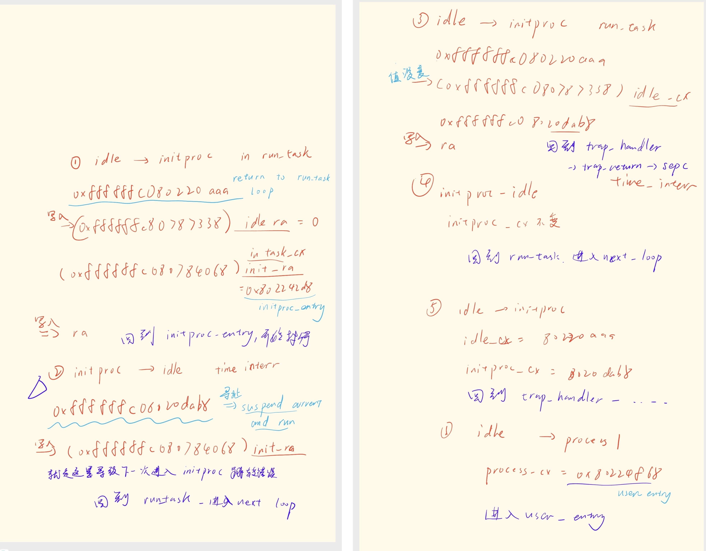
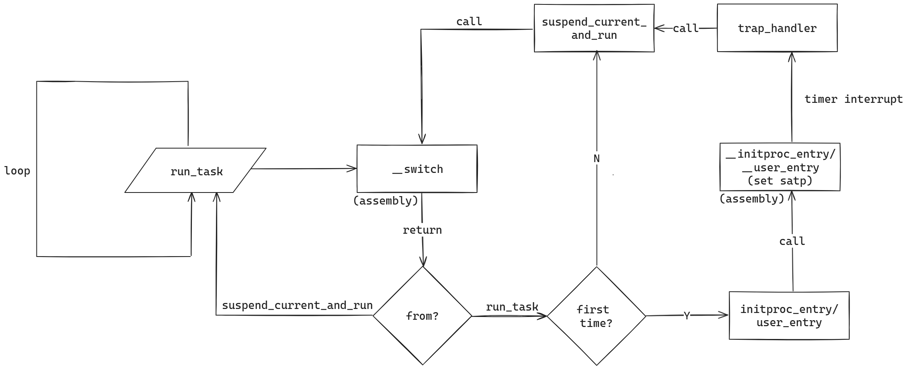
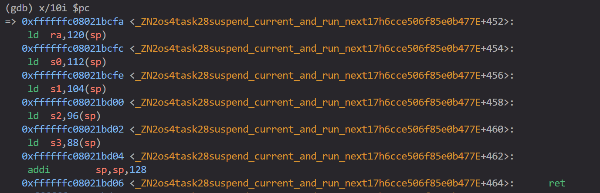
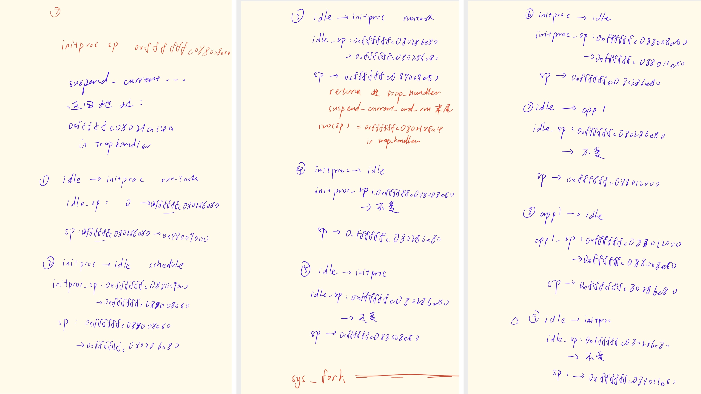
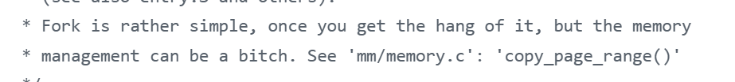
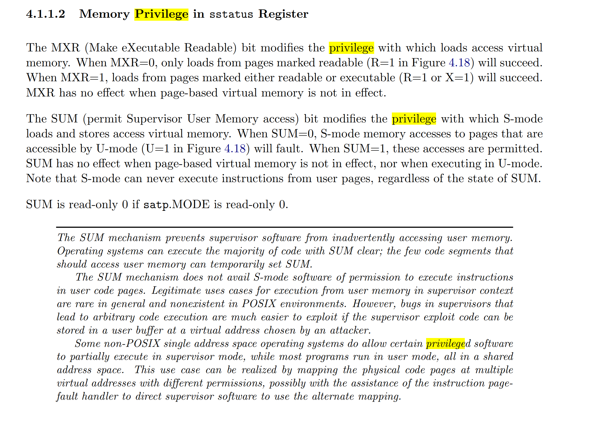

这是2024系统能力大赛操作系统内核赛道作品chaos开发日志，本项目基于~~ArceOS~~ rCore开发。

### 2024.5.14

结束前置学习，克隆项目，配置工作区。

### 2024.5.20

基本了解ArceOS思想及架构，进行初步更改。

#### ArceOS基本架构思想

ArceOS最大的特点就是组件化开发，它把系统内核的功能拆分为了系统有关和系统无关，也就是不可移植和可移植的区别。不可移植的模块叫module，命名以ax开头；可移植的模块叫crate，与内核只通过接口交流。

#### ArceOS实现全流程syscall过程

要想明白应该如何在ArceOS的架构中实现一个syscall，最好的方式就是从用户出发，从用户的syscall请求开始回溯。

在ArceOS中，用户直接面对的是来自用户库`ulib`的接口，用户只需要直接调用其中接口即可，在调用的同时，用户也要对应的启用一定的`feature`，这也是ArceOS的特色之一，我们先按下不表。深入`ulib`，仔细参考接口的实现后，可以发现接口都是对于`arceos_api`中方法的封装，正如其名字所说的那样，`arceos_api`提供了一系列面向用户库的接口，如最基础的`ax_console_read_byte`等。这里可以看到ArceOS的代码规范非常好，所有mod和lib文件都是非常干净的接口引用，没有添加任何功能代码的实现。

再进入`arceos_api`，我们就可以看到这里的方法来自各个module，同时我们熟悉的`sys_*`函数也分布在这里。实现过syscall的朋友们都知道（迫真），到这里就是一个`原子syscall`（我自己瞎取的名），即所有内核功能在这里首次被打包成一个完整syscall，再进行层层封装。

了解了syscall的调用流程，想要实现一个syscall也就简单了，具体syscall过程中，特权级的切换，上下文的保存等我还没有深究，还要继续研究，但是中断实现上应该都大差不差。

需要注意的是syscall的具体实现方法。ArceOS为我们实现了一个奇妙的宏`syscall_body`，我们需要传入syscall_id等参数，对于参数的主要操作也就是syscall的主要部分都在里面完成，宏如其名了属于是。

### 2024.5.23

淦，ArceOS看不下去了，转投rCore

#### 修改测试逻辑和用例

修改`Makefile`，让chaos可以运行初赛测例，同时基本删除原有的应用，只保留`shell`和`initproc`，再自定义了一个应用用于一键执行所有应用。

基本思路就是把编译好的elf初赛测例也和rust应用的elf文件塞到一起然后一起加载，rCore原有的流程扩展性不强，因此花了不少时间改。

#### 新建dev分支开发syscall

新维护了一个dev分支，同时队友大改文件系统，分了一个feat分支出去。

感觉换成rCore之后前途一片光明（完犊紫）啊。

### 2024.5.24

#### 实现`SYS_times`

统计一下进程的内核和用户态clock时间，之前写过，没什么难度。大致可以参考rCore的习题`扩展内核，统计每个应用完成时间`。

#### 修改测例顺序

王老板在参考linux源码重构文件系统，暂时不处理文件系统相关syscall，把文件系统相关syscall放到了后面。

#### 实现`SYS_uname`

只是输出固定字符串而已，非常简单，但是一定一定要注意在我们内核内部，u8数组的长度要和riscv标准下的`utsname`结构体的成员字符数组长度保持一致，都是65字节，长度不一致就会导致切片复制时出错。

### 2024.5.25

#### （4:38 am）实现`SYS_wait4`

只需要修复rCore的`sys_waitpid`方法即可。

这里踩了不少雷。首先是需要搞清楚对于`SYS_wait4`的调用函数看似很多而且各不相同，实际上都是`SYS_wait4`通过封装派生出来的，因此安安稳稳实现就行。

其次是`WEXITSTATUS`宏的问题。`WEXITSTATUS`宏名义上会取`wstatus`的低8位，作为子进程的退出状态，但是阅读其源码会发现，所谓低8位指的是小端法下的低8位！鬼知道为什么这里会出现小端！！因此在赋值的时候我们需要把传进去的`exit_code`左移8位来保证其存储在小端上（这里就偷懒不交换两端而是直接左移了），这样才能正确解析出退出状态值，通过测例。参考往届的代码也没有在这里做特殊处理，暂时不知道他怎么过的测例，猜测是FAT32文件系统发力了，而我们尚未实现FAT32，王老板还在猛肝。

#### （7:24 am）实现`SYS_brk`

要实现`SYS_brk`，首先要支持堆的操作。我为地址空间memory_set新增维护了其对应的堆空间，地址即为elf文件中读到的地址，这个地址原本被用作user_stack_top，即用户栈顶，然后将用户栈顶放置到一个固定地址0x100000000，最后再把`UserTaskRes`维护的的用户栈底`ustack_base`改为用户栈顶`ustack_top`，维护相关方法。妥善维护上面所有修改之后就可以动手实现syscall了，具体的实现参考了往届的学长，按照传入地址修改堆区末尾指针位置在再修改映射即可。

#### 实现`SYS_nanosleep`

设置一个预计时间，反复循环忙等待到时间到达即可，期间进程直接yield。（或许应该block？）

#### 维护了阻塞队列`block_queue`

还未实现具体应用。

#### 实现`SYS_getppid`

过于简单，不做赘述。

### 2024.5.26

#### 完成FAT32文件系统

王老板写完了FAT32，分支merge进了dev。王老板牛逼。

#### 修复`LoadPageFault`的问题

加入文件系统之后遇到了严重的错误，所有的应用都能正常读取，但是全部报`LoadPageFault`，非法的地址是用户栈顶。debug了一整天后认为和文件系统和内存管理都无关，最后发现是分配的用户栈没有没有左闭右开，然后读取右边的栈顶就炸了，但是原来的rCore没有维护这个问题。进一步思考后发现应该是因为引入文件系统镜像之后取消了初始进程`initproc`，由他`fork`出的进程用户栈地址空间都合法的维护了，而取消了初始进程之后，所有应用申请的用户栈地址空间读取右边就会非法，因为他们都变成了0号进程。

至于为什么初始进程作为0号进程可以正常运行，我们认为是初始进程使用了`no_main`feature，这样他在启动的时候就不会首先读取用户栈顶获取`main`函数的参数。目前的解决办法是暂时给用户栈顶 -4 ，等完成了所有syscall之后再修复。具体的修复方案暂定是额外打包一个包含了初始进程的镜像一起上传。

### 2024.5.28

#### 实现`SYS_clone`

`SYS_clone`我调了足足两天，问题来自于参数的不匹配以及参考资料的稀少。en读了Linux源码和测例提供的部分glibc之后选择单独为测例实现一个`fork2`，即创建新进程，且执行自定义函数。测例提供的lib很关键，因为测例的lib是经过魔改的，`clone`函数的实现被替换成了自定义的汇编函数，阅读汇编代码可知，需要运行的函数指针并不会直接传给内核，而是会把它和函数参数一起压栈，再把栈指针传入内核，因此只需要把子进程中断上下文中保存的栈指针替换成传入的栈指针即可实现执行指定的函数。

#### 修复`SYS_execve`

加文件系统后会`StorePageFault`，猜测是内核栈爆了，开了两倍的内核栈成功修好。

#### 实现`SYS_fstat`

`SYS_fstat`在rCore-lab期间已经完成，只是`Stat`结构体的内容不同，因此修改结构体，维护一下内容即可。因为测例没有要求，目前仅维护了文件大小。

#### 重构`SYS_mmap`

之前的`SYS_mmap`过于原始，耦合度高且映射方式存在问题，因此给予重构。

首先是映射位置需要再修改，对于`flag`没有指明是`FIXED`的映射，我们不需要按照传入的虚拟地址直接映射，而是应该指定一个地址用于匿名映射，并以这个地址为基准进行映射。为此我们规定`MMAP_BASE`为0x20000000，然后为每个地址空间维护`mmap_base`和`mmap_end`，用于管理映射。对于指定了`FIXED`的映射，我们按照之前那样直接映射。

其次是文件映射，`SYS_mmap`要求能够实现文件映射，也就是在映射一块空间的同时把指定文件的数据初始化在这段内存中，`copy_from_slice`一下即可。

#### 实现`SYS_munmap`

`SYS_mmap`改了，`SYS_munmap`当然也要改。取消映射就简单多了，修改`mmap_end`再unmap一下就行。

### 2024.5.29（凌晨）

#### 比赛环境配置

到这里，所有的`syscall`都实现了，接下来就是配置环境尝试提交。

首先要做的是把所有外部包改为本地编译，因为测评机不联网。统一放进一个`vendor`文件夹管理即可。
然后是修改一下`Makefile`，满足测评要求的同时维护一下`.cargo`，因为测评机`clone`项目时会忽略隐藏文件夹，需要交上去再在`make`的时候改名。
最后我们要在`rust-toolchain`里指定`building targets`，并且在`cargo.toml`里添加`rustflags = ["-Zbuild-std=core,alloc"]`，确保编译时包含`core`库。
这样我们提交后就可以成功得到成绩（~~已经寄了7发了~~）

### **通过初赛！**

小修两个bug，9发提交满分通过，排名14

---

### 2024.6.19 开始重构

摆了一段时间开始计划重构代码，首先的目标是取消rCore的双页表机制，双页表虽然可以防侧信道攻击，但是带来的性能开销也很大，与我们的目标不符。

取消双页表也是为下一步进一步实现无栈协程做铺垫，修改为内核态用户态共用页表之后就可以按照无栈协程的一般处理方式，让进程共用内核栈。

### 2024.6.23

#### 修改内核地址空间

为了让内核态核用户态共用一张页表，我们需要对地址空间进行适当分割。这里我们直接利用 SV39 的机制：64 位虚拟地址只有低 39 位有效，[63 : 39] 这 25 位必须和第 38 位相同，即对于 SV39 机制来说，有效的地址范围为 `0x0000000000000000` - `0x0000003fffffffff` 和 `0xffffffc000000000` - `0xffffffffffffffff`，这恰好分成两份，还能根据符号位（作为补码看）轻易辨别地址属于哪个区间。因此我们把用户地址空间映射到`0x0000000000000000` - `0x0000003fffffffff`，把内核地址空间映射到`0xffffffc000000000` - `0xffffffffffffffff`。

我们首先修改链接脚本，把内核代码映射到 `0xffffffc080200000`，因为目前编译出的elf并不是位置无关的，而 rustsbi 默认跳转的位置是 `0x80200000`，那怎么在能在启动的时候迅速把内核代码映射到高位呢，我们需要在启动时手写一个简单的页表，修改 `satp` 寄存器。

手写个三级页表显然太炸裂了，因此我们利用大页机制，只映射两个 1G 大页，也就是只使用一级页表，MMU 查到有效页表项就会自动停止。将 `0x8000_0000` 和 `0xffff_ffc0_8000_0000` 两个大页添加到页表项即可。

```Assembly
boot_pagetable:
    # we need 2 pte here
    # 0x0000_0000_8000_0000 -> 0x0000_0000_8000_0000
    # 0xffff_fc00_8000_0000 -> 0x0000_0000_8000_0000
    .quad 0
    .quad 0
    .quad (0x80000 << 10) | 0xcf # VRWXAD
    .zero 8 * 255
    .quad (0x80000 << 10) | 0xcf # VRWXAD
    .zero 8 * 253
```

经过修改后内核可以正常启动进入，证明了映射的处理正确，当然内存管理经过修改显然存在严重问题，有待进一步修改。

仍然存在的疑问：为什么也需要映射用户态地址空间，进入内核时不是应该保持在高位运行吗

#### 实现自旋锁，添加锁支持

一个多核操作系统会需要一套完善的锁机制，由于锁模块与内核相对隔离，且使用较多，优先实现一部分锁的内容。首先我对代码架构进行了一定更新，然后添加了 `MutexSupport` ，用来为自旋锁、互斥锁等简单锁提供支持，随后实现了基础的自旋锁。接下来还会需要大幅重构锁机制的代码，逐步替换原先的锁，使它结构上更加独立，形成一个独立的锁模块。这里很大程度上参考了 Titanix 的实现和文档。

```rust
/// Low-level support for mutex(spinlock, sleeplock, etc)
pub trait MutexSupport {
    /// Guard data
    type GuardData;
    /// Called before lock() & try_lock()
    fn before_lock() -> Self::GuardData;
    /// Called when MutexGuard dropping
    fn after_unlock(_: &mut Self::GuardData);
}
```

#### 移除信号量和条件变量机制

为了实现无栈携程，我们计划提供 futex 给用户使用，并取代信号量机制，同时，我们实现了 `SpinNoIrqLock` 给内核提供锁服务。因此，我移除了所有的信号量机制以及条件变量，并将 rCore 原本的自旋锁替换为了新架构的关中断的自旋锁。这一步没有实现什么新的功能，主要是在重构代码，并使其逐步适应无栈携程的需要。

### 2024.6.29

#### 虚拟地址与链接脚本不一致

修改了链接脚本的内核基址并且在内核入口中手写页表之后，通过内核映射前打印出的数据可知，内核的各个段还是被映射到了页表中的低地址，与链接脚本不符。这里我思考了我们是如何从链接脚本中获取代码段地址的，我认为函数名、汇编符号、函数代码入口地址这三者是同一回事（假设函数名未被混淆，实际上C++和Rust都会混淆，C不会），我们通过 `extern "C"` 引入外部C函数实际引入的是函数符号，也就是函数入口地址，因此我们就可以在Rust里调用C函数，同样，我们也可以用相同的方式获取某个符号的地址。这里我们直接在链接脚本中规定了各个代码段以及具体符号的位置，链接脚本直接指导链接器，也就绕过了编译器可能的混淆，保留了符号的原本名称，我们就可以通过 `extern "C"` 将其引入，从而得到了各个代码段的具体地址

经过一段时间（3个小时）的排查，我们发现虽然符号表中各个符号确实处于地址空间高位，但是代码段实际位置与符号表不符，仍然位于低地址空间。由于低地址空间和高地址空间完全对称，内核虚拟地址也只需要减去偏移量（`0xffffffc000000000`）就是物理地址，所以我们可以在进入主函数 `rust_main` 之前，将跳转目标加上偏移量，使后续的代码在高地址空间执行，由于所有的跳转都被编译为相对 pc 跳转，因此不影响程序的正确性。

```rust
#[no_mangle]
pub fn fake_main() {
    unsafe {
        asm!("add sp, sp, {}", in(reg) KERNEL_SPACE_OFFSET << 12);
        asm!("la t0, rust_main");
        asm!("add t0, t0, {}", in(reg) KERNEL_SPACE_OFFSET << 12);
        asm!("jalr zero, 0(t0)");
    }
}
```

修改后获取的虚拟地址与符号表匹配了，但是创建新地址空间时卡死，使用gdb调试还会导致内核无限循环。通过检查又长又臭的 qemu log 发现，在访存内核代码段末尾，也就是 `ekernel` 时出现异常，而异常处理函数的位置，也就是 `stvec` 寄存器，被默认指向了内核开头 `0x80200000` ，这就是出现循环的原因。进一步检查代码发现 rCore 原生的地址转换逻辑有误，因为原先并没有考虑传入虚拟地址可能位于地址空间高位的情况，因此取物理地址时忽略了高8位，导致取出的地址不合法，重构地址转换逻辑即可解决。

### 2024.7.1

#### 修正地址转换机制

我们把内核地址空间映射到高位之后，rCore原先的物理、虚拟地址，usize以及页号之间的转换规则就不对了，需要加以修正，按照SV39的要求维护好高位，这一层维护完成之后，加载应用程序前的所有工作就完成了，内核成功被映射到了高位，进入了加载文件系统阶段。

### 2024.7.2

#### 支持连续分配物理页

支持连续分配物理页。注意当前连续分配不会考虑 recycled 的物理页。

#### 页表切换

新的页表是被物理页帧随机映射直接放进内核地址空间部分的内存里。

还在尝试加载文件，现在是虚拟块设备炸了，目前不知道应该重构虚拟块设备还是添加初始页表映射部分。

### 2024.7.4

#### 重构虚拟块设备驱动

完成了对虚拟块设备驱动的重构

### 2024.7.5

#### 修改页表创建和内存布局

现在新创建的页表确保了内核部分一致，这样页表的切换不会导致内核找不着了，同时重新安排了内核栈和用户栈以及用户堆的位置。现在用户栈放在应用程序代码段之后，用户栈之后间隔一页的位置放置用户堆。

#### 移除trampoline

改成单页表之后就不需要使用 `trampoline` 沟通内核和用户态，到这里 `trampoline`彻底滚出了内核。

### 2024.7.9

#### 为内核页表映射 init trap context

在创建初始进程的时候需要向 `TRAP_CONTEXT_BASE` 中写入初始进程的 `trap context` ，确保接下来的跳转正确，而 `TRAP_CONTEXT_BASE` 虽然在初始进程的页表中映射了，却并没有在当前页表中映射，因此在这里访问会出现 PageFault ，所以我们要为当前正在使用的页表映射这块内存，只需要查新页表确认 `trap context` 的物理地址，然后在当前页表中将 `TRAP_CONTEXT_BASE` 映射到该物理地址即可。

#### 添加初始进程

初始进程对于操作系统来说能够省去大量麻烦，是去草台班子化的必经之路。由于比赛统一使用提供的系统镜像，因此我们选择将初始进程的代码段在编译时嵌入内核代码段，再把 elf 文件直接读出来执行，这样的处理非常高效，开发也很方便，rCore 在实现文件系统之前也是采用这种方式，后面会以 git module 的形式添加root fs。王老板把初始进程加进去之后启动其他程序出现严重问题，最后发现是按名称查找应用程序时忘记给应用程序名称字符串结尾加结束符 '\0' 了，难绷。

#### chaos的页表机制

目前chaos的做法是在进入内核时手写临时页表以进入内核所在的地址空间高位，然后完整映射内核到新页表之后切换过去，进行初始化工作，随后再创建初始进程的页表并切换进去。接下来chaos将首先按照传统的处理方式由初始进程 fork 出所有应用程序，调度时相应切换页表，然后再升级为无栈协程，即切换到初始进程页表之后不再有页表切换。

### 2024.7.11

#### 停用stride算法

决赛的实现并不要求进程的调度，调度也不能明显提升性能，反而留下大量干扰阅读的代码甚至造成bug，因此暂时停用，后续会逐步移除相关代码，其最初编写时耦合度也较高，不利于阅读代码。

#### 在复制页表之前分配内核栈

rCore原先的逻辑是为内核的页表分配各个进程的内核栈，因为原先进入内核态需要切换到内核页表因此这样做没有问题，但是进入单页表之后，我们不再需要反复进入内核页表，内核页表的作用变为了固定保存内核地址空间，每创建一个新的页表就把内核部分复制过去，这样就能确保在切换页表时内核地址空间不受影响。但是在原本的rCore中是先创建页表再分配内核栈，此时内核部分已经完成复制，这样就会导致新的页表缺少队内核栈的映射，于是把内核栈的分配和映射提前到新页表创建之前，完美解决问题。

#### fork时复制页表跳过内核地址空间

小bug，子进程fork出来要复制父进程的几乎所有内容，但是由于页表创建的时候已经复制了内核部分，所以再复制就会重映射，简单加一个 if 就行。

#### 为进程添加专属入口

原先rCore的逻辑是切换进程统一先进入 `trap_return` ，通过进入 `__restore` 来切换 `satp` ，现在换成单页表了，trap处理不需要切换页表修改 `satp` ，所以为初始进程和其他进程设计了入口 `initproc_entry` 和 `user_entry`，汇编代码也添加了对应的入口，这里其实两个入口的汇编没有任何区别，可以用同一个，不过在 gdb 的时候有两个不同符号区分还是方便一点的。

#### 成功进入用户进程

到这里一直进不去用户进程，急急急。debug搞了两天才意识到中断上下文应该被映射到用户地址空间，我也不知道我在想什么要把它挪到内核地址空间，修改了 `TRAP_CONTEXT_BASE` 常量就修好了，真就一行就修好了。

### 2024.7.12

#### 修改 `execve`

改成单页表之后一堆来自用户态的字符串参数等就不需要转译了，之前需要两个页表互相翻译，怪麻烦的，现在直接翻译成 `String` 就行，同时还注意要管理一下用户栈，把参数分门别类压栈对齐，处理完这些就能进入 `execve` 执行了。

#### 虚拟块设备驱动读取出现问题

`open_file` 的时候炸了，发现第一块虚拟块读不进来，会是 `NotReady` 的状态，而且虚拟块设备驱动由于使用了外部库，我也不太了解文件系统和 qemu 怎么搞的虚拟设备，所以完全无法debug也完全没有思路，暂时搁置。

### 2024.7.15

#### 严重bug，返回初始进程时`InstructionPageFault`

这个问题非常难找也非常的精彩，从13号发现至今经过了足足三天的 gdb 不断调试才成功修复，期间理解也反复出错。

首先是发现在刚刚进入用户进程的时候，fork结束后的那次时钟中断会调度到初始进程然后panic，由于错误是 `InstructionPageFault` ，所以常规想法没有思路，只能开始gdb。因为是进程调度时取指报错，所以优先跟踪跳转地址，也就是 `ra` 寄存器以及保存 `ra` 寄存器的 `task_cx` 即任务上下文。`ra` 与任务上下文的交换只发生在汇编函数 `__switch` 中，因此断点也设在该符号处。



第一轮gdb之后，发现最后的跳转地址会进入 `suspend_current_and_run` ，并且在返回时报错，认为是 `task_cx` 中 `ra` 的维护出错导致问题。但是在仔细观察了rCore的处理和gdb结果后发现跳转流程实际上并没有问题。

rCore设计的进程切换方式非常巧妙，具体流程如下图所示。之所以会跳转进入 `suspend_current_and_run` ，是因为经过了时间片中断，在 `suspend_current_and_run` 调用的 `__switch` 中把当前 `ra` 的值保存到 `idle` 进程的上下文中，下一次 `__switch` 时又会恢复这个 `ra`，所以函数返回时会跳转到 `suspend_current_and_run` ，这是完全正常的。



继续仔细观察跳转出错的原因发现，返回进入 `suspend_current_and_run` 后的第一条指令是按照栈指针加偏移量设置 `ra` 的值。



由此，猜测是栈指针遭到修改，继续进行gdb，观察栈指针的变化。



通过gdb很快发现栈指针遭到异常修改，看起来是一个非常地狱的bug，但是非常幸运的是，栈指针异常的数字是一个非常好的数字：正常情况下，进入异常前的栈指针是： `0xffffffc088008e50`， 但是在引发异常的那次跳转中，栈指针 sp 被修改成了 `0xffffffc088011e50`，相差 `0x9000`，这是什么？这恰好是一个进程内核栈的大小！！（8页内核栈加上一页 guard page ）从这里我就可以绝对的肯定是 trap 上下文的维护有问题，因为用户内核栈的基址和内核栈的分配都只与 trap 上下文相关，而非之前关注的任务上下文 `task_cx` 。

重新关注 trap 上下文的维护，很快找到了原因：中断上下文放置在用户地址空间最高位，即 `0x3fffffe000` 处，每次更新时都会基于这个地址根据tid寻址后，获取对应虚拟地址的可变引用然后把数据直接写入。在原先的fork中，fork函数的结尾有一次目前看来似乎没有必要的写入，把新进程的内核栈写入中断上下文，因为原先的rCore是直接获取物理地址的直接引用，所以这样写入没有问题，但是现在我换为单页表之后不能这样做，所以我把它改成了获取虚拟地址，这就导致了fork结尾的这次写入没有写入到预想的、新进程的中断上下文中，而是覆盖了当前进程，也就是初始进程的中断上下文，也就导致了跳转的出错。

之所以我认为这一次写入没有意义，是因为在execve中也进行了中断上下文的初始化；至于rCore为什么可以获取物理地址的引用但我不行，我的理解是把虚拟地址翻译到了一张纯恒等映射的页表中，这样获取的虽然是虚拟地址，但是写入到的位置就是对应的物理地址，毕竟启用虚拟地址空间机制之后不可能再直接获取并修改物理地址。

#### 虚拟块设备驱动读取第一个虚拟块时读取失败

完全没有头绪，有一个投机取巧的思路，就是第一个块既然 `NotReady`，那我特判这个情况，然后重试，还没有实践过，值得一试。

### 2024.7.17

#### 为虚拟块设备添加读取错误重试

如果失败就重试十次，看着效果还行

#### 删除多余代码

删了一些无用的代码和debug信息

#### 准备重构

参考了一些往届代码以及linux之后，我觉得如果想要改成单页表得重构一下，合并PCB和TCB，两个分开的数据结构虽然对于线程的处理方便了很多，但是对于大大复杂了各类代码写法，所有权和可变引用变得非常复杂，因此我决定重构。

### 2024.7.20

#### 移除 `TaskUserRes`

`TaskUserRes`的设计思路应该是按照 `tid` 分配用户栈和中断上下文，并且整合到一个 "res" 里，是一种典型的RAII思想。其实这种想法相当好，因为我后面发现确实不太好管理，正如Linux的注释里写的那样：



但是考虑到重构的复杂性和难度，以及这货前期给我带来的很多所有权麻烦（我是Rust低手），还是先把他移除。

### 2024.7.21 - 24

#### 完成重构！！！

鬼知道我经历了什么。没得说，纯纯苦力活，还留下了不少的坑，不过确实精简了很多代码。

我的思路是逐步添加，把PCB的功能整合进TCB。首先为TCB添加所有需要的成员，然后逐步补充PCB的重要函数，如 `fork` `exec` 等，其中最难搞的就是添加这几个函数，要考虑很多东西，比如什么时候分配内核栈，什么时候分配用户栈，什么时候分配中断上下文又如何写入，如何安排内存空间等等等等。

我参考linux的做法，把pid作为任务的唯一标识，tid则作为线程标识符，主线程的tid与pid一致，子线程的tid则与主线程的pid相同，也就是同一个线程组的tid相同。同时原先按照tid分配的中断上下文的内存我也改为了按照pid分配（函数名还没改）。在原先的rCore中，每个进程享有独立的tid分配器，也就是每个进程的tid都是从零开始分配，tid为0就是主进程，一个进程一个虚拟地址空间，所以拿tid来分配用户资源非常的优雅。可惜，现在的的进程内对于各个线程并没有顺序的标识符，因此按照pid分配比较好管理，由于虚拟地址空间应该足够大，所以这种做法也不是不行。

rCore中对于中断上下文的管理方式并不是一个对象，而是放在一段固定的地址中然后直接获取地址的可变借用然后写入读取，这样的做法给我带来了不少麻烦，因为这导致我经常需要去写其他进程的地址空间，而这个虚拟地址因为按照全局唯一的pid分配，还没有被映射到当前地址空间的页表中，由此引起了不少次PageFault。我暂时没有优雅的解决方案，只是在映射完其他进程的中断上下文之后，为当前进程也复制一份映射（虚拟地址物理地址都要一致），确保可以访问。

过了编译之后遇到很多重复borrow mut的问题，主要是我重构代码时没仔细看上下文导致的，修复了之后成功运行出了重构前的水平。成功！

#### 页表切换

这个bug实际上非常铸币，因为这一点我早就想到得写，结果没有记下来，重构的东西一多就忘记了，导致了非常多的debug时间浪费。

首先是发现在进程切换回第一个用户进程要开始执行应用程序的时候，发生神奇的指令错误（InstructionPageFault），这个错误还不固定，有时候是一个 Unknow 的 Interrupt ，我一个头两个大，手册上也没写这可能是什么，`scause` 总不能骗我，更有时候是输出一堆乱码，看起来似乎是应用程序的二进制制转译文件内容，非常地狱；bug的发生位置也不固定，有时候是输出字符串时，有时候是打印log时。更离谱的是，有时候 `sys_execve` 甚至可能在 `initproc` 也就是初始进程里执行，fork出来的子进程也执行，无视if语句。后面发现这两个其实是一个bug，这就是内存bug的魅力。

这种问题显然是严重的内存错误，肯定是动了内存里不该动的东西，但是我从 `init` 排查到 `fork` 再到 `trap_handler` 以及所有汇编代码，没有发现任何严重问题。我决定从最明显的问题开始，即初始进程执行 `execve` ，这应该是因为在trap返回时， `sepc` 的值有误造成的。但就在我通过gdb仔细排查初始进程的中断上下文中 `sepc` 寄存器的变化的时候，我发现在进程切换时，地址空间没有跟着切换。

这其实是我忘了，因为现在只有 `__user_entry` 和 `__init_entry` 保留了页表切换，原先的 `__restore` 里没有了，因此在调度到对应进程的时候需要手动把调度后第一个跳转的地址指向这两个函数，即`task_cx` 的 `ra` 字段，这样才能在进程切换之后第一时间且换地址空间。在 `run_task` 里修改后解决。这个早就想到得写，还是忘了，所以想到重构计划立刻记录下来很重要（

#### pid提前drop

上一个bug修复后成功运行了第一个应用程序，虽然退出还有问题但是解决优先级不高，先尝试多个应用程序轮流运行，结果发现新进程的pid提前drop了，导致pid被重复使用，中断上下文区域惨遭冲突映射，优化了一下rust写法解决，我的rust水平问题。

#### 多进程调度bug

现在多进程的调度存在严重bug，调度到即将运行应用程序的进程之后，系统卡死。我猜测是因为 `sepc` 有误导致跳转到一个空地址去了，通过gdb发现确实，`sepc` 变成了0，具体原因有待debug。

#### 添加人工断点

内存地方，历代，大规模征战几十余次，是非曲折难以论说，但sys家无不注意到，正是在这个古战场，决定了多少代OS的盛衰兴亡、此兴彼落，所以古来就有问鼎操作系统之说。

内存相关的问题往往苦大仇深学海无涯荡气回肠，因此一般只能靠gdb解决，而操作系统偏偏还天天出内存问题，因此提高gdb的效率非常重要。

为此我在内核使用 `no_mangle` feature 创建了一个空函数 `__breakpoint()` ，这样就能在rust代码的任意一个地方加上一个符号标记，便于gdb打断点，非常方便。

### 2024.7.28

#### 修复乱输出log导致的死循环bug

在 entry 函数输出 `sepc` 来 debug 可能造成 PageFault，因为只有初始进程映射了所有人的中断，但如果从一个子进程切换到另一个子进程就会在页表切换前提早访问不该访问的中断，造成 pagefault ，pagefault 之后，又因为其中有一个子进程是第一次进入， `sscratch` 还没来得及存他的内核栈位置，所以`sp` 和 `sscratch`里存的都不是什么好东西，都不是合法地址，所以一访问又 PageFault ，嘿您猜怎么着，死循环了。

虽然log输出一半炸了导致这个bug的嫌疑人很显然，但是弄清楚这个小登怎么做到给我干出死循环的还是花了我不少功夫。

#### 修复物理页帧生命周期

之前 `sepc` 被清空的原因找到了，没有思路gdb无果于是想到开始跟踪物理页帧，果然，sepc所在的中断上下文的物理页帧被提前释放了。

这个bug的来源非常曲折：首先，`execve` 会进入一张新页表，需要恢复上下文，但上下文在上一张页表的映射里，于是我想的方案是获取上下文的物理地址，在新页表里也做一个映射，保证对上下文的访问（这里显然已经想错了，过于沉迷乱加映射了）。

这里我就忽略了严重的问题，即做一个映射虽然方便快捷，但是物理页帧终究不在自己手上，而刚好 `execve` 会直接用地址空间替换旧地址空间，旧地址空间的所有物理页帧当场free了，我的上下文也一起免费了，导致 `sepc` 没了变成0，而且由于 rCore 不会第一时间清理物理页帧，而是物理页帧被回收才清理，导致出bug的位置隔得很远，给我一个大惊喜。

我删除了原先的铸币做法，换成了老老实实重新映射，同时把老的上下文内容复制了过来，就ok了。

#### 写用户地址空间置位SUM

写用户地址空间传进来的地址各种螺旋 pagefault ，我穷尽毕生所学也想不通还有什么原因可能导致pagefault，直到我翻手册偶然看到：



原来还有 memory privilege 这茬！ISA博大精深，终于理解Titanix的 `sum_guard` 有什么用了。

到这里可以总结一下几乎所有pagefault的可能原因了：

1. 没映射/页表不对
2. 读/写/执行权限不对
3. 访问的指针指错地方了（很多情况下是栈指针导致的）
4. SUM位没置位（标U内存在S态访问必须置位SUM）
5. 物理页帧没了

（2024.8.20 补充：遇到一个不是上述原因的爹，只有上板有，没思路）

### 2024.7.29

#### 停用物理页帧回收

后面的进程正常用着就pagefault，追查到物理页帧的时候，发现出问题的全是回收的物理页帧，因为赶时间，暂时停止使用回收的物理页帧，物理内存反正够大。

### 2024.7.30

#### 处理execve跳转

`execve` 进程结束之后按道理要进新进程，但是忘记了，于是它走了 `trap_return` ，没换页表，导致一系列问题，赶时间所以特判了事，已加入重构名单。

虽然上面就几句话描述，但是这个bug我其实gdb了两个小时。

#### merge 分支

到这里整个单页表架构差不多写完了，激动人心的merge代码时间。

2024.8.20更新：绷不住了，现场赛才意识到我原来写的全是屎山，统统都要重构。

### 决赛一阶段前

#### 添加各种syscall

如题

#### 移除部分地址翻译

重构为单页表之后，用户地址空间的地址翻译不再需要，改为直接写入。

一阶段还是非常遗憾的，我们时间不足，没能完成适配测例，甚至没有分数（笑。我的大部分时间也花在重构架构而不是适配测例上，因此实现的内容相当少，只能先沉淀一年了。

#### 2024.8.10

不是，哥们。测评 0 分一阶段还拿了最高一档分，家人们，好好写文档真的有用。

### 2024.8.13

#### 修复子进程内核栈

发现进程在执行完fork之后出错panic，经过gdb后确定是内核栈遭到修改，但是代码中完全找不到任何显式修改内核栈的痕迹，通过gdb进一步缩小范围之后发现修改内核栈的操作发生在子进程中，仔细排查才发现原来 `fork` 的问题，内容太多写昏了，新分配的内核栈没写进子进程，子进程函数调用导致的修改父进程内核栈。

#### 修复跳转问题

决赛一阶段时暴露出我的单页表架构存在问题，忽略了众多在内核态 yield 的情况，因此予以补救，做法是检查调用 syscall 的进程和退出时的进程是否使用同一张页表，如果不是就切换页表。（此时还没意识到整个架构都不合理，需要大重构）

### 2024.8.15

决赛冲刺阶段日志后面再补

### 2024.8.22

#### 完赛！

完赛已经一个月了，才想起来没有更新结果。虽然答辩发挥的依托，但是chaos还是成功拿到了国二，
简直和做梦一样，6个月的学习开发，几十个不眠长夜，最终证明了热爱与坚持的重要性。


### 2024.9.2

梳理了一下下一阶段开发计划，我计划回归到底层架构的推敲，即确定单页表和双页表究竟有什么区别，在性能上的差异是否值得重构。这一步初步计划找一位相关方向老师提问，并深入研究一下 Linux 内核的处理，同时，在修复目前 chaos 的单页表之后，分为两个仓库开发两个版本的 chaos 内核，分别测试单页表以及双页表，这个过程也可以引入新手作练手用，比如将单页表的 syscall 实现移植到双页表上。

有关比赛的经验以及资料也在整理当中。

### Todos：

- [ ] 完整实现clone、execve
- [ ] 补充实现Mutex
- [ ] 重构锁结构 half way done
- [ ] 无栈异步协程调度
- [ ] 内核态中断
- [ ] 实现多核
- [ ] 页缓存
- [ ] inode缓存
- [ ] 写时复制
- [ ] 共享页映射
- [ ] Lazy分配
- [ ] mmap内存拷贝优化
- [ ] trap_cx_bottom_from_tid改名pid
- [ ] 重构进程切换
- [ ] 重构条件编译
- [ ] 添加uboot命令
- [ ] 为SUM实现添加RAII思想
- [ ] 修复物理页帧回收
- [ ]
