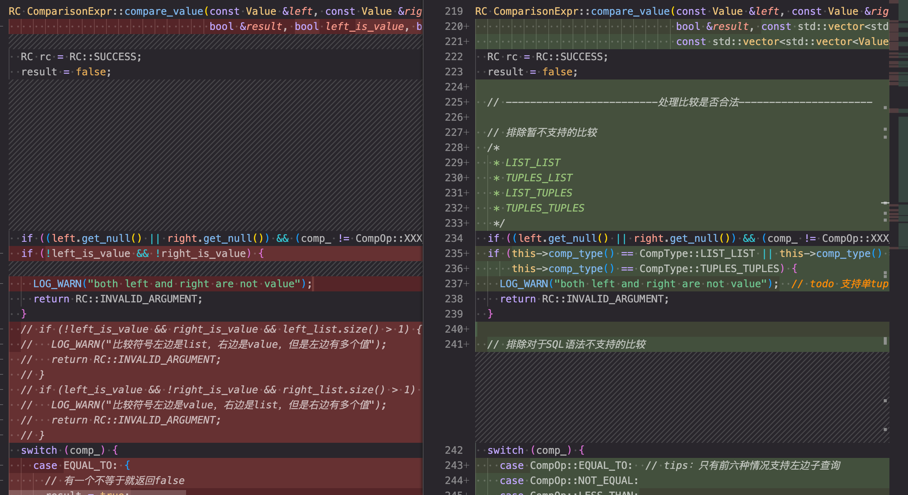
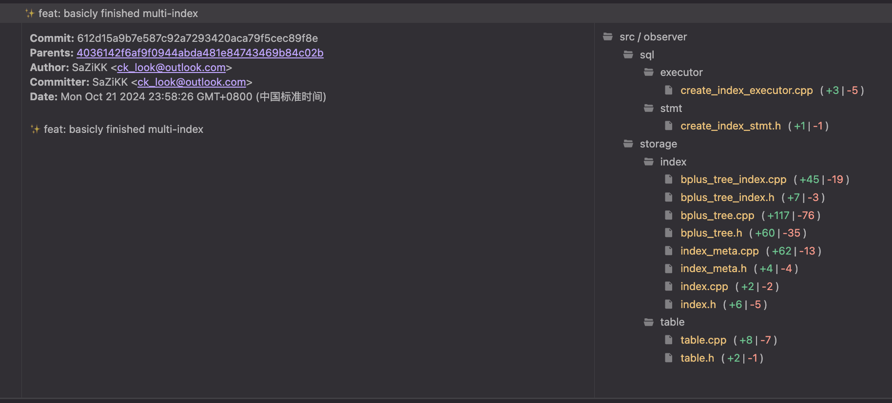
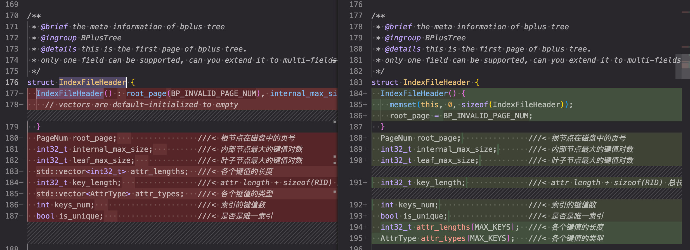

这是2024系统能力大赛OceanBase数据库赛道的开发日志，记录我的开发思路和遇到的问题。

### 2024.10.5

虽然对数据库内核知之甚少，但是迫于时间紧迫只能边写边学。

#### miniob环境配置及源码阅读

为miniob配置了虚拟机环境和mac环境，并修改了vscode的配置文件。

vscode的task.json类似于一个makefile，规定了一系列目标，同时可以在launch.json里规定gdb等的配置，并且指定依赖于task.json里的某几个目标。总的来说像一个大号makefile。

### 2024.10.9

#### 熟悉项目阅读代码

miniob的项目代码非常庞大，且没有较为详细的手册，因此上手写之前肯定要先大体理解代码架构。

半年多没写C++有点陌生，但因为在学习rust的期间对于语言有了一些更深的理解，重新回头再去看C++的一些特性时也有了不少收获。

虽然C/C++确实跑的快也非常强大非常自由，但是难崩的的地方确实难崩。大家都有所诟病的使用宏导致可读性一塌糊涂就不说了，为了解决头文件重复引用导致重定义的问题，C++打了足足四个补丁：

- 使用 `extern` 关键字
- 使用 `inline` 变量
- 使用头文件保护宏，即 `#ifdef`
- 使用 `#pragma once`

我承认我的C++水平很烂，以上四个feature有三个之前都不知道有什么用，因此在一个项目里同时看到以上四者让我大为震撼。
我：“C++写的够好就不需要rust”
也是我：“rust的诞生不是没有原因的”

不过说回来，维护大型C++项目的能力非常重要，正好借此机会练习一下，从这里也能体会到，rust作为一种更新的语言，在项目构建以及文件的互相依赖方面确实做的更好更加明晰。

#### 添加 Makefile

习惯用make了，加一个方便点

#### 完成 `DATE` 类型前端兼容

为数据库添加一种全新类型比较繁琐，因为同时需要前后端的支持，同时miniob在某些方面的可维护性也确实不太好。首先就是要完成编译前段的兼容。

前端兼容分为词法分析和语法分析两部分。词法分析即提取所有关键字，然后把非关键字压栈，传递给语法分析部分，这一部分由lex完成。我们需要在关键字中加入 `DATE` ，同时我们也要通过正则表达式筛选符合 `DATE` 字段YYYY-mm-DD格式的字符串

```c++
// miniob/src/observer/sql/parser/lex_sql.l
CHAR                                    RETURN_TOKEN(STRING_T);
FLOAT                                   RETURN_TOKEN(FLOAT_T);
DATE                                    RETURN_TOKEN(DATE_T);
LOAD                                    RETURN_TOKEN(LOAD);
DATA                                    RETURN_TOKEN(DATA);
```

```c++
// miniob/src/observer/sql/parser/lex_sql.l
{ID}                                    yylval->string=strdup(yytext); RETURN_TOKEN(ID);
{QUOTE}[0-9]{4}\-(0?[1-9]|1[012])\-(0?[1-9]|[12][0-9]|3[01]){QUOTE} yylval->string=strdup(yytext); RETURN_TOKEN(DATE_STR);
"("                                     RETURN_TOKEN(LBRACE);
```

这样词法分析部分就完成了。

接下来是语法分析，这部分由yacc完成。这一部分我个人的理解就是，将词法分析的得到的符号结合数据，定义最简单的表达式如何处理，然后再将表达式与其他符号或者其他表达式组合，递归定义所有语法，这样就可以通过一段相对简短的声明来定义一个逻辑完备的语法。

我们首先增加token，包含`DATE_T`和`DATE_STR`两个标签，确保可以识别出来，然后分别定义解析规则：

```c++
// miniob/src/observer/sql/parser/yacc_sql.y
type:
    INT_T      { $$ = static_cast<int>(AttrType::INTS); }
    | STRING_T { $$ = static_cast<int>(AttrType::CHARS); }
    | FLOAT_T  { $$ = static_cast<int>(AttrType::FLOATS); }
    | DATE_T   { $$ = static_cast<int>(AttrType::DATE); }
```

```c++
// miniob/src/observer/sql/parser/yacc_sql.y
    |DATE_STR {
      char *tmp = common::substr($1, 1, strlen($1)-2);  // 去掉首尾的引号
      int year, month, day;
      sscanf(tmp, "%d-%d-%d", &year, &month, &day);    //sscanf会自动转换字符串中的数字，不用显式stoi
      int date_num = year * 10000 + month * 100 + day;
      $$ = new Value(date_num);
      free(tmp);
      free($1);
```

其中 `DATE_STR` 在 `value` 规则下定义。注意 `DATE_STR` 的声明要在 `SSS` 之前，因为 `DATE_STR` 属于 `SSS` 的一个子集，这样 `DATE` 的前端部分就完成了。

### 2024.10.11

#### 添加 `DATE` 类型检验

按照题目要求，为各个有关 `Stmt` 创建 `DATE` 类型校验。

### 2024.10.12

#### 支持 `LIKE` 字句

`LIKE` 字句本质是使用正则表达式对表内元素进行筛选，一种较好的思想是将 `LIKE` 作为一个运算符处理，再将运算符和两端的表达式一起作为 `condition` 处理。支持前端之后，只需要在运算符列表中加入 `LIKE` ，并为其实现相应的运算逻辑，即正则表达式的匹配即可。同时，因为需要进行运算，所以需要为其适配类型强转，即进行 `LIKE` 运算时需要哪些类型之间的强制类型转换，这样字句的支持就完成了。

### 2024.10.12

#### 开始实现子查询 `subquery`

子查询的实现是第一个真正的挑战，需要考虑的修改的点极多，并且涉及到了非常复杂的 C++ 语法上的操作。

首先需要仔细考虑前端上的实现。子查询最致命的一点在于可以无限套娃，即子查询套子查询。对于这种情况显然我们需要递归的解析 sql 语句，这点在前端上实现较为简单，因为语法解析本身就是靠着递归定义来使用很少的代码定义一整套完整的语法。我们先定义一个 `sub_select_stmt` 规则:
``` c++
sub_select_stmt:
    LBRACE select_stmt RBRACE
    {
      LOG_DEBUG("parse sub_select_stmt");
      $$ = $2;
    }
    ;
```
随后，我们要处理子查询的关键字，如 `IN` `NOT IN` 等等，我把他们统一作为运算符处理，同时把子查询的 stmt 加在运算符的左右两边，让子查询可以被作为运算数解析，这样前端就基本完成了

#### 递归解析子查询

子查询可能出现嵌套查询的情况，因此要支持递归的解析子查询，并且将查询结果逐级回传。嵌套查询即 `ConditionSqlNode` 的两边除了是值之外还有可能是子查询，因此要为 `ConditionSqlNode` 添加子查询成员，并添加子查询标志位：
``` c++
struct ConditionSqlNode {  
  int left_is_attr;  ///< TRUE if left-hand side is an attribute
                     ///< 1时，操作符左边是属性名，0时，是属性值
  Value left_value;          ///< left-hand side value if left_is_attr = FALSE
  RelAttrSqlNode left_attr;  ///< left-hand side attribute
  CompOp comp;               ///< comparison operator
  int right_is_attr;         ///< TRUE if right-hand side is an attribute
  bool left_is_sub_query;  ///< 1时，操作符左边是属性名，0时，是属性值  // todo:
                           ///< not support in yaccccccc yet
  bool right_is_sub_query;  ///< 1时，操作符右边是属性名，0时，是属性值
  RelAttrSqlNode right_attr;  ///< 右边的属性
  Value right_value;  ///< right-hand side value if right_is_attr = FALSE
  SubSelectSqlNode* left_sub_query;  ///< sub-query if left_is_sub_query = TRUE
  SubSelectSqlNode*
      right_sub_query;               ///< sub-query if right_is_sub_query = TRUE
  SelectStmt* left_sub_query_stmt;   ///< sub-query stmt
  SelectStmt* right_sub_query_stmt;  ///< sub-query stmt
};

```
需要注意的是，无论是 `Value` 还是子查询，都应当当作一个表达式处理，这样能大幅简化代码，提高开发效率。这里由于经验不足，还是在他原有框架上补全，导致开发中后期浪费了大量时间重构代码和适配框架。

这里的递归实现比较简单，就是在逻辑算子的创建函数中，检查是否有子查询并为子查询创建逻辑算子，这样就能够实现递归的调用逻辑算子创建函数。

#### `filter` 支持子查询类型

filter 会记录表达式左右的值以及运算符，显然这里也需要支持子查询，因此新增了一种子查询类型。从这里就可以看出，如果先前先把所有子查询、`Value` 等都统一解析为表达式，那么这里的适配就会简单很多，统一当作 `Expression` 处理即可。

### 2024.10.15

#### 继续支持子查询

为了保证子查询能够被成功的执行，除了支持递归解析子查询外，还要提前将子查询的结果查出来并记录、外传，这样才能保证外层查询正常进行。

具体的实现方法参考了正常查询的实现，但是把查询结果的过程提前到了对子查询类型 `get_value` 时。由于所有的值都是通过 `get_value` 函数取出并进行比较的，因此在这里实现子查询变量的实际查询可以保证不重不漏，同时这也近似一种懒分配的思想，即需要使用时才查询出实际的值。
```c++
// src/observer/sql/expr/expression.cpp
RC SubQueryExpr::get_value_list(std::vector<Value> &value_list) {
  LogicalPlanGenerator generator;
  SelectStmt *selectstmt = this->sub_query_;
  Trx *trx = nullptr;  // todo: 暂时使用临时创建的trx

  if (selectstmt == nullptr) {
    LOG_WARN("subquery is null");
    return RC::INVALID_ARGUMENT;
  }

  // 初始化物理算子
  RC rc = physical_operator->open(trx);
  if (rc != RC::SUCCESS) {
    LOG_WARN("failed to open sub physical operator. rc=%s", strrc(rc));
    return rc;
  }

  // 将查表结果放入value_list
  while (RC::SUCCESS == (rc = physical_operator->next())) {
    Tuple *tuple = physical_operator->current_tuple();
    Value value;
    RC rc = tuple->cell_at(0, value);
    if (rc != RC::SUCCESS) {
      LOG_WARN("failed to get tuple cell value. rc=%s", strrc(rc));
      return rc;
    }
    value_list.push_back(value);
  }

  rc = physical_operator->close();
  if (rc != RC::SUCCESS) {
    LOG_WARN("failed to close sub physical operator. rc=%s", strrc(rc));
    return rc;
  }

  return RC::SUCCESS;
}
```

### 2024.10.16
#### 支持`exists` `in`
`exists` 和 `not exists` 的实现较为简单，因为仅需要判断后面的表达式是否为 true 即可。`in` 和 `not in` 的实现稍复杂，因为需要考虑左右是子查询的情况，在子查询的实现基础上稍加适配即可。

### 2024.10.19
#### 重写比较，完成子查询
`value` 之间的比较是数据库查询的基础，因为我们引入了子查询，子查询的结果可能是一组数据即 `value_list` 甚至 `tuple_list` ，因此比较函数需要大改。

我定义了一系列比较标识符用于定义每个类型的比较：
```c++
// src/observer/sql/expr/expression.h

enum CompType {
  VAL_VAL,        ///< 值-值
  VAL_LIST,       ///< 值-列表
  LIST_VAL,       ///< 列表-值
  LIST_LIST,      ///< 列表-列表
  VAL_TUPLES,     ///< 值-元组列
  TUPLES_VAL,     ///< 元组列-值
  TUPLES_TUPLES,  ///< 元组列-元组列
  TUPLES_LIST,    ///< 元组列-列表
  LIST_TUPLES,    ///< 列表-元组列
  VAL_TUPLE,      ///< 值-元组
  LIST_TUPLE,     ///< 列表-元组
  TUPLE_TUPLE,    ///< 元组-元组
  TUPLES_TUPLE,   ///< 元组列-元组
  TUPLE_VAL,      ///< 元组-值
  TUPLE_LIST,     ///< 元组-列表
  TUPLE_TUPLES,   ///< 元组-元组列
};
```
随后我在 `ComparisonExpr` 的 `get_value` 函数中对于比较进行预处理并分类，确定 CompType 然后再调用 `compare_value` 函数进行实际比较。 `get_value` 函数获取 `ComparisonExpr` 的结果，即比较的结果。

修改完`get_value`引入比较标识符之后，就可以使用新的标识符统一的重构`compare_value`函数：


重构后的比较函数架构清晰，大大便利了后续开发。

### 2024.10.20
#### 完成 `multi-index` 前端支持
`multi-index` 即允许一次索引多个字段，实现需要深入修改索引实现的B+树，不仅要让B+树的各个节点支持存储多个字段的值，还要为多个字段支持比较，确保B+树可以正常排序。

由于对于索引设计完全不了解，对于B+树也不太熟悉，因此先实现前端的支持，再一步步根据已实现的 `create_index` 等 stmt 去逐步修改和了解索引。

### 2024.10.21
#### 基本完成 `multi-index` 支持
这一步需要做的修改非常的复杂和分散，但是基本有迹可循。



因为我不熟悉B+树相关代码，因此我采取了一种比较投机取巧的做法：哪里错了改哪里。我将 `create index stmt` 传入的字段 `Field` 改为了 `Vector<Field>` 以便一次传入多个字段进行索引，随后我根据 `clangd` 的报错进行修改，把所有相关函数的参数全部修改为支持 `const std::vector<const char *>`，将 vector 逐步传递并修改相关实现，如计算字段长度改为计算多个字段长度总和；修改 `memcpy` 的长度以复制全部的字段等等。

这种方法相当的有效，因为大部分修改都仅是函数参数和函数调用的修改，同时这样逐层深入的方式也更加有利于我理解索引部分的代码。整体没有报错之后， `multi-index` 的实现便基本完成。

### 2024.10.22
#### 修复 `IndexFileHeader`
 `IndexFileHeader` 结构体用于记录B+树的元数据，由于 `multi-index` 需要修改B+树以支持存储多个字段，因此相应的 `header` 也要修改。
 

#### 检查 `Field` 是否存在
测例可能出现创建索引的字段不存在的情况，需要加以判断。到这里 `multi-index` 的实现就结束了。

### 2024.10.23
#### 初步实现 `unique` 
`unique` 即支持唯一索引。由于其设计与 `multi-index` 有很大相关性，因此一起实现。

`unique` 的实现思路非常巧妙。miniob 的源码实现中就包含了查重，且对于两个节点的存储的键值对，他的查重策略是从前到后每个字段逐一对比，使用专门的对比器记录了索引中各个字段的长度，确保对比的时候不会错位（因为是暴力的指针加 offset ），如果完全相同，就会返回一个错误 `RC::RECORD_DUPLICATE_KEY`。在实现 `unique` 之前，索引的字段之所以可以插入/更新重复值，是因为在对比时，键值对的开头是自己的唯一的 rid，因此绝对不会出现重复的情况。

综合以上的查重逻辑，`unique` 的实现逻辑就非常明晰了：对于唯一索引，把所有键值对的 rid 置零。
```c++
// src/observer/storage/index/bplus_tree.cpp

MemPoolItem::item_unique_ptr BplusTreeHandler::make_keys(const std::vector<const char *> user_keys, const RID &rid) {
  MemPoolItem::item_unique_ptr key = mem_pool_item_->alloc_unique_ptr();
  if (key == nullptr) {
    LOG_WARN("Failed to alloc memory for key.");
    return nullptr;
  }
  int offset = 0;
  // 创建字段与rid的键值对
  for (int i = 0; i < file_header_.keys_num; i++) {
    memcpy(static_cast<char *>(key.get()) + offset, user_keys[i], file_header_.attr_lengths[i]);
    offset += file_header_.attr_lengths[i];
  }
  if (file_header_.is_unique) {
    // 对于重复唯一索引，由于键值的比较机制，我们只要保证所有的rid都相等，那最后就会被查重掉，因此这里给rid赋值为固定值
    memset(static_cast<char *>(key.get()) + offset, 0, sizeof(rid));
  } else {
    memcpy(static_cast<char *>(key.get()) + offset, &rid, sizeof(rid));
  }
  return key;
}
```

支持了查重之后，还有另一个问题就是 recovery，即如果在更新和插入的过程中遇到问题，需要回滚所有修改。在这里 `insert` 的实现略为简单，遇到问题仅需要直接删除所有同批次插入的值即可，但是由于 `update` 还需要保证变回原来的值，所以实现较为简单粗暴。我记录了整个索引列的所有内容，也就是存了一份 old_data，如果更新遇到问题，就使用 old_data 整个覆盖回去，这样就实现了 table 级的数据回滚。实现比较粗糙，处于时间考虑只能先这样了。

### 2024.10.24
#### `unique` 支持 `NULL` 值
`NULL` 是 `unique` 实现的一个难点，因为所有 `NULL` 都要保证可以重复插入，在这里由于我的队友dmx实现 `NULL` 的方式非常难崩，所以我的实现也非常难崩。我们的 `NULL` 值是直接使用特殊字符特判，从ASCII码角落里翻出来那种超级抽象的字符，所以我的实现就是在最底层的查重函数那里特判，如果有这个字符直接返回。
这种属于赛博案底的代码写在博客里是不是算赛博自首。

### 2024.10.29
#### 实现 `TEXT` 
`TEXT` 即超长字符串，过长而不能存储在 `record` 中，需要存储在 miniob 提供的抽象页中。由于我对 miniob 的底层实现不了解（也没时间看），因此我不清楚这个页是否和内存中的页对应，但是他页大小不是4k，应该是一个抽象出的页。

这里实现的思路就很简单了，在应该写入 `record` 的时候写入页中即可，读取时一样操作。为了保证到时候读得出来，这里我把写入的页号代替字符串本体写入了 `record` 中。我们直接在写入 `record` 的函数中特判一下 `TEXT`，调用分配页的函数 `data_buffer_pool_->allocate_page()` 然后按照上述方案仔细处理即可。
```c++
// src/observer/storage/table/table.cpp

RC Table::set_value_to_record(char *record_data, Value &value, const FieldMeta *field, int index) {
  size_t copy_len = field->len();
  size_t data_len = value.length();

  if (value.attr_type() == AttrType::VECTORS && data_len <= 1000 && copy_len != (size_t)data_len) return RC::INVALID_ARGUMENT;

  // 如果是 TEXT 类型，在这里就要写入页中
  if (field->type() == AttrType::TEXT) {
    int offset = 0;
    vector<PageNum> page_nums;
    for (int i = 0; i < BP_MAX_TEXT_PAGES && offset < value.length(); i++) {
      Frame *frame = nullptr;
      RC rc = RC::SUCCESS;
      rc = data_buffer_pool_->allocate_page(&frame);
      data_buffer_pool_->mark_text_page(frame->page_num(), true);
      if (rc != RC::SUCCESS) {
        LOG_ERROR("Failed to allocate page for text field. table name=%s, field name=%s, rc=%d:%s", table_meta_.name(), field->name(), rc, strrc(rc));
        return rc;
      }
      auto data = frame->page().data;
      memset(data, 0, BP_PAGE_DATA_SIZE);
      int len = std::min(value.length() - offset, BP_PAGE_DATA_SIZE);
      memcpy(data, value.data() + offset, len);
      offset += len;
      page_nums.push_back(frame->page_num());
      frame->dirty();
      data_buffer_pool_->unpin_page(frame);
    }
    char *data = new char[BP_MAX_TEXT_RECORD_SIZE];
    memset(data, 0, BP_MAX_TEXT_RECORD_SIZE);
    offset = 0;
    int length = value.length();
    memcpy(data, &length, 4);
    offset += 4;
    for (int i = 0; i < (int)page_nums.size(); i++) {
      memcpy(data + offset, &page_nums[i], 4);
      offset += 4;
    }
    for (int i = page_nums.size(); i < BP_MAX_TEXT_PAGES; i++) {
      memset(data + offset, 0, 4);
      offset += 4;
    }
    value.set_type(AttrType::CHARS);
    value.update_text_data(data, BP_MAX_TEXT_RECORD_SIZE);
    delete[] data;
  }

  // copy_len = field->len();
  // data_len = value.length();
  if (field->type() == AttrType::CHARS) {
    if (copy_len > data_len) {
      data_len = value.length();
      copy_len = data_len + 1;
    }
  }

  if (field->type() != AttrType::VECTORS || value.get_vector_size() <= 1000) {
    memcpy(record_data + field->offset(), value.data(), copy_len);
  }

  if (value.get_null()) {
    const char *flag = "ÿÿÿÿ";
    memcpy(record_data + field->offset(), flag, std::min(field->len(), 4));
  }
  return RC::SUCCESS;
}
```

下面是读取的实现（其实是我懒得解析了所以直接贴代码）：

```c++
// src/observer/sql/expr/tuple.h

 RC cell_at(int index, Value &cell) const override {
    if (index < 0 || index >= static_cast<int>(speces_.size())) {
      LOG_WARN("invalid argument. index=%d", index);
      return RC::INVALID_ARGUMENT;
    }

    FieldExpr *field_expr = speces_[index];
    const FieldMeta *field_meta = field_expr->field().meta();
    int target_offset = field_meta->offset();
    cell.set_type(field_meta->type());
    if (strncmp(record_->data() + field_meta->offset(), "ÿÿÿÿ", std::min(4, field_meta->len())) == 0)
      cell.set_null(true);
    else if (cell.attr_type() == AttrType::TEXT) {
      vector<Field> text_fields;
      for (const FieldMeta &field_meta : *table_->table_meta().field_metas()) {
        if (field_meta.type() == AttrType::TEXT) {
          char *text_data = nullptr;                           // 用于存储text的数据
          char *text_meta = (char *)malloc(field_meta.len());  // 用于存储text的元数据
          char *text_index = (char *)malloc(sizeof(int));      // 用于取出text元数据的每个页号
          int page_nums[BP_MAX_TEXT_PAGES];                    // 用于存储text所在的页号
          memset(text_meta, 0, field_meta.len());
          memcpy(text_meta, record_->data() + field_meta.offset(), field_meta.len());
          memset(text_index, 0, sizeof(int));
          memcpy(text_index, text_meta, sizeof(int));  // 取出头四位text的长度
          int length = *((int *)text_index);
          text_data = (char *)malloc(length);
          memset(text_data, 0, length);
          int used_pages = length / BP_PAGE_DATA_SIZE + 1;
          for (int i = 0; i < used_pages; i++) {
            memcpy(text_index, text_meta + sizeof(int) + i * sizeof(int), sizeof(int));
            page_nums[i] = *((int *)text_index);
          }
          int offset = 0;
          for (int i = 0; i < used_pages; i++) {
            Frame *frame;
            RC rc = this->table_->data_buffer_pool()->get_this_page(page_nums[i], &frame);
            if (rc != RC::SUCCESS) {
              LOG_ERROR("Failed to get page. page_num=%d, rc=%s", page_nums[i], strrc(rc));
              return rc;
            }
            int len = std::min(length - offset, BP_PAGE_DATA_SIZE);
            memcpy(text_data + offset, frame->data(), len);
            offset += len;
          }
          cell.set_type(AttrType::CHARS);
          cell.update_text_data(text_data, length);
        }
      }
    } else
      cell.set_data(this->record_->data() + field_meta->offset(), field_meta->len());
    return RC::SUCCESS;
  }
```

#### 修复缓冲区问题

完成之后的 `TEXT` 有一个很难崩的问题，自己测试过了但是上线怎么都过不了测评，而且报错只会显示输出不一样的行，还会因为长度截断，这就导致面对一堆超长的字符串我根本无从下手 debug， 后面通过在本地使用模拟线上的另一个测评框架，发现字符串都截断在 4096 的位置，由此推测肯定是某个缓冲区满了，事实也是这样。

miniob 的线上环境分为 server 端和 client 端，在他的发送端和接收端都有一个读写缓存限制，就是这个限制导致字符串被截断。而我们平时使用 Makefile 都是相当于直接启动 server 端，读取 server 端的输出，因此没法发现这个问题，修改了缓冲区大小后成功通过测评。

### 2024.11.3
#### 实现 `high dim vector`
`high dim vector` 即高维向量，就是很长的 vector，实现思路与 `TEXT` 完全相同，这里也就不再赘述。

到这里，整个初赛期间的工作都已完成，后续的 `create_view` 受制于时间和学业压力未能实现。

### 完赛
完成比赛！排名41，北京排名第三。

首先要感谢和我一起熬夜通大宵的队友dmx，虽然他不断的在代码中堆史，但他堆的确实快！快的让掏粪几十载的老农都黯然失色，而且他的石山还能跑！这更是锦上添花！

写 miniob 确实是比较痛苦的，我意识到我确实对数据库没有一点兴趣，而编写自己不感兴趣的大型项目确实非常痛苦，更不用提我一大坨的c++水平，三个星期十几次熬大夜几次通宵纯纯是靠毅力挺过来的，好在结果确实不错，我的c++技巧也确实熟练了很多，并且这是第一个基本由我主导项目版本管理以及 workflow 的项目（ chaos 主要是王老板处理 workflow ），而接下来我要拿着这份经验，去挑战我所热爱的东西了。