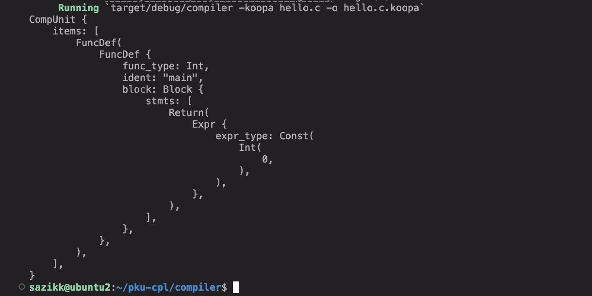
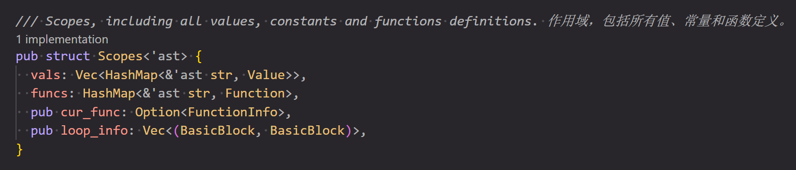
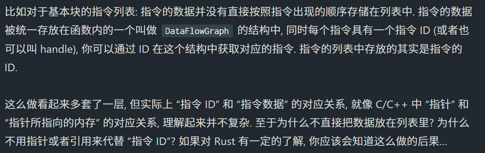

这是我学习编译器的学习笔记，同时也是为参与2025系统能力大赛编译系统设计赛道做准备。

### 2024.9.25

#### 新的开始！

出于对于编译器的兴趣以及队友的建议，我打算在大三这一年改为参与编译赛道，虽然操作系统内核赛道仍然意难平，但是也不能拘泥于过去。当然，我仍将继续开发和维护chaos（~~我要给chaos完整的一生~~），对于操作系统的探索和学习也不会停止。目前chaos的架构还在新的探索阶段，还需要大量的重复的造轮子，虽然这对我并不枯燥，造轮子也不可或缺，但作为一个研究操作系统内核这样的底层领域的工作者，深入学习编译与编译器显然对我同样重要。因此我决定投入时间转向对编译器的学习，而参与编译赛道正是我提高理解的最好方式。

### 2024.9.28

#### 黑听编译原理，阅读清华课本

摸进了王老板导师的编译课黑听，同时略读了一下清华的编译原理课本。课本上大段内容似乎都是在讲编译前端的原理，如词法分析文法分析等，虽然晦涩但还好不需要怎么操心，编译前端的生成已经非常成熟，可以从数学上证明其完备性，我应该把主要精力放到编译优化上的学习。同时我也计划去做一下北大的编译原理实验，动手总是能更好的促进理论学习.

### 2024.10.8

#### 数据库内核也是一种编译

时间原因正在写数据库的比赛，结果发现数据库内核也需要yacc写个编译前端解析SQL语句，也是歪打正着学上编译了。

### 2025.2.27

终于，经过漫长的摆烂，我终于开始编译赛道的准备了。

纠结了一下最后还是选择了北大的编译原理实验，因为有本地测试，rust我也熟悉.虽然做了一段时间南大的实验，但是 java 是在是不会，antlr 的环境也确实不适合拿 vscode 写，所以还是弃坑了。~~而且北大的实验由前辈 MaxXing 手搓，现在我学他的实验去接着打编译也算继承衣钵了（~~

实验我选用 Rust 实现，具体方案是采用 lalrpop 编写前端然后调用 koopa 的接口生成 IR 。[lalrpop](https://lalrpop.github.io/lalrpop/) 是基于 rust 的编译前端生成器，把 lexer 和 parser 结合到了一个文件里，语法上和 rust 的宏定义很类似，毕竟都是匹配特定内容，对于熟悉 rust 的人很好上手，尤其优点是出现规约冲突的时候报错很详细。但是对我来说把词法分析和与法分析放在一块还是感觉不太清晰，还是得自己做好区分。koopa 是 MaxXing 自己写的 IR ，支持 SSA ，并且打包扔到了 [crate.io](https://crates.io/crates/koopa) 上，实在是非常牛比。

#### 构建 AST

写实验的过程操之过急了，我还以为前端可以速成，把重心放在编译优化，实际上真的上手写了之后才发现前端的讲究非常多。部分优化从前端就要开始，比如记录变量作用域以及计算编译时就能确定的常量。

遇到的第一个问题就是构建 AST，在这之前的 miniob 实际上已经帮我做好了这一步，而北科的实验根本不涉及 AST，导致我上来需要手写 AST 的时候懵了一会，而且对于一个完整的编译器， AST 的构建还要有一些方便优化和信息记录的整体设计。AST 具象到代码上实际上就是为 parser 的各个语法节点创建对应的结构体，然后在 parser 中把识别到的对应的内容存到结构体里，构建出一颗保存在数据结构里的语法树。AST 的整体设计有不少有意思的细节，但是还是一步步来，先构建一个最小集按顺序完成实验。打印 AST 对于 rust 来说非常简单，对于每个结构体都 `derive(Debug)` 就行，新语言还是有新语言的好。



#### IR 生成

第二道大坎就是 IR 生成。确实，中间代码优化才是编译器的大头，但是你首先要有中间代码。在幻想有东西可以一键生成 IR 半个小时后（~~又幻想了~~），我意识到需要纯手搓的去生成 koopa IR ，好在仁慈的 MaxXing 留了一些 rust 接口可以使用，于是我开始研究如何结合接口。这里直接去读文档虽然是好文明，但是实在太难理解了，**更好的办法**是去阅读 MaxXing 提供的 demo：[kira-rs](https://github.com/pku-minic/kira-rs) 的源码。里面包含了接口的各种用法，并且在 AST 构建和 IR 生成上都提供了非常有意义的参考。

Rust 中根据 AST 生成 IR 的思路非常的自然。我们实现一个 `GenerateProgram` trait 来包含 `generate` 函数，然后为每个 AST 的结构体 impl 对应的函数版本。在函数中，由于 AST 本身是递归构建的，所以大多数 `generate` 函数 我们只需要遍历并调用这个结构体所有成员的 `generate` 函数即可，非常的优雅。有关如何转化为具体的 IR 代码我还在逐渐研究。

#### 作用域记录与生命周期

虽然 IR 生成在 rust 中的实现逻辑已经非常优雅，但是我们还要进一步为其添加新的 feature，比如变量的**作用域**这一重要概念。和 C 语言一样， SysY 语言也支持变量遮蔽，因此我们要在 IR 生成时就确定变量的作用域。 kira 的做法是在扫描 AST 时，一道记录当前正在处理的函数和循环信息，并将函数和变量以压栈的方式存储到 Scopes（作用域） 结构体中，不仅维护了作用域，还起到了**符号表**的作用：



这里的数据结构设计很巧妙。函数使用 `HashMap` 很合理，方便查找非常好理解，这个变量使用 `Vec<HashMap>` 存就很巧妙了，这样的设计使我们可以在进入一个作用域时，直接 push 一个新的 `HashMap` ，在退出时一个作用域时，因为内部所有变量的生命周期到此为止，所以我们可以直接闭眼 pop ，然后我们在查找一个变量时总是从栈顶开始查找即可，使用最小的代价实现了对于作用域的准确描述，实在是妙。

同时这里 kira 引入了生命周期来确保和 AST 相关的引用不会出现悬垂。确实之前学生命周期的时候感觉读天书，这里生命周期标识符叫 ast 一下就看懂了什么意思。

这里我尝试着简单的搭建了一下 IR gen 的框架，明天再继续写。

### 2025.3.1

#### 完善简单的 IR gen

照着 kira 的写法简单构建了一系列 `generate` 函数。对于这个 koopa rust 库来说，生成 IR 实际上就是往 `Program` 结构体里填数据，它本身已经实现了生成 IR 并输出到指定文件的方法，从这个角度来看，实际上 kira-rs 这个项目完全是对于 koopa 库的各种接口的一个演示，基本上完整的展示了在编译的各个阶段如何调用接口来在将 SysY 代码转化为 koopa IR 再到 riscv asm。

在参考 ~~开抄~~ 的过程中，我发现 kira 的代码非常紧凑，要构建一个简单的最小集还挺麻烦，真是没有一点多余的代码。

### 2025.3.3 - 3.5

#### 摸索 koopa 库

在不断搬运简化 kira 的过程中逐渐摸索 koopa 库的各个接口以及具体实现。在 koopa 库中，所有的值也就是数据被统一存放在 DFG 数据流图中，而对外暴露的 `Value` 结构体实际上只是 Value 的 id ，这里一开始对我的理解带来了很大的挑战，也让我困惑了一会为什么要这么写，好在 MaxXing 在第二章的文档中解释了这种设计：



确实，如果把 id 与数据绑定，对于 rust 的所有权和生命周期机制来说完全就是灾难。

通过读了几天 kira 和 koopa 的源码，我大概弄明白了 koopa 的接口并完整的写完了一个简单的 IR 生成框架，接下来就是逐渐完善语法了。

### 2025.3.6

#### 完成 lab1

修了一下多行注释的 bug 。通过了 lab1 ，现在已经具备基本的 IR 生成能力了。

#### 设计汇编生成框架

lab2 还有一道大坎就是目标代码生成，这一步我简直一行也写不下去。首先 kira 的架构思想我暂未理解，其次我认为这一步应该没有什么固定的 principle ，也不应该完全取信于 kira，因此我决定先照着 kira 抄，实现一个基于 kira 设计思想的 codegen ，通过这样来理解汇编生成的一些技巧，然后尝试引入 inkwell 生成 llvm IR 并生成目标代码，这样逐步推广着学习。

### 2025.3.10

#### 理论学习

了解了一圈发现了一个使用 rust 以及 llvm 后端的开源编译器项目参考：[ante](https://github.com/jfecher/ante/tree/master) 

对于目标代码生成还是没什么概念，阅读了一段时间龙书。龙书的内容有一定的参考意义，但还是有点太理论了，看不太懂。

### 2025.6.7

#### R神，启动！

处理了一大堆琐事以及保研的事情，终于可以回过头静下心来开始比赛了。我真傻，真的，赛题都没仔细看，不让用现成的编译器框架，说来也是，能用 LLVM API 那就没有任何手写的必要了，能看出我编译基础约等于 0，急了。

#### 代码重构

时间仓促，原版计划基于南开的编译原理实验继续写，可惜他们的实验没有公开源代码，发给助教的邮件也暂时没有回复，因此改为基于北大编译原理实验继续开发。
首先要做的就是代码重构，先把前端部分代码独立拆分出来开发做好解耦，然后的计划是逐步替换掉 koopa 库，改为使用 LLVM IR，这一步需要补课大量的基础设施，主要的参考就是 koopa 和去年南开的 orzcc。

### 2025.6.8

#### 重构 type

声明 SysY 基础类型是最简单的一步，因此先从这里开始入手。koopa 使用了一个类型池的概念，所有相同类型共用同一个地址，这样就可以在类型比较的时候直接比较地址，复杂度直接降到 O(1)，妙啊。具体使用的是 Rust 的 `thead_local!` 宏，这个宏的作用是创建一个局部静态变量，每一个线程都各自维护这个变量的值，这样就不用加锁，性能很好。

```rust
thread_local! {
    /// 类型池，参考 Koopa
    /// Reference: https://github.com/pku-minic/koopa/blob/master/src/ir/types.rs
    static TYPEPOOL: RefCell<FxHashMap<BasicType, Type>> = RefCell::new(FxHashMap::default());
}

pub fn new(basic_type: BasicType) -> Type {
  Self::TYPEPOOL.with(|pool| {
      let mut pool = pool.borrow_mut();
      if let Some(ty) = pool.get(&basic_type) {
          ty.clone()
      } else {
          let ty = Type(Rc::new(basic_type.clone()));
          pool.insert(basic_type, ty.clone());
          ty
      }
  })
}
```

有一个获取指针大小的技巧挺有意思：
```rust
/* 
* 使用 mem::size_of::<*const ()>() 在编译时计算指针大小
* 使用 AtomicUsize::new() 将大小存储在原子类型中
*/
static PTR_SIZE: AtomicUsize = AtomicUsize::new(mem::size_of::<*const ()>());

...

// 使用 PTR_SIZE.load(Ordering::Relaxed) 原子的读取指针大小
BasicType::Func(_, _) => PTR_SIZE.load(Ordering::Relaxed),


```