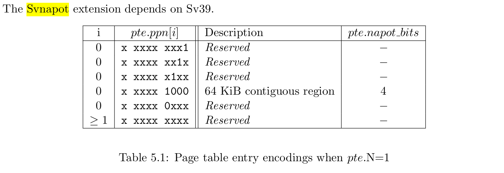

结束系统能力大赛之后，我尝试投了许多老师，但是都没能找到一份合适的实习。后面在软件所牢学长的推荐下了解到了 PLCT，读完了他们的招新文档之后，我有一种找到组织了的感觉，于是我成功的进入了 PLCT 的 rvlk 小队进行实习，开始准备成为一名真正的 Kernel Developer。

## 环境配置

## Patch Review

开发内核首先要从 review 别人的优秀 patch 开始.

### [RFC PATCH v2 00/21] riscv: Introduce 64K base page

邮件地址：https://lore.kernel.org/all/20241205103729.14798-1-luxu.kernel@bytedance.com/

这是一个由字节的开发者提交的 patch，旨在使用软件方法为 RISCV 支持 64k 大小的页表（现有 MMU 只支持 4k），以提高性能表现。邮件交流过程中有其他开发者提到了 64k 页表潜在的内存内碎片问题，但是字节的开发者表示他们在 ARM 架构上的测试表现出了非常逆天的性能优化，所以想在 RISCV 上也试一下。

#### 实现方式

64k 页表的原理是通过将 16 张标准的 4k 大小页表的空间连续分配，并通过 RISCV 的 Svnapot（supervisor virtual naturally aligned power-of-2） Standard Extension 实现加速内存访问。

Svnapot 要求 pte 的第 63 位也就是 N 位为 1，然后会根据 pte 中 ppn 的编码判断扩展的大小，具体编码如下图所示。

可以看出实际上目前只支持 64k 的扩展，其余全部都是 reserved。~~从名字 naturally aligned power-of-2（自然对齐的二次方）也能看出来这个也扩展只支持二的幂次大小，这也非常好理解，因为两个 pte.ppn[0] 的 x xxxx 1000 之间恰好隔了 16，也就是 16 个 4k 页。~~ 这里的理解有误，还没有很好的理解这个扩展，需要继续研究。