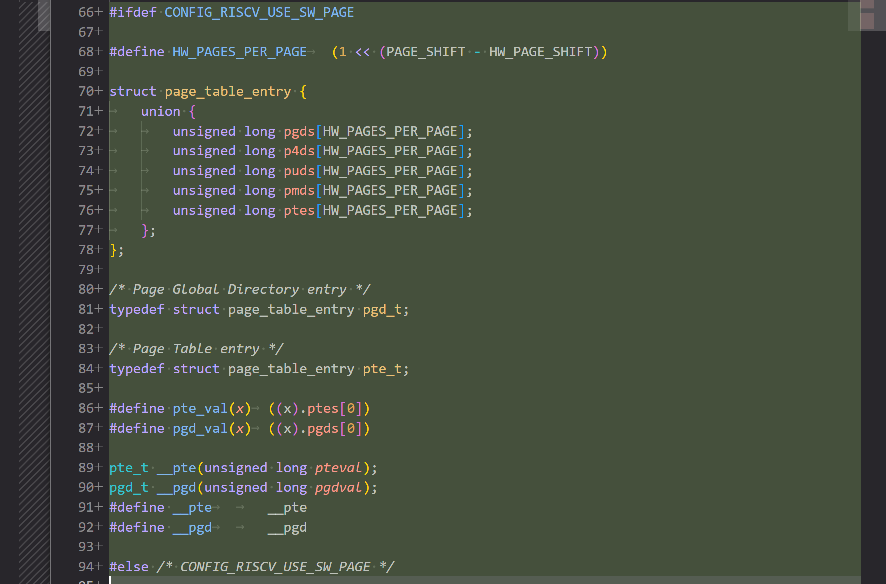
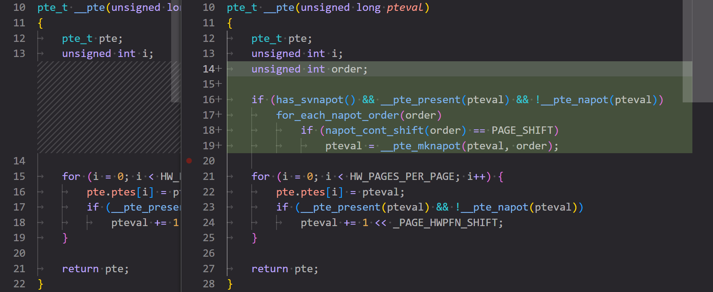

结束系统能力大赛之后，我尝试投了许多老师，但是都没能找到一份合适的实习。后面在软件所牢学长的推荐下了解到了 PLCT，读完了他们的招新文档之后，我有一种找到组织了的感觉，于是我成功的进入了 PLCT 的 rvlk 小队进行实习，开始准备成为一名真正的 Kernel Developer。

## 环境配置

### Kernel 环境

使用组内 Linux Kernel 仓库，由于完整代码仓库过于大，因此只 fetch 我们需要的那个版本的 commit。

```bash
# 浅 clone，只取 10 个 commit
git clone --single-branch --depth 10 -b master <git-address-of-repo>
# 取我们需要的那个 commit 的版本（v6.12），组内的 repo 没有保留 tag 信息，所以查询了 commit 号
git fetch origin adc218676eef25575469234709c2d87185ca223a
# 基于这个节点创建一个新分支并推上去，然后就可以在自己的分支上进行 patch 测试或者开发了
git checkout -b riscv-64k
git push -u origin riscv-64k:onfoo/sazikk/foo/bar/feature/branch/riscv-64k
```

配置内核

```bash
# 以 RISC-V 架构为例
make ARCH=riscv CROSS_COMPILE=riscv64-linux-gnu- defconfig
```

编译内核

```bash
# RISC-V架构
make ARCH=riscv CROSS_COMPILE=riscv64-linux-gnu- -j$(nproc)
```

完成编译后，将系统镜像复制到工作目录即可，对于 RISCV，镜像在 `arch/riscv/boot/Image` 目录下。

### Mail Patch 处理

对于邮件中提到的 patch，我们可以从这里下载完整的 mbox 文件：


解压之后就可以获得打包了所有 patch 的 mbox 文件，通过 `git splitmail` 可以进行 patch 拆分：

```bash
# git mailsplit -o<des-path> <src-path>
git mailsplit  -o. RFC-PATCH-v2-01-21-riscv-mm-Distinguish-hardware-base-page-and-software-base-page.mbox
```

这里要注意拆分之后获得的 `0001` `0002` 文件**不是**按照 patch commit 的顺序编号的，而应用 patch 必须要按照其 commit 的顺序来。虽然可以在邮件原文里看到这是第几个 patch，但是一个个点开看还是太唐了，所以我写了一个 sh 脚本来重命名全部的 patch，简单的检测了每个 patch 的标题中的编号：

```shell
#!/bin/bash

# 遍历所有以0开头的文件
for file in 0*; do
    # 检查文件是否存在
    if [ -f "$file" ]; then
        # 使用grep在文件内容中查找xx/21模式
        content=$(grep -o '[0-9]\{2\}/21' "$file" | head -n 1)
        if [ ! -z "$content" ]; then
            # 提取数字部分
            num=${content%/*}
            # 重命名文件
            mv "$file" "patch$num"
            echo "Renamed $file to patch$num"
        fi
    fi
done
```

最后我们就可以在我们的 kernel repo 中应用全部的 patch：

```bash
# git am <your-patch>
git am patches/patch01
...
```

## Patch Review

开发内核首先要从 review 别人的优秀 patch 开始.

### [RFC PATCH v2 00/21] riscv: Introduce 64K base page

邮件地址：https://lore.kernel.org/all/20241205103729.14798-1-luxu.kernel@bytedance.com/

这是一系列共 21 个由字节的开发者提交的 patch，旨在使用软件方法为 RISCV 支持 64k 大小的页表（现有 MMU 只支持 4k），以提高性能表现。邮件交流过程中有其他开发者提到了 64k 页表潜在的内存内碎片问题，但是字节的开发者表示他们在 ARM 架构上的测试表现出了非常逆天的性能优化，所以想在 RISCV 上也试一下。不过他们提到在 riscv64 上的性能测试正在进行，他们争取在下一个版本给出性能数据。

#### patch 实现思路

64k 页表的原理是通过将 16 张标准的 4k 大小页表的空间连续分配，并通过 RISCV 的 Svnapot（supervisor virtual naturally aligned power-of-2） Standard Extension 实现加速内存访问。

Svnapot 要求 pte 的第 63 位也就是 N 位为 1，然后会根据 pte 中 ppn 的编码判断扩展的大小，具体编码如下图所示。


可以看出实际上目前只支持 64k 的扩展，其余全部都是 reserved，内核源码注释中也提到了这一点。这是因为细粒度的中间页面大小是否有用还有待证实，所以作为第一步，目前仅决定标准化 64k 的页表。


这个扩展允许厂商自己处理 tlb 条目大小，比如对于目前支持的 64k ，tlb 条目可以是一条，也可以被分割为数条，其中每一条指向的内存区域大小都是 2 的幂次。这里的自定义条目大小目前支持 64k 和 4k，但是目前是否支持比如 8 16 32 这种大小我并不确定，因为目前这些大小的页还未支持，也就是说在 N 位置位的情况下，这个 pte 必须符合 64k 的标准，不然会抛出 page fault，况且手册中举的例子也是 64k 条目和 4k 条目。

关于完整支持了 64k tlb 条目的 riscv soc 测试参见这篇论文：[Design, Implementation and Evaluation of the SVNAPOT Extension on a RISC-V Processor](https://sazikk.top/assets/figures/pdf/2406.17802v1.pdf)

这篇文章使用了刚刚支持 svnapot 的 6.5 linux 内核，使用了 mmap 的特殊标志 `MAP_HUGE_64KB` 来创建 64k 页。

值得一提的是，这个 patch 虽然想法很好，可惜的是我在市面上没找到哪个 soc 支持了 svnapot ，可用范围不大。

#### 代码实现

##### patch 01/21: Distinguish hardware base page and software base page

第一个 patch 首先是把软件页表和硬件页表的概念拆分开来。在一个 4k MMU 上实现 64k 页表的关键就是在内核视角解耦合软件页表和 MMU 的页表，为了做一个明确的区分，这里将 MMU 页表称为硬件页表。解耦软件页表和硬件页表，就是在管理、分配映射内存的时候按照软件页表粒度进行（即 64k），而在处理具体页表项时还是按照硬件页表粒度（4k）进行处理。

代码上第一个 patch 主要修改了页表相关的一些常用宏，如 `PAGE_SHIFT`、`_PAGE_PFN_MASK` 以及 `PAGE_SIZE` 等，为这些宏增加了硬件页表的版本并在宏名中以 `HW` 标识，便于对于硬件页表和软件页表使用不同的宏进行处理，并增加了软件页号和物理页号的转换宏。同时这个 patch 修改了 kconfig ，当系统配置的软件页大小 (PAGE_SHIFT) 与硬件页大小 (RISCV_HW_PAGE_SHIFT) 不一致时，提供一个开关 (RISCV_USE_SW_PAGE) 来启用软硬件页面大小不同的支持

##### patch 02/21: Configure satp with hw page pfn

做完第一个 patch 的操作后，下面其实就是逐步替换和 page 相关的实现。patch 2 主要维护了 satp 寄存器相关的实现，这里显然应该以硬件页表的粒度考虑问题，因此做了少许修改以适配硬件页表，同时打包了几个函数用于处理 satp，因为现在内核视角看到的都是软件页表，不能按照之前的方式写入 satp。大致是封装了 `make_satp` `satp_pfn` 函数然后把所有读写 satp 的地方都套了一层。

一个有趣的小知识点，其中一个需要修改的写 satp 的地方是函数 `hibernate_restore_image()` ，这个函数用于休眠后恢复系统镜像，同时因为这个函数必须被运行以从休眠中“苏醒”，所以这个函数被临时映射到了休眠使用的临时页表上，使用了函数 `temp_pgtable_mapping()`。~~原来干这种事不算石山，释怀了~~
 


##### patch 03/21: Reimplement page table entry structures

linux 内核使用 pte 结构体来管理页表项，但是现在我们拥有了 64k 的页表，足足 16 张连续的 4k 表，我们需要把 pte 结构体修改为数组结构，注意由于底层修改，所以整个页表架构都需要修改，因此需要把所有页表层级的结构体都改为数组，这里使用了上面的开关 (RISCV_USE_SW_PAGE) 作了一个条件编译。同时这个 patch 还维护了一下连续分配内存的情况，一般来说连续分配只要递增 pte 的 pfn 就行，这里因为一个软件 pte 对应 16 个硬件 pte 了，所以变成每一个硬件 pte 的 pfn 加 16 ，小细节。

这里有一个没看懂的部分，这个 patch 还加了一个整数到 5 种页表等级类型的转换，是原来 kernel 里没有这个东西？

原来 Linux 已经支持 5 级页表了。



##### patch 04/21: Reimplement page table entry constructor function

第四个 patch 重新实现了 pte 构造函数。这下看懂了，原来 patch 3 里那个莫名其妙的类型转换是为后面重写构造函数打个底，感情还没写完。这里就是依次构建软件页表项包含的 16 个硬件页表项，同时除了 pte 以外，另外 4 个页表等级还额外维护了大页情况。

值得一提这里改了 4 个文件，其中 3 个文件大部分是完全等价的重构，使我研究了很久才发现好像效果一点没变（

##### patch 05/21: Reimplement conversion functions between page table entry

这个 patch 通过直接转换结构类型来实现页表项的转换。linux 中一些代码会将高层级的页表项转换为低层级的页表项，以便重用 pte 相关的函数。例如，pmd_dirty() 会将 pmd 结构转换为 pte 结构，以使用 pte_dirty() 来检查是否为脏页。由于现在不同层级的 pte 结构有不同的构造函数，我们在转换过程中不能使用 pte 构造函数，所以这个 patch 修改了一下，加入了 pte 和 pmd pud p4d pgd 的互相的类型转换函数（其实实现就是直接强制类型转换hhh）。

##### patch 06/21: Avoid pte constructor during pte conversion

这个 patch 还是解决 pte 类型转换中的问题，具体问题出在为 pte 置位各种 flag 时，原本是直接写入 pte，现在因为软件 pte 和硬件 pte 分开，所以新写了一个处理 flag 的函数，在 64k 页表启用的时候特殊处理了一下。

commit msg 里说是因为构造函数的关系，但是我感觉似乎单纯只是因为 pte 结构体变了


##### patch 07/21: Reimplement page table entry get function

还是在按部就班的重构，这个 patch 重写了获取各级 pte 的方法，毕竟软件页表层级现在下辖 16 个硬件对应层级，不能直接拿来用了，这里使用了传统手艺：解引用。

##### patch 08/21: Reimplement page table entry atomic get function

这个 patch 实现了无锁函数来原子地获取 pte 的值。对于每个 pte 结构体，我们首先原子地获取第一个映射项，然后在循环中获取后续项并将它们与第一个映射项加上特定步长后的值进行比较。如果我们发现它们的页帧号 (pfn) 或权限位 (prot) 有任何差异，那就说明 pte 结构已被修改，需要重新加载。原理是利用了 `READ_ONCE` 宏保证原子的读取第一个映射项的值，然后循环验证，同样的要注意大页的情况。

`READ_ONCE` 真是一个玄妙的宏，看他的实现我的评价是眼花缭乱，可以防止编译器优化、保证原子性还能当内存屏障用。

虽然用 goto 是坏文明，但是这段可读性还挺好的。


##### patch 09/21: Replace READ_ONCE with atomic pte get function

第九个 patch 正式的把所有 `READ_ONCE` 读页表项的地方换成了自己实现的的无🔒函数，还把 `WRITE_ONCE` 也改了，不过是改成直接用 `=` 赋值，对，对吗？（

这个 patch 还额外修改了一下页面老化检查机制的实现，即 `ptep_test_and_clear_young()` 函数，这里没有深究原因，不过肯定是和读写 pte 方式需要修改有关。

##### patch 10/21: Reimplement PTE A/D bit check function

这个 patch 继续完善页面老化机制，即维护 pte 的 A/D 位的问题，改为了遍历软件 pte 对应的 16 个硬件 pte 并一一置位 DIRTY/ACCESSD

所有的修改就是围绕 pte 变大导致的连锁反应，当你把一个常用变量改成数组belike.jpg

##### patch 11/21: Reimplement mk_huge_pte function

大页的页表项(Huge pte)可以是 PUD、PMD 或 SVNAPOT PTE。来自不同页表级别的大页页表项具有不同的页表项构造函数。这个 patch 重新实现了 `mk_huge_pte()` 函数。我们将 `vma` 结构作为参数，用于检查目标大页页表项的级别并应用相应的构造函数。这里通过 `huge_page_shift(hstate_vma(vma))` 来获取与 vma 关联的大页信息并获取大页偏移量，不清楚两个函数的具体实现，因为我通过 ctag 获取到的函数原型里，`hstate_vma()` 直接返回 NULL， `huge_page_shift()` 直接返回常量 `PAGE_SHIFT` ，这肯定不对劲是吧，所以可能是跳转到了一个错误的版本或者压根没有完整实现，因此先搁置再议。获取到了大页偏移量后，再根据这个偏移量的大小来确定这是哪一个层级的大页并构建对应 pte，然后再把所有 `mk_huge_pte()` 函数的引用替换为新版本，这个 patch 的工作就完成了。

##### patch 12/21: Reimplement tlb flush function

当 tlb 刷新与某个地址对应的页时，CPU 实际上只刷新第一个 4K 硬件页的 tlb 项。这个 patch 重新实现了 tlb 刷新函数，以刷新同一软件页面中硬件页面的所有 tlb 条目。 patch 的修改很简单，就是把先前刷新一条 tlb 的函数改成了循环刷新接下来的 16 条。

~~这里引出了一个问题， svnapot 的优化点究竟在哪里？既然 64k 页表拥有和 16 个 4k 页一样的 16 个 tlb 条目，刷新时还要保证都刷新，那怎么能降低 tlb miss 率？怎么能优化性能？~~

~~再次细读手册，这下大概看明白了，svnapot 扩展的支持需要 soc 设计的支持，并允许 soc 设计者自行决定适配多大的 tlb 条目，可以是 64k，也可以是 4k，这里 patch 显然是考虑 4k tlb 条目的情况。但是在 4k tlb 条目的条件下，很难说 tlb miss 率能有多大的优化。~~

很高兴上面的两段话全大错特错，由于 ISA 允许厂商自行决定一个 napot pte 在 tlb 里存的条目对应的大小，所以对于一个 64k 的 napot pte，他的 tlb 条目**目前**有可能是一个，也有可能是十六个（按 4k 分割），而内核层面不知道这个具体实现，所以必须进行多次刷新确保不漏掉任何可能性。这里的设计实在非常精妙，没有深入理解 svnapot 这个扩展绝对无法理解这段代码。

读到这里才发现原来如何在 riscv 架构下刷新单个地址对应的 tlb 和地址空间对应的 tlb 在 Linux 里可以抄作业：
`ALT_SFENCE_VMA_ADDR` 和 `ALT_SFENCE_VMA_ADDR_ASID` ，其中名字里的 ALT 是因为这个版本的宏适配修复了 sifive 特定几个 soc 的 bug。

##### patch 13/21: Adjust PGDIR/P4D/PUD/PMD_SHIFT

这个 patch 调整了每个页表级别的 pte 索引位的偏移量。比如 SV39 下，所有的级别的位置都左移了 4 位，因为基础页大小是 64k，所以需要 16 位而不是 12 位页内偏移，但是最高一级 pgd 没有位移而是失去了他的低 4 位，变成了 5 位。具体代码上就是修改了一堆常量，从原来的写死变为和 `PAGE_SHIFT` 有关。

不知道为什么许多和 32 位有关的东西也要改，因为 svnapot 只支持 64 位，大概是因为 64 位系统也要用 32 位的部分代码。

谁家好人在 commit msg 里画图（


##### patch 14/21: Only apply svnapot region bigger than software page

这个 patch 更新了计算 napot order 的方法，原先的 napot order 基于软件页面数量计算，现在软件页面大小改了，计算方法自然要更新。同时这个 patch 还修改了大页机制，当大页大小不大于软件页表时就不生效。

napot order 用于指定内存区域的大小，含义是二的幂次的大小的页面的阶数，如 4k 页的 order 是 12，8k 是 13。虽然 claude 说 napot order 主要用于 PMP(Physical Memory Protection) 配置中，但我看在创建大页时也有用到。


##### patch 15/21: Adjust FIX_BTMAPS_SLOTS for variable PAGE_SIZE

这个 patch 修改了 `FIX_BTMAPS_SLOTS` 常量以适配更多页大小，原本是写死的 7。这个 patch 就改了两行。

`FIX_BTMAPS_SLOTS` 是在 Linux 内核中用于固定映射区域（Fixed Mappings）的一个配置，特别是用于块设备临时映射（Block Temporary Mappings）。

这块代码不太懂，没有看懂这里的修改原因。

##### patch 16/21: Adjust FIX_FDT_SIZE for variable PMD_SIZE

这个 patch 修改了 `FIX_FDT_SIZE` 常量以适配更多 `PMD_SIZE`，原本写死了加 `MAX_FDT_SIZE` + 2M。这个 patch 也就改了两行。

##### patch 17/21: Apply Svnapot for base page mapping if possible

这个 patch 真正引入了 svnapot 来减少 tlb 条目，具体做法是在创建 pte 时判断当前这个页大小和哪个二的幂次符合，符合哪个就创建成哪个大小的 napot pte，这里自然默认是 64k 大小。

可扩展性真的做的很好面面俱到。



##### patch 18/21: Introduce 64K page size

这个 patch 引入了新的配置来控制是否在 RISC-V 上启用 64K 基本页特性。64K 配置将软件页面大小设置为 64K，并自动使用 svnapot 来加速基本页面映射。这里只修改了 Kconfig。

##### patch 19/21: Adjust mmap rnd bits for 64K Page

修改了 Kconfig 里的参数 `ARCH_MMAP_RND_BITS_MAX`，这个参数指定了地址空间布局随机化（KASLR）中随机化位数的最大值。

##### patch 20/21: Adjust address space layout and init page table for 64K Page

这个 patch 调整了地址空间布局并初始化了 64K 页表，具体上就是修改了 SV39 和 SV48 中内核地址空间的起点以保证 64k 页表情况下的对齐。初始化页表的部分没有很看懂。

SV39 内核地址空间起点叫：`PAGE_OFFSET_L3`
SV48 内核地址空间起点叫：`PAGE_OFFSET_L4`

##### patch 21/21: Update EXEC_PAGESIZE for 64K Page

最后一个 patch 为 64k 页表定义了 `EXEC_PAGESIZE` 常量，这是可执行文件的页大小常量。

#### patch 测试
##### 测试环境：
- Ubuntu 22.04.5 LTS (GNU/Linux 6.8.0-49-generic x86_64) （ 806 服务器 ）
  - qemu-9.2.0
##### 测试方案：
基于 v6.12 稳定版打 patch，跑一些简单的 testbench，测试 redis、MySQL 等性能，与稳定版进行对比

##### 测试流程：

按照 Nextcloud 的文档用 qemu 启动了一下 kernel，这里遇到了一个[抽象的问题](https://sazikk.top/assets/figures/pdf/bug-when-cp.pdf)，硬控我一晚上。

成功启动 kernel 之后我意识到一个简单的手搓 rootfs 没办法满足我的测试需要，这里可以选择各个发行版的 rootfs，也可以去找其他的 mini-rootfs。这里我选择了 alpine-minirootfs，他本体大小只有 2m，如果基础工具链齐全，后面所有的测试就都会基于这个 fs 来做。

