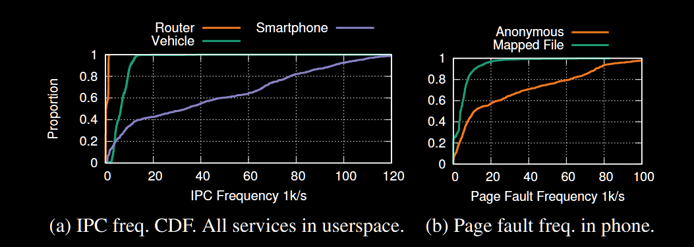

打完比赛后一直对鸿蒙和微内核架构很感兴趣，于是抽出时间阅读了这篇论文。

### 文章概述：

本文介绍了鸿蒙微内核架构的设计和实现，重点描述了传统微内核的性能瓶颈以及鸿蒙针对性的优化方式。

### 现实问题：

移动设备系统、嵌入式系统以及车载系统等新兴场景需要内核拥有更好的安全性、可扩展性和性能，以 linux 为代表的宏内核并不擅长这些场景，**微内核**在这些方面拥有显著的架构优势，但主流的微内核架构在**性能和兼容性**上存在很多问题。

#### 问题一：软件生态

在以智能手机为代表的新兴场景中，很多应用和库以二进制形式分发，仅仅满足 posix 标准并不足以兼容，需要能够兼容 linux ABI。

#### 问题二：资源管理

在为专门领域设计的系统中，应用程序较少，硬件资源优先，所以内核往往负责预留资源，应用程序自己管理，但在新兴场景中，多个应用程序竞争资源，因此需要内核有更完善的资源管理机制，实现高效而公平的资源管理和分配。

#### 问题三：性能

领域特定场景下的微内核往往更加重视安全性和严格的资源隔离，性能不是关键点，但在新兴场景中，性能也是重中之重，因为性能直接决定用户体验以及由此带来的内核的广泛部署。

#### linux 的问题：

1. 安全可靠性不足。其文件系统和大量驱动贡献了大量 CVE 漏洞，并且其中 80% 的漏洞都可以通过正确的隔离解决，而且由于代码的紧密耦合，很难对其进行优化和重构。同时，内核模块的不稳定也导致了频繁的升级，使内核在实际部署中不太实用
2. 通用和专业化的冲突。linux 的目标是通用化，然而最新的 patch 在向服务器和云倾斜，甚至影响到了部分其他场景。同时，快速增长的各种设备需要专门的策略来保证性能和能耗，而对于 linux 进行针对性优化不仅需要消耗巨量人力，还很难并入内核主线。
3. 定制化和内核更新的不兼容。定制化的内核和内核主线同步需要花费大量努力，而 linux 频繁更新的内核 API 更是阻碍了同步，这导致了实际部署内核时的内核定制化非常困难。因此，市面上大量产品仍在使用 linux 2.6。

### 针对问题的观察

由于鸿蒙早已广泛部署商用，所以收集了很多如手机、路由器、汽车等具有代表性的场景下的运行数据。

#### 观察一：新兴场景中 IPC 频率快速增加

当所有 OS 服务被限制在用户地址空间时，部分新兴场景下的 IPC 频率如图（a）所示：

智能手机（平均 41k/s）和车辆（平均 7k/s）的 IPC 频率远高于路由器（平均 0.6k/s，更接近领域特定场景），而从图（b）（e）（f）中可以看出，更高的 IPC 频率不仅仅是因为更高的 syscall 频率（61k/s，路由器的 13 倍），还因为大量的文件操作（与文件系统的 IPC），以及在映射在内存上的文件上触发了大量的 page fault，这需要内存管理器和文件系统之间的大量 IPC。

