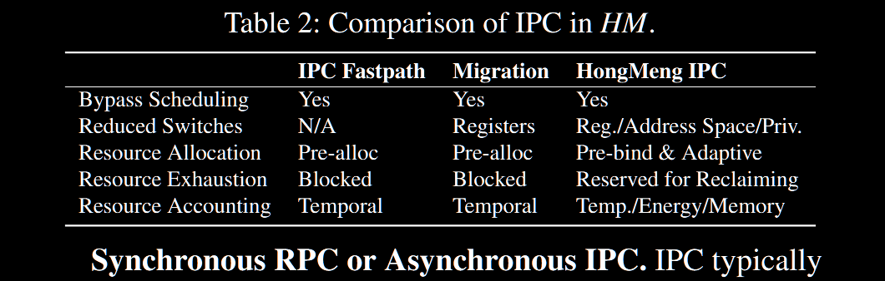

打完比赛后一直对鸿蒙和微内核架构很感兴趣，于是抽出时间阅读了这篇论文。这篇博客的主要内容是对了论文的总结，并加入了大量我自己的思考。

### 文章概述：

本文介绍了鸿蒙微内核架构的设计和实现，重点描述了传统微内核的性能瓶颈以及鸿蒙针对性的优化方式。

### 背景

**微内核是什么**？微内核与传统的通用内核架构宏内核相对。在**宏内核**中，内存管理、文件系统等操作系统的主要功能全部被集成在内核中，各个功能之间的通信开销小，因此具有优秀的性能，但是紧密耦合的各个操作系统服务也带来了较差的安全性和可扩展性，因为单个服务难以被拆分/升级，且一个服务的崩溃就会引发整个内核的崩溃。相对应的，**微内核**只在核心内核中保留必要的功能，比如调度、内存管理、访问控制机制等，将其余的功能隔离在内核之外，作为独立的服务进程运行在用户地址空间，这有效提高了安全性以及服务的可扩展性，可以简单的对单个服务进行更换和升级，单个服务的崩溃也不会影响到核心内核的运行。但是微内核隔离了各个系统服务，导致需要大量使用 IPC（Inter Process Communication） 来替代宏内核中部分 syscall 和函数接口的功能，这严重的影响了性能。

只在核心内核中保留必要的功能也被称为**微内核的最小化原则**。

SOTA 微内核采用了细粒度的**基于能力的访问控制**以保持**最小权限原则**。这与最小化原则一起为微内核提供了比宏内核更高的安全性、可靠性和可扩展性。**基于能力的访问控制**是指把权限抽象为能力，只有拥有一定能力（具体表现为特定的 token）的服务才能访问相应资源，而**最小权限原则**是指程序/进程只能获得完成任务所需的最小权限

智能手机、智能汽车等新兴场景要求内核拥有更好的安全性、可扩展性和性能，宏内核并不擅长这些场景，而**微内核**在这些方面拥有显著的架构优势。不过 SOTA 微内核设计大多针对特定领域（sepcific domain），如嵌入式和高安全要求场景，通常使用静态资源分区，面对新兴场景在**性能和兼容性**上还存在很多问题。

工业界采取了一些混合内核设计比如 Windows NT 和 Apple XNU 等，将最小化微内核和其他服务结合。尽管这些混合内核也保持了内核的最小化，但是他们并没有完全继承微内核的优点，比如这些混合内核设计没有很好的隔离各个服务，并且没有遵循**最小权限原则**。因此，任何服务的 bug 都可能导致整个系统的崩溃。

#### 问题一：软件生态兼容性

在特定领域的场景中，应用程序往往是针对需求和环境定制的，因此符合 posix 标准就被认为足以兼容应用，但在以智能手机为代表的新兴场景中，很多应用和库以二进制形式分发，仅仅满足 posix 标准并不足以兼容，还要求 Linux ABI 兼容性。

#### 问题二：资源管理
在特定领域的场景中，应用程序较少，硬件资源优先，所以内核往往负责预留资源，应用程序自己管理，但在新兴场景中，多个应用程序竞争资源（大量来自第三方应用程序，且新兴场景需求多样），因此需要内核有更完善的资源管理机制，实现高效而公平的资源管理和分配。

#### 问题三：性能

在特定领域的场景中，微内核优先考虑安全性和严格的资源隔离，并主要用于静态应用程序，性能不是关键点，但在新兴场景中，性能也是重中之重，因为性能直接决定用户体验并籍此影响内核的广泛部署。尽管 SOTA 微内核如 sel4 已经实现了破纪录的高 IPC 性能，但是他们仍会因为新场景下高频率的 IPC 、多服务端设计导致的状态双重簿记、基于能力的访问控制等问题造成不小的性能开销。

#### linux 的问题：

1. 安全可靠性不足。其文件系统和大量驱动贡献了大量 CVE 漏洞，并且其中 80% 的漏洞都可以通过正确的隔离解决，而且由于 linux 代码固有的紧密耦合，很难对其进行优化和重构。同时，内核模块的不稳定也导致了频繁的升级，使内核在实际部署中不太实用
2. 通用和专业化的冲突。linux 的目标是通用化，然而最新的 patch 在向服务器和云倾斜，甚至影响到了部分其他场景。同时，快速增长的各种设备需要专门的策略来保证性能和能耗，而对于 linux 进行针对性优化不仅需要消耗巨量人力，还很难并入内核主线。
3. 定制化和内核更新的冲突。定制化的内核和内核主线同步需要花费大量努力，而 linux 频繁更新的内核 API 更是阻碍了同步，这导致了实际部署内核时的内核定制化非常困难。因此，市面上大量产品仍在使用 linux 2.6，其生命周期早已结束。

### 针对问题的观察

由于鸿蒙早已广泛部署商用，所以收集了很多如手机、路由器、汽车等具有代表性的场景下的运行数据。

#### 观察一：新兴场景中 IPC 频率快速增加

当所有 OS 服务被限制在用户地址空间时，部分新兴场景下的 IPC 频率如图（1a）所示，智能手机（平均 41k/s）和车辆（平均 7k/s）的 IPC 频率远高于路由器（平均 0.6k/s，更接近领域特定场景），而从图（1b）（1e）（1f）中可以看出，更高的 IPC 频率不仅仅是因为更高的 syscall 频率（61k/s，路由器的 13 倍），还因为大量的文件操作（与文件系统的 IPC），以及在映射在内存上的文件上触发了大量的 page fault，这需要内存管理器和文件系统之间的大量 IPC。

**结论**：相比起提高 IPC 性能，减少 IPC 频率也很重要。

#### 观察二：分布式多服务端导致状态双重簿记

在传统的宏内核设计中，所有服务包括文件系统、内存管理都在内核空间，页缓存、文件描述符等信息都作为全局变量由内核统一管理，仅需要维护一份；但在微内核架构的分布式多服务端设计中，文件系统服务和内存管理服务是隔离的，他们各自需要一份页缓存来加速文件访问/管理内存映射，并且两个服务都需要记录文件描述符，这就是状态双重簿记（state double bookkeeping）

微内核设计的最小化准则决定了共享资源（比如 fd 和页缓存）没有被集中化管理而是分布式存放，但是如图（1c）（1d）（1e）所示，新兴场景下的应用程序经常调用 poll 等函数，这些函数较为依赖对于这些共享资源的集中管理。图 2 进一步展示了应用程序启动的 CPU 火焰图，这对于文件映射的性能依赖很大，同时也对用户体验至关重要。如图所示， 16% 的时间倍用来处理页缓存未命中，比 linux 慢一倍，且状态双重簿记在文件系统和内存已经消耗了 120MB 的基础上额外消耗了 50MB 的内存。

#### 观察三：基于能力的访问控制阻碍了高效合作

基于能力的访问控制将内核对象隐藏在不同能力后面，这导致了某些内核对象的频繁更新（比如页表）从而引入了显著的性能开销，并阻碍了他们之间的高效合作，比如这可能会导致匿名页错误的处理比 linux 慢 3.4 倍，这种情况在智能手机中尤为常见（平均 27k/s，占图（1b）中的小型 page fault 的 80%），并且给应用程序增加了不小的启动开销时间（图 2 中的 4%）。

#### 观察四：生态兼容性要求不仅仅是符合 POSIX 标准

许多 SOTA 微内核通过使用自定义运行时库来实现 POSIX 合规的最小子集，这些库直接链接到应用长须，并生成 IPC 到系统服务，但是这样面临着二进制不兼容的问题以及需要一个自定义构建环境。此外，因为 Linux 使用文件作为统一的接口，而微内核内没有这样的接口，实现高效的 fd 复用以及向 ioctl 这样的向量系统调用变得很有挑战性，而这些系统调用在新兴场景非常常用（如图（1c-1e））

#### 观察五：新兴场景部署需要高效的驱动复用

在智能手机上部署鸿蒙时，我们发现所需的驱动数量大幅增加，对于路由器，所需的驱动少于 20 个，但是对于智能手机和车辆，则需要超过 700 个。我们估计重写这些驱动需要花费 5000 人/年，并且需要时间持续成熟和演化。所以，重用驱动是一个更明智的选择。然而，之前的工作，包括一直驱动的运行时环境和使用虚拟机等，面临着兼容性、工作量和性能方面的挑战。

### 鸿蒙的宏观设计

鸿蒙的设计总体上尊重微内核的设计准则，但是没有极端的追求而是做出了一些取舍。

#### 原则一：保持最小化

微内核的安全、可靠、可扩展来自于三个基本的架构设计原则：

1. **分离策略（Policy）和机制（Mechanism）**。内核仅提供基本的机制，具体策略由用户态服务实现。
2. **解耦和隔离系统服务**。把 OS 服务分解为独立组件，服务之间严格隔离并降低互相依赖。
3. **细粒度的访问控制**。遵循最小权限原则，严格控制资源访问权限。

鸿蒙只**在核心内核中保留最小和必要的功能**，包括线程调度器、串口和定时器的驱动以及访问控制器，其他所有功能都被限制在**隔离的操作系统服务**中，比如进程/内存管理，驱动和文件系统。同时，鸿蒙采用了**细粒度的访问控制**以保持最小权限原则

**保留：拥有良好隔离的系统服务并保持最小权限原则的最小化微内核**

#### 原则二：性能优先

微内核在新兴场景中的巨大优势被架构固有的性能问题所损害。因此鸿蒙**没有强制执行严格而统一的隔离，而是提供结构上的支持来组装系统**，以满足性能和安全需求。同时，鸿蒙除了**采用类似 RPC 的快速路径来解决资源分配/耗尽/簿记问题**，还提出了**差异化的隔离类**，通过放宽受信任操作系统服务之间的隔离来减少 IPC 开销。鸿蒙还**将紧密耦合的操作系统服务整合在一起**（图三中的❶），以尽可能降低 IPC 频率。此外，鸿蒙**使用地址令牌（token）补充能力**（基于地址令牌的访问控制），实现高效的内核对象共同管理（图三中的❷），从而加速**对匿名内存的无策略内核分页**（policy-free kernel paging of anonymous memory）。

**灵活：通过提供结构性支持以实现灵活组装，适应多样化场景，从而优先考虑性能**

#### 原则三：最大化生态兼容性

鸿蒙通过一个 shim（图三中的❸） 层来实现与现有软件生态的兼容，确保 **Linux ABI 兼容性**，这个 shim 层把所有 Linux syscall 重定向到适当的操作系统服务，并作为一个中心储存库来存储和翻译 Linux 系统抽象（比如 fd），从而高效支持 poll 等功能。此外，鸿蒙通过**驱动程序容器**（图三中的❹）提供一个从 Linux 主线派生的运行环境来复用原版的 Linux 设备驱动，这样所需的工作量较少。鸿蒙还进一步利用**分离控制层和数据层**来提高驱动程序的性能（图三中的❺）。

**增强：通过实现 Linux API/ABI 兼容和高性能的驱动程序复用来最大限度地提高兼容性。**

### 鸿蒙的威胁模型

鸿蒙为了防止恶意应用程序和操作系统服务访问彼此的内存，并确保数据的机密性、完整性和可用性（CIA），维持了类似于现有微内核的威胁模型，但有以下不同：

#### 集中式内存管理

由于新兴场景中的应用程序出于兼容性原因需要集中式内存管理，内存管理器和它整合的服务（在部署的手机上只有文件系统）会不可避免的访问应用程序的地址空间。此外，在内存由自身管理的安全关键场景中，鸿蒙就不会创建这样的集中式内存管理器。

#### 部分妥协

出于性能考虑，存在对一些额外的攻击面、故障域的划分以及额外的数据泄露可能性（只存在于精心选择的对象）的妥协。

### 鸿蒙的性能设计

#### 同步的类 RPC 式 IPC 快速路径

**同步还是异步 IPC**

IPC 通常假设两端对称，也就是拥有相同执行模型。因此以往的研究提议异步 IPC 可以避免多核上的串行化，允许双方都能不阻塞的运行。然而，在新兴场景中，鸿蒙团队观察到大多数 IPC 都是过程调用，可以清楚识别调用方和被调用方。此外，操作系统服务主要是被动调用的而不是连续工作的，并且应用程序后续的操作大多依赖于过程调用的结果（也就是不能异步）。因此，同步远程过程调用（RPC Remote Procedure Call）是服务调用更适合的抽象。

鸿蒙采用类似 RPC 的线程迁移作为服务调用的 IPC 快速路径。当发送 IPC 时，核心内核执行直接切换（绕过调度），只切换栈指针和指令指针（避免切换其他寄存器）以及保护域。具体地说，鸿蒙要求操作系统服务注册一个处理函数作为入口点，并准备一个执行堆栈池。当应用程序调用服务时，核心内核在一个调用堆栈中记录调用者的栈指针和指令指针，并切换到处理函数和准备好的执行栈。在返回时，鸿蒙从调用堆栈里 pop 出 entry 并跳转回调用者。 IPC 的参数主要由寄存器传递，附加参数通过共享内存传递。

虽然鸿蒙绕过了调度并避免切换寄存器，但是由于权限级别/地址空间切换和缓存/TLB污染（占总 IPC 成本的 50%），仍然面临着显著的性能下降。鸿蒙团队使用差异化隔离类进一步弥补了这一性能差距。

**资源分配**

大部分之前的工作都忽视了 IPC 的内存占用。然而，由于智能手机等新兴场景中的极高频 IPC 和海量的连接数（同一时间 >1k 线程），鸿蒙团队发现在生产中考虑 IPC 内存占用非常重要，因为它可能会导致严重的问题，比如 OOM 甚至系统挂起。尽管鸿蒙的每个 IPC 连接仅需要一个单独的执行栈（而不是一个具有所有相关数据结构的成熟线程），但考虑搭配巨量的 IPC ，其内存占用仍然不小。

传统的做法是预分配固定大小的线程/栈池并绑定到各个连接，但是固定的大小很难确定，因为工作负载多样而且动态变化，比如不同 OS 服务的需求不同，运行的线程数量也在变化。一个大池会迅速耗尽内存，而动态分配则会在 IPC 关键路径上引入运行时开销。鸿蒙团队尝试过在线程创建的时候为每个 OS 服务创建并绑定堆栈，但是他们很快发现一些服务几乎不被某些线程使用造成浪费，并且存在一些到另一个 OS 服务的 IPC 链需要另一个堆栈。（最后一句没看懂）

因此，鸿蒙通过**为每个线程预绑定常用的 OS 服务（进程/内存管理和 fs）中的堆栈**，并同时维护一个大小在运行时自适应的堆栈池，从而找到了一个折中点。当剩余堆栈大小低于阈值时，OS 服务将分配更多堆栈以减少同步分配。鸿蒙还通过在 IPC 链调用同一个 OS 服务时重用堆栈来进一步减少了内存占用。

不是很懂这里的 OS 服务中的堆栈是什么。

**资源耗尽**

由于资源耗尽，IPC 是可能会失败的。具体来说，当堆栈池耗尽也就是出现 OOM 的时候，OS 服务无法分配新的堆栈处理 IPC 请求，而且应用程序无法处理这种问题（因为在宏内核中不存在 syscall 无法处理的情况）。因此，在 SOTA 微内核中，这类请求会被排队（阻塞），这可能导致严重的问题，比如循环等待死锁甚至系统挂起。

一种直观的想法是向内存管理器发送一个 IPC 回收内存，但是在这种已经 OOM 的情况下这个 IPC 也可能会失败。这种情况可能发生在作负载不确定且频繁发生重负载的新兴场景中（例如，手机同时打开多个应用程序）。

鸿蒙通过保留一个专门的堆栈池来解决这种问题，当 OOM 的时候，内核会使用这个堆栈池同步 IPC 到内存管理器进行内存回收，直到用户的 IPC 成功。（这何尝不是一种水多加面面多加水（）

**资源审计**

IPC 在处理请求时假定一个不同的执行实体，因此把消耗的资源都归属给 OS 服务，然而由于在新兴场景中竞争的应用程序需要明确的资源审计，因此消耗的资源应该准确的归属调用者应用程序。之前的工作通过继承调用者的调度上下文来实现时间的隔离，但是新兴场景还需要对能量（这里的能量指什么？）和内存消耗进行核算。所以，鸿蒙在处理 IPC 时记录用户应用程序的身份（IPC 链的根调用者），并把消耗的资源归属给他。

**决策：使用类似 RPC 的快速路径调用操作系统服务来解决同步/异步 IPC 问题，同时仔细解决资源分配/耗尽/审计问题**

#### 差异化隔离等级

**OS 服务的隔离**

将所有操作系统服务放在用户空间中可能会提高安全性，但无法满足新兴方案中的性能要求。鸿蒙团队观察到，并非所有服务都需要相同类别的隔离。特别是，成熟、经过验证和性能优先的操作系统服务可以进行较弱的隔离，以便在实际部署中获得最佳性能。此外，快速发展的服务可能会经常引入错误和漏洞，因此需要更强大的隔离来防止内核损坏。具有大型代码库和繁琐功能（如驱动程序）的操作系统服务需要隔离以减少可信计算基础（Trusted computing base, TCB）的大小。

鸿蒙采用差异化隔离等级（isolation classes, IC）为不同的操作系统服务提供定制的隔离和性能。具体来说，隔离等级对服务进行分类并定义它们之间的隔离。图 4 显示了不同隔离等级服务之间的往返IPC延迟，并与 seL4 和 Fiasco.OC 进行了比较。

**IC0：核心 TCB**
IC0 适用于经过仔细验证的、对性能极其关键的、可信的操作系统服务，如 ABI 兼容的 shim（部署中唯一的 IC0 服务）。这些服务与内核之间不强制隔离。因此，IPC 都是间接函数调用。

**IC0 威胁模型**
IC0 是核心 TCB 的一部分，任何被破坏的 IC0 服务都可以任意读取和修改其他服务的内存。因此，放置在 IC0 的服务应经过仔细验证以避免核心内核损坏。

**IC1：机制强制隔离**
IC1 适用于对性能关键和经过验证的操作系统服务。受之前的内核内隔离方法启发，鸿蒙将这些服务放置在内核空间中，并使用机制在服务之间强制隔离。

**决策：并非所有的操作系统服务都需要相同类别的隔离。采用差异化的隔离等级来放松受信任服务之间的隔离，以提高性能。**

#### 灵活的组装

**系统服务的分区**
虽然直观上操作系统服务应该是良好解耦的，例如文件系统和内存管理器，但是作者观察到操作系统服务并不是对称的，因为某些功能需要特定服务之间的紧密合作。例如，文件系统并不是访问文件的唯一入口。POSIX 支持通过内存管理器读取文件的文件映射，这种操作经常出现在关键路径上，显著影响用户体验。

隔离等级在同类操作系统服务之间强制执行相同的隔离。因此，没有进一步的结构性支持，鸿蒙仍然面临与宏内核相比的性能下降。首先，紧密耦合服务之间的频繁调用的 IPC 即使在 IC1（内核空间）中仍会导致明显的开销（内存映射文件的 page fault 处理开销为 20%）。此外，共享状态（如页面缓存）的双重簿记会引入显著的内存占用和同步开销。最后，没有全局视图的页面缓存来指导资源回收（例如 LRU）。

为弥合性能差距，鸿蒙采用了一种可配置的方法，允许在性能需求场景中合并紧密耦合的操作系统服务，以隔离换取性能，同时在安全关键场景中继续分离它们的能力。合并后，不再强制执行隔离，两个服务之间的 IPC 变为函数调用，而其他服务保持原状（良好隔离）。

合并还可以实现页面缓存的高效共同管理。与其在文件系统和内存管理器中都维护页面缓存，不如在合并时共同管理它们。这样消除了状态双重簿记和同步开销，并提供了高效回收的全局视图。为了保留分离它们的能力，鸿蒙提供了一种机制，当分离时，自动将共享页面缓存的访问转换为 IPC。然而，这会引入不小的开销。因此，在部署中，鸿蒙团队手动实现了两种版本（分离/共享）并相应地启用它们。

**性能**
如表 3 所示，将文件系统与内存管理器合并后，替换 IPC 可以将页面缓存未命中导致的页面错误处理延迟减少 20%（Sep. Cache）。通过共同管理共享页面缓存，延迟还可以进一步减少 30%（Shr. Cache），并实现与 Linux 5.10 相似的性能。合并还使 tmpfs 的写入吞吐量提高了 40%。此外，在智能手机中，合并服务的内存占用减少了 37%（FS + 内存）。

**安全性**
合并的服务位于一个单一的故障域，其威胁模型（作为一个整体）与其所在的隔离等级相同。因此，任何失效或被破坏的服务只能损害其合并的服务，这也是为了性能而做的主要妥协。因此，服务合并应经过仔细评估。在实践中，由于智能手机中文件操作的频率极高（图 1e），其性能目标只能通过将文件系统与内存管理器合并来实现。然而，与宏内核相比，安全性仍然得到提高（与其他服务隔离）。

**部署经验**
使用差异化隔离等级，鸿蒙支持灵活组合，允许关键组件灵活组装（用户空间或内核空间，分离或合并），能够根据场景需求探索隔离和性能之间的权衡，并能够使用相同的代码库从路由器扩展到智能手机。鸿蒙的演变见证了这样的探索。最初，所有服务都隔离在 IC2 上。为了实现性能目标，鸿蒙精心组装系统，通过保留以下规则来保留大多数安全属性。

首先，由于额外的攻击面，IC1 服务不能包含任何第三方代码。因此，尽管某些驱动程序对性能也至关重要，但鸿蒙将它们保持在 IC2 并通过控制/数据层分离加速。其次，服务合并，尤其是内存管理器，不可否认地削弱了隔离性和安全性（尽管与宏内核相比仍然有所改善）。因此，鸿蒙将其保留为可配置的，并且仅在手机上启用它。此外，IC0 不仅增加了核心 TCB，而且具有严格的内存限制和非阻塞要求。因此，在实践中，鸿蒙仅将 ABI shim置于 IC0 中（可以移出）。

**决策：OS 服务是不对称的。将紧密耦合的作系统服务合并，灵活组装系统，以满足各种场景下的多样化需求。**

#### 基于地址令牌的访问控制

SOTA 微内核让所有内核对象都是显式的，并受制于基于能力的访问控制，以保留最小特权原则，该原则主要以分区方式实现，在用户空间中保留一个令牌（通常是 slot ID），表示访问内核对象的权限。但是，在新兴场景中部署它时遇到了严重的性能问题。

**关系清晰但访问速度慢**
尽管能力（capabilities）在描述内核对象的外部关系（即授权链）方面非常有效，但访问它们的内部内容需要将令牌与操作一起发送到核心内核，这会由于特权切换和多个元数据表的访问而引入显著的性能开销。内核对象被隐藏在能力后面，只有核心内核可以访问它们。然而，由于最小化原则，一些内核对象的内容（例如，页表）应由核心内核之外的操作系统服务频繁更新，对于这些情况，分区实现的基于能力的访问控制已经不再高效。

一些微内核通过将特定对象映射到用户空间来加速访问。然而，它们只能应用于有限的几个对象（例如，内存对象、线程控制块的一部分和内核接口页）以确保安全，并且缺乏正确同步数据的能力，这阻碍了内核和操作系统服务之间的合作。为了解决这些问题，鸿蒙提出了一种基于广义地址令牌的方法，可以应用于更广泛的对象，从而实现高效的共同管理。

具体来说，如图 5 所示，在鸿蒙中每个内核对象被放置在一个独特的物理页上。将内核对象授予操作系统服务需要将该页面映射到其地址空间（❶）。因此，映射的地址作为令牌，用于直接从硬件访问内核对象，而无需内核参与。内核对象可以被授予（映射）为只读（RO）或读写（RW）。操作系统服务可以在不涉及内核的情况下读取只读的内核对象。要更新它们，需要使用新的系统调用 `writev`，传递目标地址和更新值，核心内核将通过参考内核对象的元数据来验证权限（❷）。对于读写内核对象权限，一旦授予，操作系统服务可以在不涉及内核的情况下更新它们（❸）。此外，对于小于一个页且具有相同属性（权限）和相似生命周期的对象，鸿蒙在分配时将这些对象批量放入一个页面，从而允许它们被集体授予和撤销。

