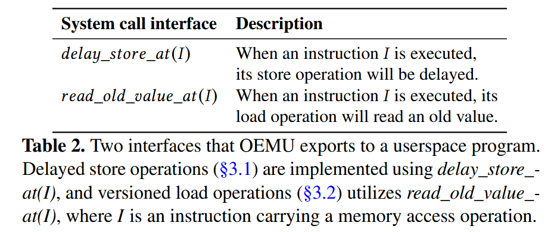
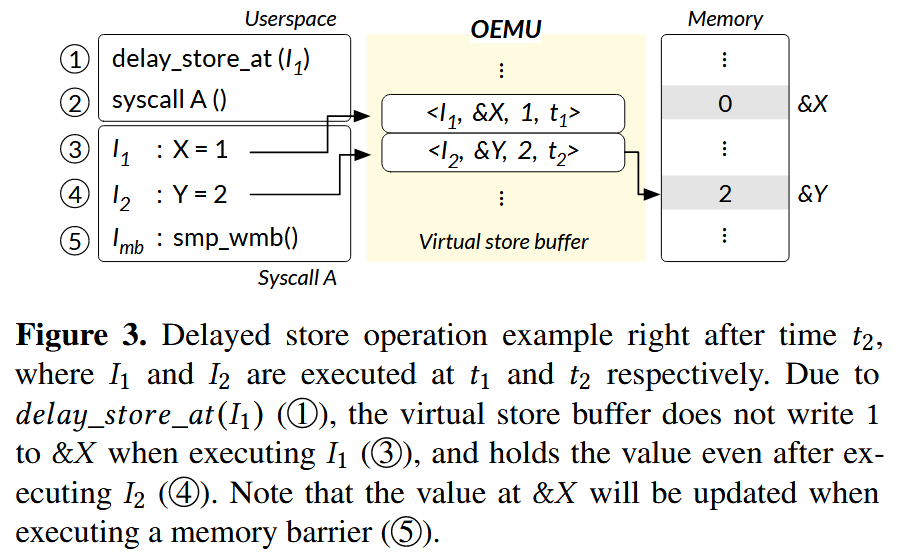
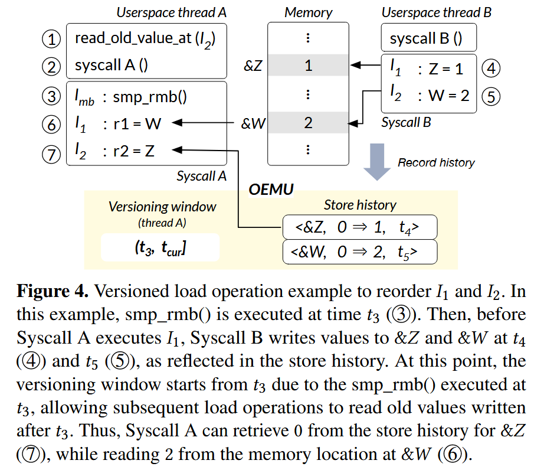
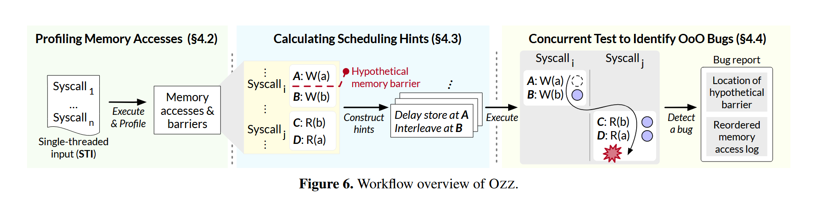
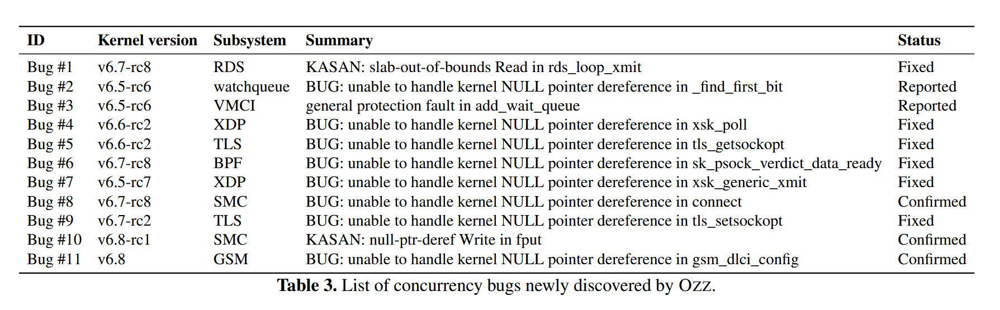
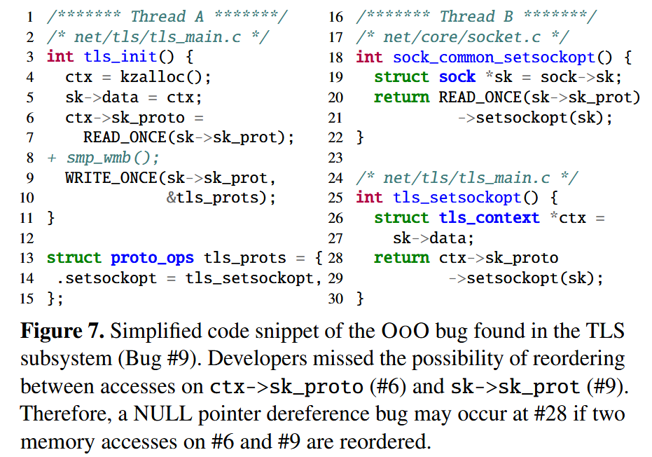
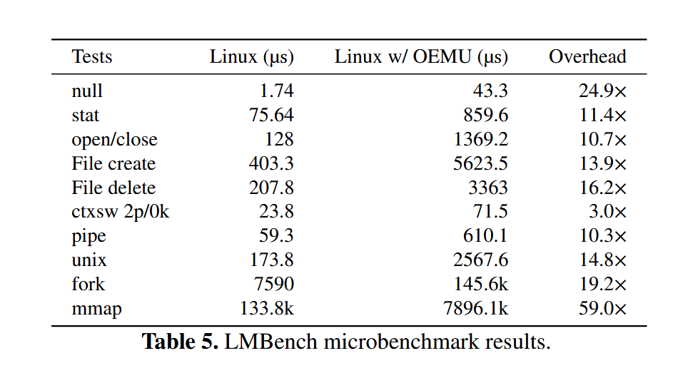

包含对于论文的翻译、总结、以及结合了个人思考

**OZZ: Identifying Kernel Out-of-Order Concurrency Bugs with In-Vivo Memory Access Reordering** (**best paper**)
> Dae R. Jeong (Georgia Tech), Yewon Choi (KAIST), Byoungyoung Lee (Seoul National University), Insik Shin (KAIST), Youngjin Kwon (KAIST) 

## 概要

内核的**并发 bug** 很难调，开发者不仅需要使用锁，还需要考虑内存屏障，不正确的内存屏障可能会引发很难观测的并发问题，作者称之为 **OoO（Out-of-Order）** 问题。基于此背景下，作者提出了 OEMU 模拟器和 Ozz 工具。

OEMU 是一种**乱序执行模拟器**，可以在内核代码实际**运行时模拟 CPU 的乱序执行**行为。因为在运行时控制和观测乱序执行很困难，所以传统方法是在内核中添加断点以控制内存访问顺序，但是这样会阻碍对于乱序执行的自然观察，可能无意中掩盖潜在的影响；还有一部分先前的工作是收集访存信息后进行离线分析，虽然这些方法可能部分地暴露出源于乱序执行的行为，但它们无法获取内核运行时上下文（例如已释放内存对象的列表），在识别如双重释放 bug 等问题时受到限制（类似于刻舟求剑）。

Ozz 是**基于 OEMU 查找内核 OoO 问题的 fuzzing 工具**，目前是这个领域的第一个 fuzzing 工具。

## 主要贡献

#### 实时乱序执行模拟

OEMU 被编译集成到内核中，可以在运行时显示重排访存顺序，并暴露接口给 debug 工具，因此工具可以结合运行时的实际内核上下文，并利用内核中已有的 bug 监测工具（如 sanitizers 或内核断言），为自动化 bug 检测工具的实现提供了可能。

#### OoO 问题自动检测工具

Ozz 是第一个 OoO 问题运行时自动检测工具，可以确定的控制乱序执行和线程交错并高效的检测出 OoO 问题。

仓库地址：https://github.com/casys-kaist/ozz

#### 实战效果

使用 Ozz 在 Linux 内核中发现了 11 个新的 OoO 问题。

## 背景和动力

现代处理器为了提高性能，通常采用**乱序执行**（Out-of-Order Execution）技术，使指令执行的顺序可能与代码不符，使访存的顺序变得随机，分支预测优势也会导致提前访存。对此，不同指令集采用了不同的内存一致性模型以定义不同核心对于共享内存操作需要遵循的规则。**x86 支持 TSO 内存模型**，其保证对不同地址且⽆依赖的“读读”、“读写”、“写写”操作之间的全局可⻅顺序，但不保证“写读”的全局可⻅顺序（中立守序）；**Arm 和 RISC-V 使用的是宽松内存模型**，不保证任何不同地址且⽆依赖的访存操作之间的顺序，也即读读，读写，写读与写写操作之间都可以乱序全局可⻅（混乱邪恶）

在宽松内存模型下，要保证并发正确性，需要手动插入硬件内存屏障，Linux 就提供了一系列内存屏障 API：

### OoO 问题样例

下图给出了一个简单的可能导致并发问题的代码示例。（来自实际 Linux 发现的 bug）

两个拟添加的内存屏障都是必要的。如果 `smp_wmb()` 缺失，可能出现 `#8 → #14 → #18 → #6` 的乱序并导致错误；如果 `smp_rmb()` 缺失，则可能出现 `#18 → #6 → #8 → #14` 的乱序导致错误。

## 思路和实现

### 实时乱序执行模拟

完全模拟处理器的乱序执行行为不太现实。作者为此引入了**延迟存储**以及**版本化加载**（读取旧值）来模拟内核代码的乱序执行。OEMU 为用户程序（比如他们的 fuzz ）提供了两个自定义 syscall 以实现这两个操作：

重新排序内核指令显然不现实，因为他们的顺序在处理器里就已经决定了。因此，作者提出了**通过回调函数接管内核的访存操作**，通过重新排序实际的访存操作来模拟访存指令的乱序，回调函数是在编译时被引入并接管的。

这种实时的模拟仿真可以充分利用内核的上下文，弄清楚是哪些内核对象被读取/写入了，哪些锁被线程获取/释放了。相较于先前提出的记录访存操作，并离线分析的方法，这种与实时上下文的结合可以更加精确的定位更多并发问题，比如双重释放问题。

值得一提的是，本文的模拟局限于 **store-store**、**load-load**、**store-load** 乱序从而导致可能的 OoO 问题，排除了 **load-store**。虽然理论上 load-store 乱序也可能引发 OoO 问题，但是由于 CPU 里很少出现 load-store 乱序（因为提供的优化有限，违例时的恢复最复杂），因此留给未来实现了。（相信后人的智慧）

#### 延迟存储

对于存储操作，OEMU 可以延迟其执行，以模拟 store-store、store-load 操作。

OEMU 使用**虚拟存储缓冲区**来实现这一延迟操作。虚拟存储缓冲区是每个线程的临时存储区，所有存储操作都会存储到 buffer 中并且可以被延迟提交给内存，默认情况下 buffer 会立刻提交，确保存储按指令顺序进行。在遇到下一个 store、buffer 已满、对应内存屏障或者当前核发生中断的时候，buffer 会提交所有延迟的操作。

为了在测试并发乱序的情况下确保单线程的顺序执行， OEMU 还引入了**存储值转发**，简单地说就是在 load 的时候搜索 buffer 里面有没有 load 地址存储的新值还没提交，如果有就使用新值以保证 store-load 顺序执行。相当于某种前递。

下面是一个延迟存储的简单例子：

#### 版本化加载

有版本的 load 允许 load 操作读取一个内存中的旧值，以模拟 load-load 乱序。

OEMU 维护了一个**全局存储历史**，包含了存储操作的地址、被覆盖的值、操作时间戳等，用户（Fuzz 器）可以使用上面提到的 syscall 进行旧值的 load。这里值得注意的是访存优先级被确保为 buffer > history > memory，因为用户态的 fuzz 器并不管地址依赖这回事，所以 OEMU 要拦截这种请求防止冤枉好人。

为了正确维护内存屏障，OEMU 提出了版本时间窗口机制，用于维护 history 的有效性。同样的，为了和处理器行为保持一致，当 load-store 存在依赖时，OEMU 不会使 load 读取一个旧值，完全按照处理器的行为运行。

下面给出了一个版本化加载的例子：

#### 遵守 LKMM

既然 OEMU 模拟内存乱序执行，那他显然不能以处理器也不会出现的顺序重排序访存，但是因为不同架构的内存一致性模型不同，所以作者确保 OEMU 遵守 Linux Kernel Memory Model。

### Ozz 

Ozz 是一个 kernel fuzzer，使用了 OEMU 的接口以及先前工作已有的线程交错控制机制，基于谷歌的 Syzkaller 开发。

#### 测试流程

Ozz 通过假设关键内存屏障不存在的方式进行 fuzzing。Ozz 通过 OEMU 的接口模拟出已经乱序的情况，如果出现 bug 说明这里需要一个内存屏障。完整的测试工作流如下：

##### profile 访存和内存屏障

Ozz 单线程跑一系列 syscall，通过回调函数记录所有访存和内存屏障的信息。（回调函数通过 LLVM 后端在编译时插入）

##### 计算调度点

Ozz 通过记录的信息为每两个 syscall 生成一组测试方案，方案包括调度点信息（即执行到哪个地方就切到另一个线程）以及对应的重排哪些内存访问，然后通过算法选择出重排内存最多的几个方案进行测试（越乱越有可能出 bug）。

这种方式非常有效，发现的 19 个 bug 里，11 个重排了最多的访存，6 个重排了第二多的访存。

##### 测试并发

按照计算出来的方案跑并发测试，靠内核里已有的工具和一些 assertion 判断是不是出 bug 了。

## 效果和性能

### Fuzzing 效果

发现了 61 个 bug，其中包括一堆 Syzkaller 也能查出来的，其中 11 个被确定为并发问题。牛的。

其中 TLS 的 bug 如下：

如果因为乱序先 write 了 `sk->sk_prot` ，切换了协议，上面 `ctx->sk_proto` 就会 read 一个错误的协议，最终导致 line28 释放一个空指针彻底爆炸。

### 性能

慢最多的内存访问慢了 59 倍，整体 Fuzz 效率比 SYZKALLER 慢 7.9 倍。还可以啊这个数字。

## 一些讨论

作者提到，他们的工作可以操纵乱序执行，这意味着还可以在 x86 上模拟 ARM 的弱内存模型，很方便。虽然只能测试双线程的并发 bug，不过更多线程的并发问题真不是人查的了，用这个方法计算量也会指数级飙增，需要更好的办法（又是一篇顶会的机会（））。

还提到了他们的工作对于 Rust for Linux 也有效，他们很看好 Rust 在内核里的进一步发展，难绷的是他们发论文之后不久，Rust for Linux 就在社区里吵起来了。

### 个人意见

1. 对于内存屏障的假设引发 bug 之后，是否可以确认就是应该在假设位置添加内存屏障？如何确认这个位置添加内存屏障一定正确？
2. 文章内提出找到的 bug 没有提到修复后是否进行了回归测试，这应该是必要的（？
