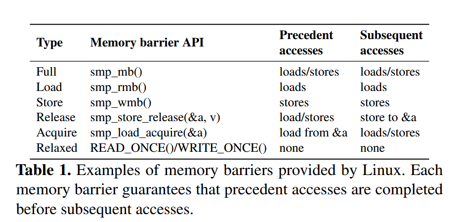
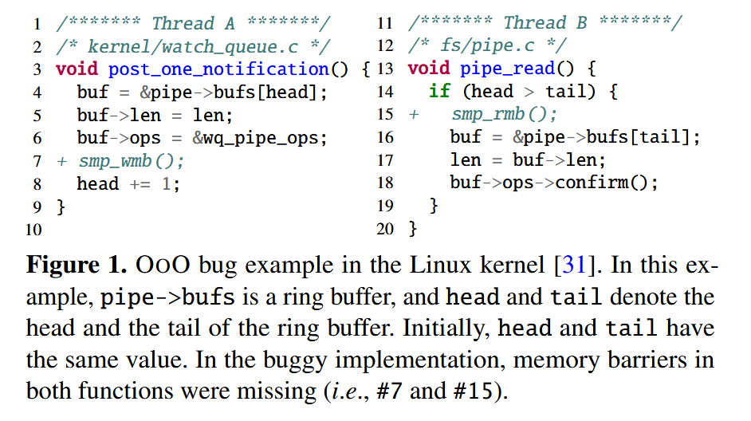

包含对于论文的翻译、总结、以及结合了个人思考

**OZZ: Identifying Kernel Out-of-Order Concurrency Bugs with In-Vivo Memory Access Reordering** (**best paper**)
> Dae R. Jeong (Georgia Tech), Yewon Choi (KAIST), Byoungyoung Lee (Seoul National University), Insik Shin (KAIST), Youngjin Kwon (KAIST) 

## 概要

内核的**并发 bug** 很难调，开发者不仅需要使用锁，还需要考虑内存屏障，不正确的内存屏障可能会引发很难观测的并发问题，作者称之为 **OoO（Out-of-Order）** 问题。基于此背景下，作者提出了 OEMU 模拟器和 Ozz 工具。

OEMU 是一种**乱序执行模拟器**，可以在内核代码实际**运行时模拟 CPU 的乱序执行**行为。因为在运行时控制和观测乱序执行很困难，所以传统方法是在内核中添加断点以控制内存访问顺序，但是这样会阻碍对于乱序执行的自然观察，可能无意中掩盖潜在的影响；还有一部分先前的工作是收集访存信息后进行离线分析，虽然这些方法可能部分地暴露出源于乱序执行的行为，但它们无法获取内核运行时上下文（例如已释放内存对象的列表），在识别如双重释放 bug 等问题时受到限制（类似于刻舟求剑）。

Ozz 是**基于 OEMU 查找内核 OoO 问题的 fuzzing 工具**，目前是这个领域的第一个 fuzzing 工具。

## 主要贡献

#### 实时乱序执行模拟

OEMU 被编译集成到内核中，可以在运行时显示重排访存顺序，并暴露接口给 debug 工具，因此工具可以结合运行时的实际内核上下文，并利用内核中已有的 bug 监测工具（如 sanitizers 或内核断言），为自动化 bug 检测工具的实现提供了可能。

#### OoO 问题自动检测工具

Ozz 是第一个 OoO 问题运行时自动检测工具，可以确定的控制乱序执行和线程交错并高效的检测出 OoO 问题。

仓库地址：https://github.com/casys-kaist/ozz

#### 实战效果

使用 Ozz 在 Linux 内核中发现了 11 个新的 OoO 问题。

## 背景和动力

现代处理器为了提高性能，通常采用**乱序执行**（Out-of-Order Execution）技术，使指令执行的顺序可能与代码不符，使访存的顺序变得随机，分支预测优势也会导致提前访存。对此，不同指令集采用了不同的内存一致性模型以定义不同核心对于共享内存操作需要遵循的规则。**x86 支持 TSO 内存模型**，其保证对不同地址且⽆依赖的“读读”、“读写”、“写写”操作之间的全局可⻅顺序，但不保证“写读”的全局可⻅顺序（中立守序）；**Arm 和 RISC-V 使用的是宽松内存模型**，不保证任何不同地址且⽆依赖的访存操作之间的顺序，也即读读，读写，写读与写写操作之间都可以乱序全局可⻅（混乱邪恶）

在宽松内存模型下，要保证并发正确性，需要手动插入硬件内存屏障，Linux 就提供了一系列内存屏障 API：

### OoO 问题样例

下图给出了一个简单的可能导致并发问题的代码示例。（来自实际 Linux 发现的 bug）

两个拟添加的内存屏障都是必要的。如果 `smp_wmb()` 缺失，可能出现 `#8 → #14 → #18 → #6` 的乱序并导致错误；如果 `smp_rmb()` 缺失，则可能出现 `#18 → #6 → #8 → #14` 的乱序导致错误。

## 思路

### 实时乱序执行模拟

完全模拟处理器的乱序执行行为不太现实。作者为此引入了**延迟存储操作**以及**版本化加载操作**来模拟内核代码的乱序执行。

#### 实时模拟

重新排序内核指令显然不现实，因为他们的顺序在处理器里就已经决定了。因此，作者提出了**通过回调函数接管内核的访存操作**，通过重新排序实际的访存操作来模拟访存指令的乱序，回调函数是在编译时被引入并接管的。

这种实时的模拟仿真可以充分利用内核的上下文，弄清楚是哪些内核对象被读取/写入了，哪些锁被线程获取/释放了。相较于先前提出的记录访存操作，并离线分析的方法，这种与实时上下文的结合可以更加精确的定位更多并发问题，比如双重释放问题。

值得一提的是，本文的模拟局限于 **store-store**、**load-load**、**store-load** 乱序从而导致可能的 OoO 问题，排除了 **load-store**。虽然理论上 load-store 乱序也可能引发 OoO 问题，但是由于 CPU 里很少出现 load-store 乱序（因为提供的优化有限，违例时的恢复最复杂），因此留给未来实现了。（相信后人的智慧）

