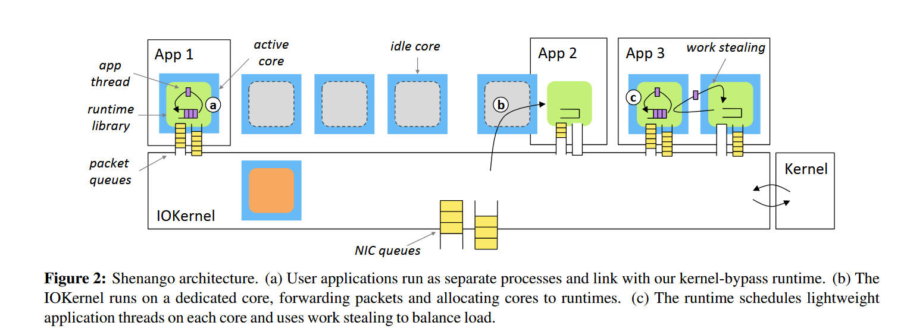
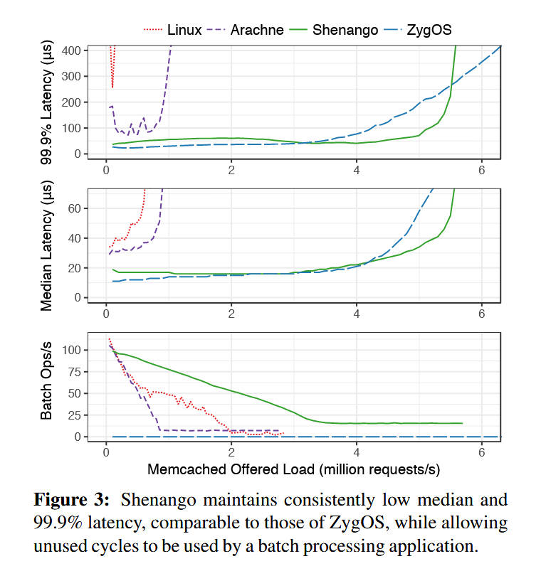
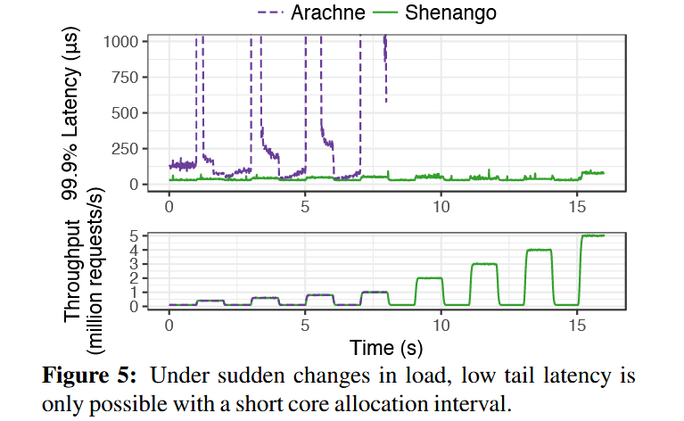

**Shenango: Achieving High CPU Efficiency for Latency-sensitive Datacenter Workloads**
> Amy Ousterhout (MIT CSAIL), Joshua Fried (MIT CSAIL), Jonathan Behrens (MIT CSAIL), Adam Belay (MIT CSAIL), Hari Balakrishnan (MIT CSAIL)

## 背景
现代数据中心需要很低的延迟（微秒级），但是通过 Linux 的协议栈进行分发会让延迟飙升到毫秒级，只有分配大量空闲的核去处理请求才能把延迟降低到微妙级别。

一些工作提出了 kernel-bypass 协议栈，比如 ZygOS、IX，绕过 OS 内核使用专门的 CPU 核来轮询网卡，有效的降低了延迟提高了吞吐量，但是因为需要分配固定的核心空转轮询，所以 CPU 利用率不高，存在浪费。尤其是现代场景下，服务的负载波动极大，大量的工作集中在很短的时间内；并且已有工作缺乏核心的调度机制，要应付很高的峰值负载只能提前分配更多的轮询核心，这更加剧了 CPU 效率的浪费。

## 主要贡献

Shenango 设计了一个调度算法以及一个内核态组件 IOKernel，以 **5μs 的超细粒度**调度 CPU 核，实现了微秒级的延迟以及更高的 CPU 效率，在处理一些内存敏感应用程序（如 memcached ）时吞吐量和尾延迟与 [ZygOS](https://dl.acm.org/doi/pdf/10.1145/3132747.3132780) 相当，而 CPU 效率相比大大提高。

## 设计与实现

相比于 Aranche 的 29μs 和 IX 的几百 μs ，而 shenango 只需要 5.9μs 就能重新分配一次核。这是因为 shenango 的两个核心设计：

首先，shenango 设计了一种**高效的拥塞检测算法**，同时将线程和数据包的等待时间都纳入拥塞检测中，并对应用程序的包和线程队列进行细粒度的高频监控。其次，shenango 设计了高特权级组件 **IOKernel**。IOKernel 在一个专门的 CPU 核上运行，用于统一轮询网卡、检查应用的线程队列和网络包队列，分发包以及重新分配 CPU 核心。由于在单独核心上运行， IOKernel 的延迟极低，5.9μs 中 IOKernel 的计算只占 2μs.

另一方面，应用程序的在各自的 runtime 中运行，和 IOKernel 通过共享内存通信。这些 runtime 都是不可信的，并负责提供线程、锁、socket 等抽象。shenango runtime 以 library 的形式与应用程序链接并被调用，以允许 kernel-like 函数在应用程序的地址空间中被调用。

在启动时，runtime 根据可能会使用的最多 CPU 核心数创建内核线程，每个内核线程都有一个 local runqueue。应用程序则跑在轻量级的用户态线程中并被存放在上面的 runqueue 里，各个核心之间的工作通过 work stealing （是一种算法？）平衡。

### IOKernel

IOKernel 负责了两个主要职能：
  - 分配 CPU 核心给应用程序
  - 负责所有网络包的输入输出转发

关于核的分配算法比较有意思，IOKernel 会以 5μs 的粒度检查等待队列，如果发现等待队列里一个应用程序连续出现两次，说明这个程序出现了 5μs 以上的延迟，因此给他额外分配一个核。

在分配的优先级上，IOKernel 考虑了**超线程、缓存局部性以及分配延迟**：
- 超线程：倾向于将同一个应用程序的超线程分配到同一个核上
- 缓存局部性：倾向于将线程分配到最近运行过同一段代码的核上
- 分配延迟：优先分配空闲核

## 效果

可以看到在相同的负载情况下，shenango 保持了与 ZygOS 类似的平均延迟和尾延迟，同时也允许调度一部分核去进行批处理操作。

这里的的原文提到了，在超过五百万每秒访问量的时候瓶颈确实是 IOKernel
> Shenango can handle over five million requests per second while maintaining a median response time of 37 μs and 99.9th percentile response time of 93 μs. Despite busy polling on all 16 hyperthreads, ZygOS maintains similar response times only up to four million requests per second. ZygOS does scale to support higher throughput than Shenango, though at a high latency penalty. Shenango achieves lower throughput because at the very low service times of memcached (< 2 μs), the IOKernel becomes a bottleneck. We discuss options for scaling out the IOKernel further in Section 8. For all other systems, memcached is bottlenecked by CPU.

在负载快速大幅波动的情况下，shenango 也能很好的保持延迟在一个很低的水平：

## 个人想法

感觉核心思想就是在 by-pass 的同时以非常细的粒度调度 CPU 核，以适合更新的硬件场景，所以效率理应有很大提升。虽然 IOKernel 在高负载场景（500w RPS 以上）下会成为瓶颈，但是作者在 discussion 里提到了解决方案，如每一个 NUMA 节点都分配一个 IOKernel。

