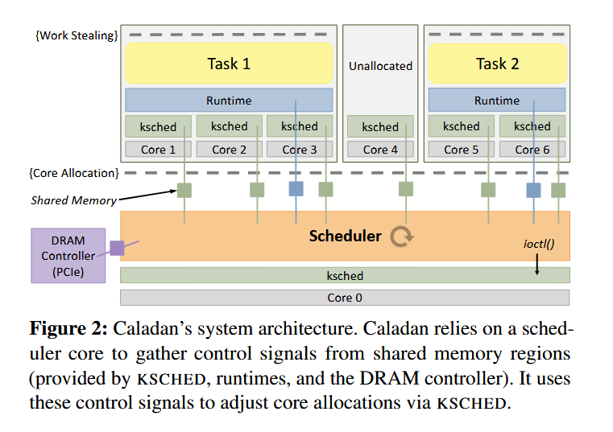

**Caladan: Mitigating Interference at Microsecond Timescales**
> Joshua Fried (MIT CSAIL), Zhenyuan Ruan (MIT CSAIL), Amy Ousterhout (UC Berkeley), Adam Belay (MIT CSAIL)

## 背景

为了实现不同任务之间的性能隔离，防止资源竞争影响关键任务，传统方法是静态的对系统资源进行划分，如 Intel 的 CAT 划分 LLC，但是这种静态划分也同时限制了任务可用资源的上限，使其无法应对短时间的峰值负载，造成高延迟和资源的浪费。
> 关于峰值负载，文中提到多个例子，包括：
> - GC（垃圾回收）
> - 压缩任务、编译任务
> - 谷歌数据中心
> - 微软 Bing
> - Spark 计算任务（这是啥？）
> 
> 这些场景都会出现短时间的爆发性负载。
> 
> 为什么爆发负载处理不佳影响很大？
> 爆发负载超出了系统的计算容量，导致大量任务进入排队中，延迟不再线性增长而是指数级爆炸，短时间性能急剧恶化，并最终导致尾延迟翻几百上千倍

## 主要贡献

作者提出了 Caladan ，一种新型 CPU 调度器。Caladan **摒弃了传统的静态资源分配**，而是以快速、细粒度的 **CPU 核调度**取而代之。Caladan 由一个**集中式调度核心**和一个**内核模块 KSCHED** 组成，集中式调度核心负责主动管理内存层次结构和超线程中的资源争用，内核模块 KSCHED 负责绕过 Linux 内核，提供微秒级的任务监控和任务安排。

## 设计与实现

### 主要思路

Caladan 团队将任务分为两类，一类是延迟敏感的任务（Latency Critical），一类是追求高效的低优先级任务（Best Effort），每一个任务都会被指定为 LC 或 BE。

对于不同的争用，Caladan 通过不同的信号进行判断并针对性的采取不同措施：

- **超线程**：对于超线程，Caladan 认为当两个超线程都活跃时，争用一直存在，因为同一个核心上的超线程共享部分硬件资源。因此 Caladan 转而检测最长运行时间的请求（主要影响尾延迟）。如果某个超线程的某个请求超过等待时间阈值，就暂时让另一个超线程休眠。
- **内存带宽**：Caladan 通过检测全局内存带宽来判断是否存在争用，并通过 LLC miss 率来判断是哪个 BE 主要导致了争用，因为占用内存带宽比例更大的任务也会有更多的 cache miss（这个真的妙），并限制 BE 任务的可用核心数以限制其内存带宽。
- **LLC**：LLC 的干扰很难判断以及确定来源，只能通过某些 side effect 来判断。Caladan 通过检测计算能力减少导致的排队延迟增加来迅速确定争用的受害者，在服务质量下降之前确定问题。然而减少 LLC 争用的影响也很难，因此 Caladan 的做法是给受害者分配更多的 CPU 核以增加其计算容量，保证性能表现上尽量保持一致。

另一方面，Caladan 的内核模块 KSCHED 负责加速调度操作，防止调度器成为瓶颈。加速策略包括：

- **中断成本摊销**（Interrupt Amortization）：利用硬件对多播处理器间中断（IPI）的支持来分摊同时在多个内核上启动操作的成本
- **工作卸载**（work offload）：它在 Caladan 管理的所有核心上运行，并将调度工作从调度程序核心转移到运行任务的核心上（怎么做到的？）
- **提供非阻塞 API**：提供了一个完全异步的调度器接口，以便调度器可以启动远程内核上的操作，并在等待操作完成时执行其他工作。

### 关于 CAT

CAT （Intel’s Cache Allocation Technology）通过对于 LLC 的静态划分和 MBA 内存带宽分配器来避免竞争干扰，但是对于 cache 的划分会减少组相联 chache 的内存/ cache 映射可能性，大大降低性能表现，使用 MBA 限制内存带宽也会使相应核心的效率大大下降。同时，CAT 要求对系统资源进行监控以实现精确的划分，然而 Intel 提出的 Cache Monitoring Technology (CMT) 和 Memory Bandwidth Monitoring (MBM) 需要几毫秒到几百毫秒才能准确获取数据，没法监测负载快速变化的场景（微秒级）。

## 效果

相比于 Parties，Caladan 在高 RPS 的情况下尾延迟显著降低，同时保证了 CPU 效率也就是 BE 任务的批处理速率：

在内存带宽干扰的情况下，Caladan 相较于以往工作（包括 shenango ）的尾延迟也大大降低：

Caladan 可以配置 LC 和 BE 应用程序的许多组合，对于 LC 任务只有适度的延迟损失（上图），同时为 BE 任务保持出色的吞吐量（下图）:

Caladan 可以同时保持高 CPU 效率以及严格的任务隔离：

## 讨论

作者提到了目前 Caladan 的兼容性仍不是很好，如果应用程序程序不使用他们的 runtime，那必须在 Caladan 不管辖的的核上运行，且造成的干扰也没法被处理。

另外，作者提到了很重要的一点，即 LC 任务的并发可见性，因为如果 LC 任务的并发性不强，那么分配更多的核给它只是在浪费资源。另一方面，BE 任务如果有更好的并发可见性，那调度就可以变得更加公平.

关于 NUMA，Caladan 目前仍然没有考虑 NUMA 场景的一些干扰，需要进一步的策略设计和适配。

安全方面，目前 Caladan 的调度策略无法防止跨超线程的瞬态执行攻击，也就是说同一核心上的超线程应当是互相信任的。

