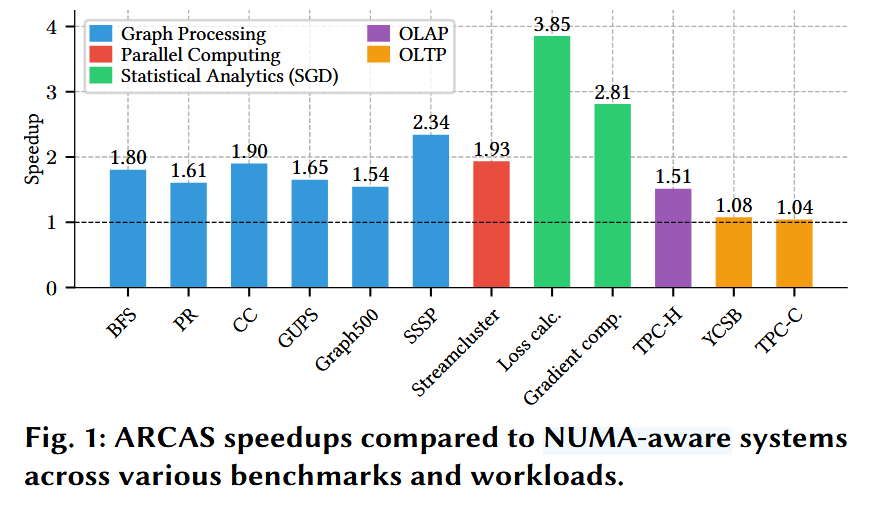
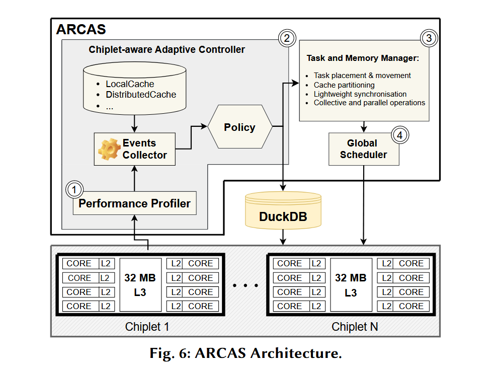

**ARCAS: Adaptive Runtime System for Chiplet-Aware Scheduling**
> Alessandro Fogli (Imperial College London), Bo Zhao (Aalto University), Peter Pietzuch (Imperial College London), Jana Giceva (TU Munich)

## 背景

Chiplet 架构下各个 CCX 间离散的 L3 缓存导致了哪怕同一个 NUMA node 里也存在不同的延迟和带宽，因此提高缓存利用率变得很复杂，传统的 NUMA 优化和任务调度方式无法解决。为此作者提出了 ARCAS ，一个针对 Chiplet 架构设计的 runtime。

## 主要贡献

ARCAS 结合了 Chiplet 感知的启发式任务调度算法、硬件感知的内存分配以及细粒度性能监控来优化工作负载执行。它实现了一个轻量级并发模型，该模型将用户级线程特性——如独立栈、按任务调度和状态管理——与协程类似的行为相结合，允许任务在定义的点上暂停和恢复执行，同时高效地管理跨 Chiplet 的任务迁移。ARCAS 相较于传统基于 NUMA 设计的系统，在各个 benchmark 上表现都有提升。

> 好玄乎

### 对于 Chiplet 问题的一些见解

1. 针对 Chiplet 的任务分区对于不规则访存（大概就是访存不连续？）的任务特别有效，比如图处理算法。
2. 对于 OLAP（Online Analytical Processing） 负载，混合缓存分区策略通常比严格的本地化策略更优。
3. 过多的核心数量会放大 Chiplet 间通信开销，因此影响性能，尤其是机器学习的统计任务。
> 说点大伙不知道的（
4. 严格的 NUMA 感知优化可能会显著损害 Chiplet 架构 CPU 的性能。
   

## 设计与实现

1. **Chiplet 感知的启发式任务调度算法**。采用了基于缓存亲和性和 Chiplet 间延迟的启发式算法加速任务放置，目标是最小化 Chiplet 间通信开销。具体包括两个算法：
  - 算法一是定时检查距离上一次修改调度策略的时间，如果达到一定时间就检查这段时间内发生了多少次跨 Chiplet 通信以计算通信速率，如果通信速率很高，算法就把任务分配到更多的 Chiplet 上（+1）增强缓存局部性减少跨 Chiplet 通信，反之就减少任务的 Chiplet 数量（-1）。
  - 算法二就是 check 一下空闲 Chiplet 够不够，然后采取环形分配确保任务均匀分布，最后设置一下线程亲和性（这是啥）并绑定一下 NUMA node。
> 没太看懂这个环形分配（wraps around）啥意思，就是按顺序分配吗。
2. **自适应缓存分区**。根据工作负载的特征动态的选择缓存的分配策略，即减少 Chiplet 间通信以换取缓存局部性或者增加通信换取更大的共享 LLC，也就是上面提到的混合缓存分区。
3. **细粒度并行性**。利用轻量级协程很小的上下文切换开销，有效的管理高并发性并提供了屏障机制保证跨 Chiplet 同步。ARCAS 为每个核心维护了一个本地队列，基于原子操作实现了无锁的出入队，并且在队列为空时 work stealing，优先从本地 Chiplet 上窃取。
4. **性能分析和优化**。使用低开销工具，动态监测计算负载和通信模式的数据，用来调整 runtime 的一些策略，比如任务迁移和调度。主要监测负载对本地 Chiplet、远程 Chiplet 和主存的访问频率以确定当前缓存可用性，还能够监测特定代码段，把信息提供给任务或者线程。
> 其实就是一组计数器，定期 check 一下。所谓监测特定代码段不会就是 if xxx then cnt++ 吧

### Chiplet 架构上的难点

1. **缓存管理**。目前的技术最多停留在缓存分区（CAT）等方面，没法很好的在 Chiplet 架构上 trade-off 缓存局部性和缓存可用性
2. **Chiplet 间通信和同步**。既要很好的处理 Chiplet 内部的缓存局部性，又要确保 Chiplet 之间的高效、轻量级的通信。作者提到基于线程的系统开销还是太大了（上下文切换），因此他们的设计改为了协程。
3. **工作负载适应性**。单个策略不足以满足现在多样的负载特征，比如有的负载是延迟敏感型，有的是内存密集型，需要动态的选用策略。（应该主要是缓存策略）

## 效果评估

## 个人想法

感觉是集百家之长然后针对新场景搓了一个 runtime，启发式算法和动态缓存分区还挺有意思的。