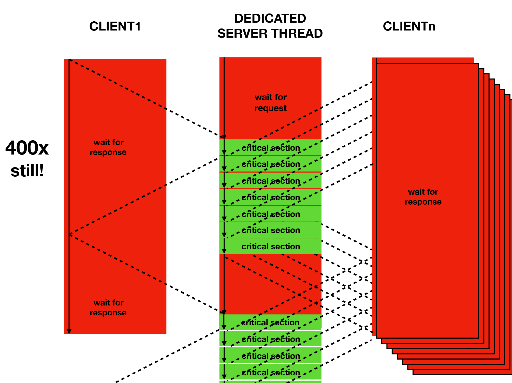
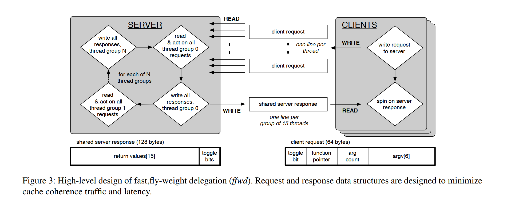
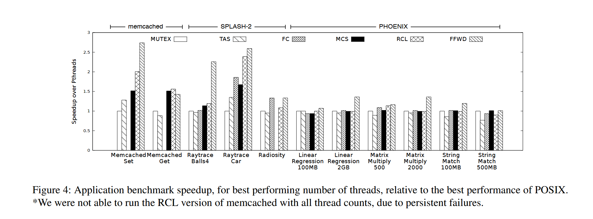

**ffwd: delegation is (much) faster than you think**
> Sepideh Roghanchi (University of Illinois at Chicago), Jakob Eriksson (University of Illinois at Chicago), Nilanjana Basu (University of Illinois at Chicago)

## 背景

在多核处理器时代，如何高效地处理多线程对共享数据结构的并发访问成为关键挑战。传统的粗粒度锁方法性能受限于单线程吞吐量，而细粒度锁、无锁数据结构等方法虽能提供并发性，但实现复杂且需要大量修改现有数据结构。委托（delegation）作为一种替代方案，让专门的服务器进程代理执行所有操作，但现有委托系统性能不够理想。

## 主要贡献

本文提出了 ffwd（fast forward）系统，这是一个针对低延迟和高吞吐量优化的轻量级委托实现，旨在为适合单线程执行的数据结构在多线程环境中提供更优的性能表现。

ffwd 在 micro benchmark 上相较于 SOTA 的委托系统 RCL 提高了 10x 的性能，在应用级 benchmark 上则是 100%。

### 什么是委托

使用锁来管理共享数据结构会导致多线程对锁的争用，因此委托方案提出，将所有涉及临界区的操作委托给一个**服务进程**进行，这样可以显著提高吞吐率，对于服务进程来说还能有很好的 cache coherence。

## 设计与实现

ffwd 设计了一个 API，允许将一个普通 C 函数委托给服务进程，并自旋等待返回值。其中，request 和 response 的方式很有意思：每个 client CPU 核维护一个 128B 的 cache line，包含函数指针、函数参数，只能被当前核的 hardware thread 写入，并且被服务进程只读，作为 request；服务进程也维护一个 128B 的 cache line，作为 response，每两个字节对应一个进程的 response，可以被同 socket 的多个核读。服务进程会轮询每个进程的 request cache line，并一批一批处理请求；client 进程发出请求之后，会轮询 response cache line 的对应 slot，直到获取到返回值。

以 128B 粒度分配的原因是某些 CPU（比如志强） 取 cache line 就是 128B 为单位。

其他方面，ffwd 确保服务进程不使用原子操作，操作过程中也不获取任何锁，以保证性能，尽管这样确实会影响是实用性，因为只能处理服务进程本地的数据结构；为了避免 MESI 带来的一系列开销，所有预留的 cache line 都和对应的核心在同一个 NUMA 节点上。

> 这里原文提到写入者和 MESI 的 cache agent 在同一个 socket 上可以大幅提高性能，但是不是很理解为什么，对于 MESI 不是很熟悉。

> 这里的数字非常混乱，文字说维护 128，图上画了 64，看了半天才反应过来是超线程，也没说清楚实际上 server 的 128 是给每个 client 各分一小段的。不过数字可以扩展，主要还是看他的思想。
> 这里说的 cache 是哪一层啊，能读写别人的 L1 L2 吗，LLC 感觉不行吧，毕竟是共享的，还是说结合 cache 隔离技术。

## 效果评估

ffwd 在临界区较短且竞争激烈（线程很多）的情况下表现优异，但是当线程数更少、程序的固有并行性更强、临界区较长或者临界区间隔较大时，ffwd 的优势开始减弱，因为服务进程成为了瓶颈。

> 作者提到了临界区较长的情况细粒度锁的表现可能比委托更优，不过这里我不能理解的是，程序固有并行性对于 ffwd 的影响在哪？给服务端发请求太密集吗？

## 个人想法

看了一段时间 runtime 之后，我一直有一个疑问，即我们和程序员的分工问题。在 ffwd 中，我非常不明确程序员和 ffwd 的分工边界，似乎是要求程序员主动使用 ffwd 的 API 去主动委托，那又涉及到应用程序是否需要基于该 runtime 进行大幅重构的问题---本质上是可用性问题，就像新的操作系统需要新的软件生态一样。

解决这个问题的办法可能只有看源代码，而且要多看几份，才能有对于 runtime 这个抽象概念的更深入的理解。