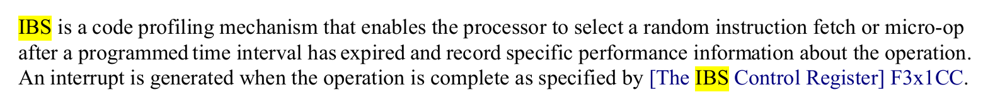

实验需求使用 perf_event_open 调用 AMD IBS 实现对于线程访存的监控，因此开始了解一下 IBS。

AMD IBS（Instruction-Based Sampling，基于指令采样）是 AMD 处理器中一项硬件级性能分析技术，用于监控和记录处理器执行的指令流，为开发者和系统管理员提供细粒度的性能洞察。

IBS 文档：[IBS](https://www.amd.com/content/dam/amd/en/documents/archived-tech-docs/white-papers/AMD_IBS_paper_EN.pdf) （没什么有用的内容）

IBS 采样结构体内容详见：[博客](https://www.weigao.cc/architecture/ibs.html#_1-ibs)

## 调用方式

### perf_event_open() + raw IBS

Linux 集成的 perf 子系统支持 IBS 事件，可以使用 `perf_event_open()` syscall 直接采集 ibs_op 类型事件，然后 mmap 一个 ring buffer 直接读取采样样本。

注意 mmap 的 buffer 大小必须是 $ 1 + 2^n $ 个 page，否则会 failed。以及记得检查当前内核是否支持 ibs。

首先需要初始化 `perf_event_attr` 的设置，对于 `attr.config` 和 `attr.sample_type` 的设置还是存疑，没有找到详细描述的文档。

```c++
#include <linux/perf_event.h>
#include <asm/unistd.h>
#include <sys/ioctl.h>
#include <unistd.h>
#include <fcntl.h>
#include <string.h>

long page_size = sysconf(_SC_PAGESIZE);
int mmap_pages = 9;  // ring buffer 大小必须是 1+2^n 页
size_t mmap_size = page_size * mmap_pages;

int fd;
struct perf_event_attr attr;

void init_ibs_perf() {
    memset(&attr, 0, sizeof(struct perf_event_attr));
    attr.type = PERF_TYPE_RAW;  // 对于 IBS，用 RAW 类型
    attr.size = sizeof(struct perf_event_attr);
    attr.config =  (1ULL << 19) |  // Enable IBS Op sampling
                  (1ULL << 1) |   // Record Linear Address
                  (1ULL << 5) |   // Record Latency
                  (1ULL << 7);    // Record Cache Hit Info
    attr.sample_type = PERF_SAMPLE_IP | PERF_SAMPLE_RAW | PERF_SAMPLE_ADDR;
    attr.sample_period = 1000000;
    attr.exclude_kernel = 0;  // 监控内核空间
    attr.exclude_user = 0;    // 监控用户空间
    attr.disabled = 0;
    attr.read_format = 0;
}


```

然后发出 syscall 并 mmap 一块 ring buffer 以读取采样到的 raw data，同时还要启动计数器，否则无法读到 sample。

```c++
    fd = syscall(__NR_perf_event_open, &attr, 0, -1, -1, 0);
    if (fd < 0) {
        perror("perf_event_open failed");
        return -1;
    }

    // 先mmap，然后再启用计数器
    size_t mmap_size = sysconf(_SC_PAGESIZE) * (16 + 1);  // 更大的缓冲区
    void* buf = mmap(NULL, mmap_size, PROT_READ | PROT_WRITE, MAP_SHARED, fd, 0);
    if (buf == MAP_FAILED) {
        perror("mmap failed");
        close(fd);
        return -1;
    }

    struct perf_event_mmap_page* meta_page = (struct perf_event_mmap_page*)buf;
    char* data_buffer = (char*)buf + meta_page->data_offset;
    size_t data_size = mmap_size - meta_page->data_offset;
intf("  data_tail: %lu\n", meta_page->data_tail);

    // 启用计数器
    if (ioctl(fd, PERF_EVENT_IOC_ENABLE, 0) < 0) {
        perror("ioctl enable failed");
        munmap(buf, mmap_size);
        close(fd);
        return -1;
    }

```

然后执行一些访存操作，使用内存屏障确保访存正确，然后从 ring buffer 中读取 sample 的值并进行 decode：

```c++
    // 运行会产生内存访问的函数
    memory_intensive_function();

    printf("Function completed, checking for samples...\n");

    // 读取内存屏障，确保看到最新的data_head
    __sync_synchronize();
    unsigned long data_head = meta_page->data_head;
    unsigned long data_tail = meta_page->data_tail;

    printf("After execution:\n");
    printf("  data_head: %lu\n", data_head);
    printf("  data_tail: %lu\n", data_tail);
    printf("  Samples available: %lu\n", data_head - data_tail);

    if (data_head > data_tail) {
        // 有样本可读
        size_t bytes_available = data_head - data_tail;
        char* read_ptr = (char*)data_buffer + (data_tail % data_size);

        size_t bytes_processed = 0;
        while (bytes_processed < bytes_available) {
            struct perf_event_header* header = (struct perf_event_header*)read_ptr;

            printf("Event type: %u, size: %u\n", header->type, header->size);

            if (header->type == PERF_RECORD_SAMPLE) {
                void* sample_data = read_ptr + sizeof(*header);
                parse_sample(header, sample_data);
            }

            bytes_processed += header->size;
            read_ptr += header->size;

            // 处理环形缓冲区回绕
            if ((size_t)(read_ptr - (char*)data_buffer) >= data_size) {
                read_ptr = (char*)data_buffer;
            }
        }

        // 更新data_tail
        meta_page->data_tail = data_head;
    } else {
        printf("No samples collected. Try:\n");
        printf("1. Decreasing sample_period (currently %llu)\n", attr.sample_period);
        printf("2. Increasing memory access intensity\n");
        printf("3. Checking if IBS is supported on your CPU\n");
    }
```

需要注意的是，上述代码读取到的 sample 难以解码，代码是否有效仍然存疑，推荐使用 AMD IBS Toolkit。

### MSR 寄存器直接访问

可以直接访问 IBS 的寄存器来启用采样读取数据。

| 名称         | 编号       | 说明                  |
| ------------ | ---------- | --------------------- |
| IBS_OP_CTL   | 0xC0011033 | 控制器寄存器          |
| IBS_OP_DATA3 | 0xC001103B | 包含 DcMissLat 等信息 |
| IBS_OP_RIP   | 0xC0011035 | 指令地址              |
| IBS_OP_DATA  | 0xC0011036 | 执行状态              |

可以通过 rdmsr_on_cpu() + 定时中断轮询方式采集，但这种方法依赖内核权限。github 可以找到使用这种方式的[参考](https://github.com/karim-manaouil/ibsmod)。


### AMD IBS Toolkit

AMD 编写了针对应用场景的 IBS Toolkit，可以直接使用，原理是直接读取 MSR 寄存器，需要内核权限。

[https://github.com/jlgreathouse/AMD_IBS_Toolkit](https://github.com/jlgreathouse/AMD_IBS_Toolkit)

#### driver

AMD IBS Toolkit 提供了一个 driver 内核模块，用于监测 msr 寄存器并读取 ibs 数据到内核缓冲区，用户程序可以通过 `ioctl()` 与其通信，`tools` 中的 monitor 使用此种方式。

他提供了自动化脚本一键安装，允许用户态读取 ibs，但是应该需要搭配 tools/ibs_decoder 使用。

#### include

提供了标准接口，封装了 ibs 的标准数据结构以及一些常量

#### lib 

一个独立的库，提供了一系列接口以供程序使用 ibs 监控，可以编译为 so 库使用，同样使用 ioctl 与内核模块通信，依赖 driver。

推荐使用 lib 的接口，也可以基于 lib 自己拓展接口。

#### tools

提供了一系列 ibs 的使用 demo，包括使用 driver 的 monitor 和 decoder，使用 lib 的 daemon。


## 问题总结

目前基于 AMD_IBS_Toolkit 的 lib 拓展了一个接口，利用 sample 中自带的 tsc 信息，可以监测一段时间内某个核的访存信息。

amd ibs 的手册中没有如何使用 ibs 的内容，也没有找到关于 perf_event_open 如何配合 ibs 使用的资料，但是找到了 2012 年将 ibs 引入 linux kernel 的 [patch](https://lore.kernel.org/all/1333390758-10893-1-git-send-email-robert.richter@amd.com/)。

目前正在测试 ibs_sample 的开销，目前认为主要开销应该来自于 read 这个系统调用，并且应该和每次 read 的字节数量正相关，计划通过调整每次 poll 的大小来测试。在使用 rdtsc 测试整个函数的开销时，获得的数据平均在一亿个 cycle 左右，这个数据很异常，目前不知道原因。

### ibs 开销分析

通过查阅文档，确定了 ibs 的开销主要来自于触发采样时会先触发一次 interrupt，因此在采样频率提高时开销会飙升，甚至在过高时导致内核崩溃，根据我们的观测，对于 ibs_op 操作，这个崩溃阈值应该在 per 0x100 - 0x300 cycle 左右，很可能因具体配置不同有偏差。相关内容记录在 BIOS and Kernel Developer's Guide (BKDG) For AMD Family 10h Processors 中，ctrl f 搜索 ibs 即可轻易找到。 很可惜，由于这个原因 ibs 不符合我们实验的需求了。


