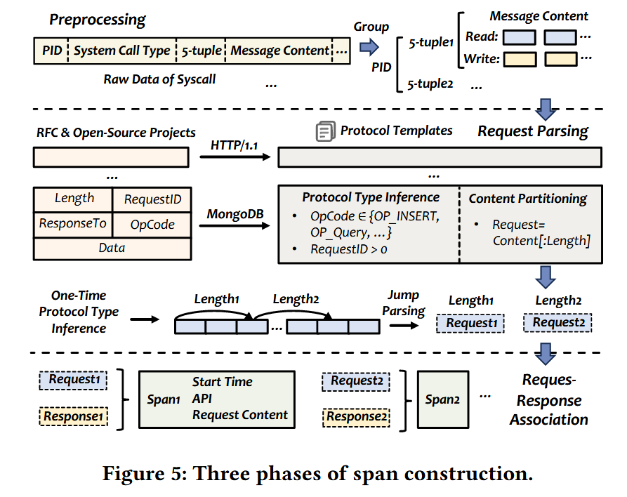

**Low-Overhead Distributed Application Observation with DeepTrace: Achieving Accurate Tracing in Production Systems**
> Yantao Geng (Tsinghua University), Han Zhang (Tsinghua University), Zhiheng Wu (Tsinghua University), Yahui Li (Tsinghua University), Jilong Wang (Tsinghua University), Xia Yin (Tsinghua University)

## 背景

微服务的发展使得其调试越来越困难，需要一个完善的分布式 trace 框架。现有的非侵入式 trace 框架主要采取两种方案：**基于 FIFO 的关联框架**和**基于延迟的关联框架**。FIFO 的适用范围有限，而基于延迟的方法在高并发下表现不佳。

### 基于 FIFO 的关联框架

简单的认为进入网络栈的请求和出网络栈的请求是按顺序一一对应的，性能较好，但在并发环境下显然会导致严重的关联错误。 

### 基于延迟的关联框架

这类系统会持续学习这个延迟的分布模型（比如，一个高斯分布）。当一个出站请求发生时，它会回顾过去一小段时间内的所有入站请求，计算与每个入站请求的时间差，然后选择那个时间差最符合所学分布的入站请求作为其父请求。在高并发的情况下，这种方案不仅会导致计算量暴增，关联的准确度也很低。

## 主要贡献

作者提出了 DeepTrace，一种基于事务的非侵入式微服务 trace 框架，在高并发环境下保持了 95% 以上的准确率，并且已被多家公司应用在生产环境。

github：[https://github.com/DeepShield-AI/DeepTrace](https://github.com/DeepShield-AI/DeepTrace)

## 设计与实现

### 协议感知的 Span 构造

DeepTrace 整合了通过对 RFC 文档和开源实现进行系统化研究而得出的协议解析模板，目前支持超过 20 种主流应用层协议。为加速 Span 构造，DeepTrace 提出了一种基于签名的协议识别方法，该方法通过固定位置字段匹配结合语义感知解析（利用协议原生的长度指示器）来实现，从而同时实现了高效的数据包处理和精确的请求边界检测。

> 简单的说就是用 eBPF 在内核态处理数据包，通过读数据包前缀等办法识别是什么协议，然后针对性的去提取所需字段如标识符等来构建 Span。

### 基于事务的 Span 关联机制

DeepTrace 发现同一个事务内的 Span 的关联可能性更高，所以 DeepTrace 分两步基于事务进行关联：

1. 通过对上下文特征的语义分析（例如，HTTP头中的用户标识符、会话令牌）来计算**事务亲和性分数**，判断两个请求属于同一个事务的概率。
2. 根据多种证据结合**事务亲和性分数**综合判断，包括：
   - 时间是否接近？
   - 是否因果依赖？某些服务调用总是遵循特定模式（例如，A服务调B服务后，总是会再调C服务）
   - 行为签名。某些请求可能具有独特的行为模式（如查询的数据量、特定的错误码）

    各种证据拥有不同的加权，且权重也会自适应调整，比如当能清晰提取到 Transaction ID 时，系统会极度信任这个信号，赋予其最高的权重；当无法获取事务上下文时（例如，监控一个老旧的不规范的服务），系统会自动降级：降低事务亲和性特征的权重，同时提高传统特征（时间序列、延迟）的权重。

### 查询驱动的追踪组装

相较于传统框架的先组装 Span 树再查询，DeepTrace 将范式从“**先收集，后查询**”转变为“**先查询，后收集**”。数据默认留在产生它的主机上，只有在用户明确需要时，才按需提取。为了支持高效的按需查询，Span数据需要在生产它的主机上临时存放一段时间，DeepTrace 使用基于 Span 的标签（Tags） 和指标（Metrics） 建立索引，实现了高效的主机本地 Span 压缩和缓存。

## 效果评估

## 个人想法

网络相关的知识完全不了解，因此涉及到具体实现和性能看的云里雾里，很多概念不了解，还需要慢慢看。
