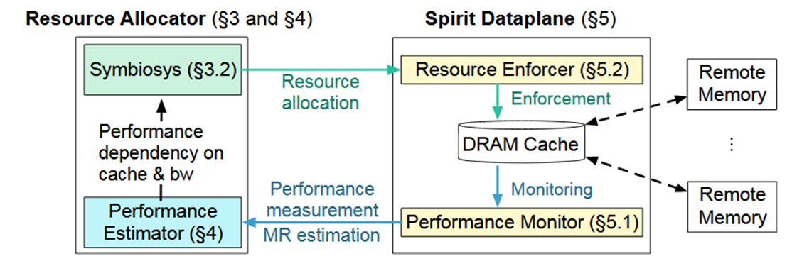

**Spirit: Fair Allocation of Interdependent Resources  in Remote Memory Systems**
> Seung-seob Lee(Yale University), Jachym Putta (Yale University), Ziming Mao (UC Berkeley), Anurag Khandelwal (Yale University)

## 背景

多用户 RDMA 系统中的资源分配一直是问题，对于同一台机器上的多个 RDMA 用户，他们各自分配有一部分带宽和 dram 作为访问 far memory 的 cache。但是，大 cache 意味着应用可能不需要频繁的和 far memory 通信，仅需要较小的带宽；而大带宽意味着应用可以以更高的频率和 far memory 进行通信，cache 可以较小。

同时，不同应用的工作负载对于带宽和 cache 的敏感性不同：
- 高局部性应用（如键值存储）：小幅增加缓存即可大幅节约带宽
- 低局部性应用（如流处理）：缓存扩容对带宽优化较小

而这种工作负载的特异性无法预先获知，因此需要在线进行动态的调整以达到最优，而以往的工作没有考虑到这一点。

## 主要贡献

作者提出了 Spirit，一个多用户 RDMA 资源分配框架，在多个应用中取得了最高 21.6% 的性能提升。

## 设计与实现

Spirit 包含两个核心组件：**集中式资源分配器**，以及与现有基于交换的RDMA 系统对接的**数据平面**：

**Symbiosis**：核心分配算法
**性能估计器**：动态维护每个应用程序性能对缓存和带宽资源依赖性的实时估计
**资源执行器**：确保分配模块决定的缓存和带宽分配方案得到严格执行（其实就是使用 docker update 控制内存，io.max 控制带宽）
**性能监控器**：在运行时测量数据访问速率，并定期将其发送给性能估计器（使用 PEBS）

用户首先向资源分配器注册应用程序，应用程序透明的执行访存，Spirit 通过数据换出实施 cache 容量限制，通过流量控制实施带宽限制，性能监测器收集数据访问速率以预测应用程序的需求。

### 共生（Symbiosis）算法设计

共生算法是一种基于拍卖的分配算法，灵感来自于微观经济学，目标是实现性能公平。不同的应用程序基于估计的自身需求，在多个拍卖轮次中相互交易缓存和带宽资源。在交易过程中，Symbiosis 通过调整资源价格来控制每种资源的需求，同时考虑了缓存和带宽之间的相互依赖性。

为了实现**性能公平**的分配，作者首先定义了什么是公平：

- **共享激励**：所有结束分配的应用程序，其数据访问吞吐量至少应不低于所有资源静态平均分配时的吞吐量。
- **无嫉妒性**：任何一个应用程序 a，如果它选择另一个应用程序 b 的分配，其数据访问吞吐量不会更优。
- **帕累托最优**：不可能通过重新分配现有的资源，使得至少一个应用程序的性能提高，而同时不降低其他任何应用程序的性能。

作者证明了当算法收敛时可以实现以上定义的公平。

## 效果评估

## 个人想法

