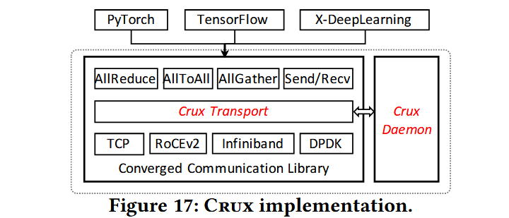
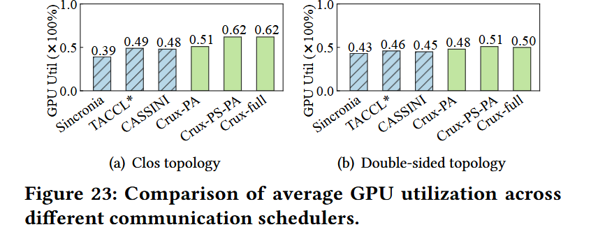
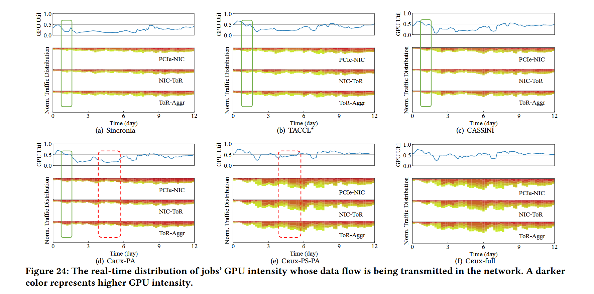

**Crux：GPU-Efficient Communication Scheduling for Deep Learning Training**
> Jiamin Cao (Alibaba Cloud), Yu Guan (Alibaba Cloud), Kun Qian (Alibaba Cloud), Jiaqi Gao (Alibaba Cloud), Wencong Xiao (Alibaba Cloud), Jianbo Dong (Alibaba Cloud), Binzhang Fu (Alibaba Cloud), Dennis Cai (Alibaba Cloud), Ennan Zhai (Alibaba Cloud)

## 背景

DLT(Deep Learning Traininng) 任务已经成为了多租户云计算服务中最重要的服务。作者团队发现，在同一集群上运行多个不同 DLT 任务时，不同 DLT 任务的通信冲突会严重影响 GPU 利用率，而之前的调度工作往往是基于任务优先级去，没有着重考虑通信冲突问题。

## 主要贡献

作者提出了 Crux ，一种基于作者定义的 "GPU 强度" 考虑的通信调度器，能够将集群的 GPU 利用率提高多达 23%。

## 设计与实现

为了调度通信，Crux 引入了 **GPU 强度**这一概念，用以衡量作业对 GPU 利用率的影响。 GPU 强度即一个任务的计算负载强度除以其在链路上传输需要的时间，即除以通信成本。

### 路径选择

Crux 的关键思想是确保 GPU 强度高的任务不被通信争用所影响，因此 Crux 以 GPU 强度为基准，优先让 GPU 强度最高的任务选路，并选择当前最不拥堵的路线。Crux 会随着任务的到达和完成动态的刷新其路径选择。

### 优先级分配和优先级压缩

Crux 为各个任务划分一个优先级以实现调度，关于如何分配优先级以及压缩优先级数量以适配硬件的物理层级涉及到具体的算法设计，这里不做赘述（其实是因为我没认真看懂）。

## 效果评估

由于问题的复杂性，Crux 很难被证明最优，因此作者团队构建了 1500 个小案例来验证。作者团队通过枚举获得了小案例中的最优路径，然后再将 Crux 的结果和最优情况进行比较。

