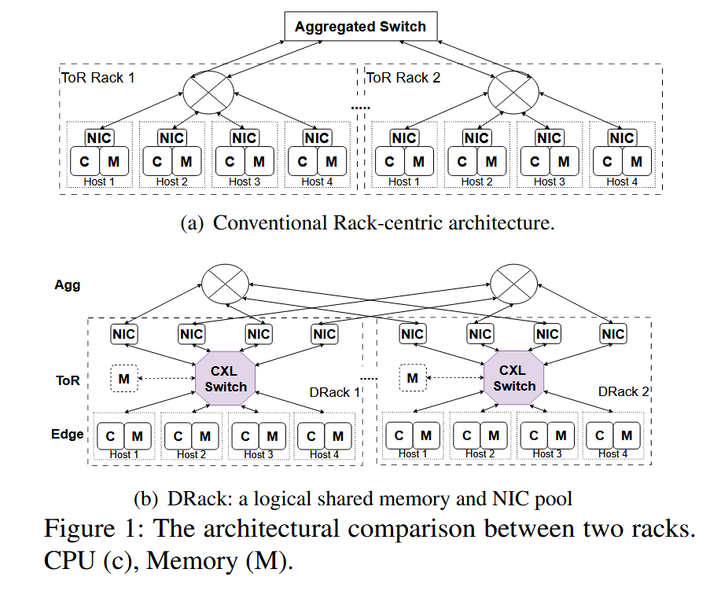
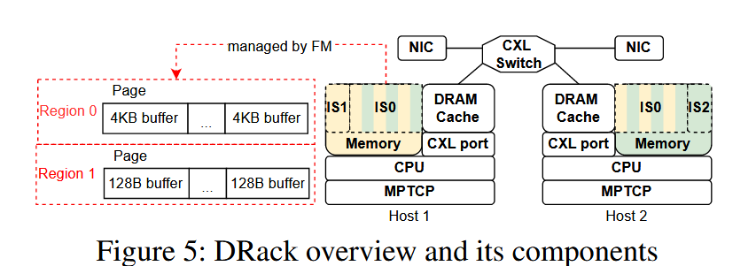
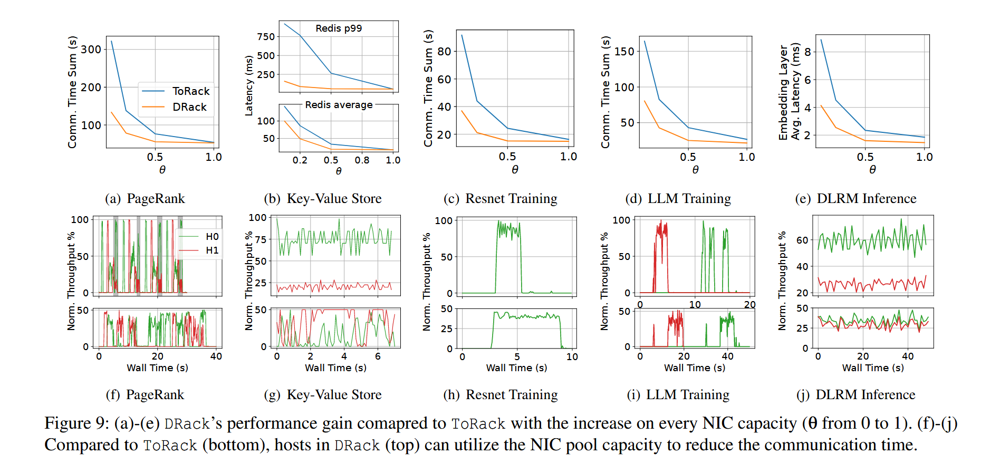
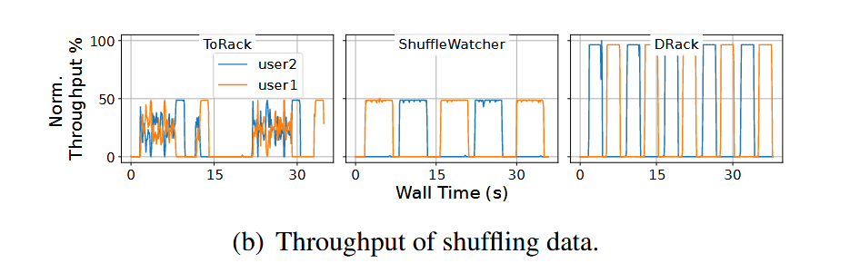

**DRack：A CXL-Disaggregated Rack Architecture to Boost Inter-Rack  Communication**
>Xu Zhang (ICT, CAS & University of Chinese Academy of Sciences), Ke Liu (ICT, CAS & University of Chinese Academy of Sciences), Yuan Hui (Huawei), Xiaolong Zheng (Huawei), Yisong Chang (ICT, CAS & University of Chinese Academy of Sciences), Yizhou Shan (Huawei Cloud), Guanghui Zhang (Shandong University), Ke Zhang (ICT, CAS & University of Chinese Academy of Sciences), Yungang Bao (ICT, CAS & University of Chinese Academy of Sciences), Mingyu Chen (ICT, CAS & University of Chinese Academy of Sciences), Chenxi Wang (ICT, CAS & University of Chinese Academy of Sciences)

## 背景

数据密集型应用在越来越多的机架（Rack）上运行，带来了越来越多的跨机架流量。然而，在 ToR（Top of Rack）架构的数据中心上运行时，机架间通信成为了瓶颈，于此同时，机架内的网卡利用率却并不高。基于这种情况，作者团队提出了一种基于 CXL 的全新机架内架构 DRack。

## 主要贡献

作者提出了 DRack，一种基于 CXL 的机架内架构，将机架内的网卡设备池化，并建立一个全局内存池，提高了网卡的利用效率以及机架通信效率，将通信阶段缩短了37.3%

## 设计与实现

DRack 将机架内的网卡池化，让每一个节点都能管理全部网卡资源，并建立一个共享的内存池以聚合内存带宽资源，防止网卡池提供的带宽超出目标主机的 pcie 带宽或者其本地内存的总带宽，网卡池通过 DMA 连接到目标机架的内存设备，通过内存交织实现内存带宽的聚合。

不过目前 DRack 仍然使用 MPTCP 将子流平均分发到各个虚拟网卡，每个子流都需要独立的中断、MMIO 操作和内核处理（子流合并），这在虚拟网卡数量增加的时候会带来额外的开销，而与此同时 CPU 核心没有被充分利用，因此还有足够的调度空间，这在文中的 discussion 中提到了。

由于目前没有 CXL 3.0 的商业化硬件，所以 DRack 采用了模拟的方式实现。DRack 使用 DoCE 模拟 CXL 硬件协议栈，将 AXI 信号转化为相关的 CXL 事务，再封装到以太网包中通过光纤口发送。当然这套逻辑也允许将封装了 CXL 事务的以太网帧解包为 AXI 信号。

网卡和内存池方面，DRack 集中了 FPAG 的 16G 内存作为共享内存池，其中 12G 进行内存交织，4G 留作本地内存以便存储 virt_queue 和 sk_buf，网卡池则是使用 DPDK 实现。

## 效果评估

这里 MapReduce 的数据中，DRack 没有特别的调度策略但还是跑出了规律的吞吐量，不太清楚为什么。