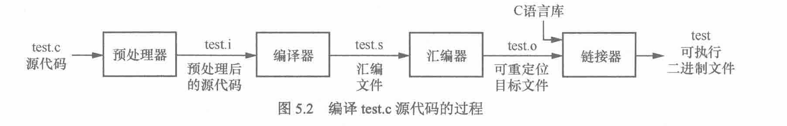
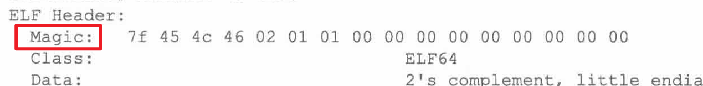

对于所有内核开发者来说，Linux Kernel 都是一座绕不过去的大山，因此我决定系统性的学习一下 RV Linux，同时为了给编译比赛打好基础，我同时也会学习 riscv 体系结构相关知识。

学习的参考资料有：
 - *Unstanding the Linux Kernel 3rd edition* / 《深入理解 Linux 内核》第三版
 - 《奔跑吧 Linux 内核》第二版 卷一/二
 - 《RISC-V 体系结构编程与实践》
 - Linux Kernel v6.12 源码

*[Unstanding the Linux Kernel](https://sazikk.top/assets/figures/pdf/UnderStanding%20The%20Linux%20Kernel%203rd%20Edition.pdf)* 深入浅出的介绍了 Linux Kernel 乃至大多数 OS 设计和运行上的主要规律以及具体架构，但是由于其仍然基于 2.x 版本的老内核，所以阅读重点会放在其中更通用化的知识上。值得一提的是这本书有中译本，叫《深入理解 Linux 内核》，推荐和英文版本对照着阅读。

在学习笔记中，我会写一些重要概念的辨析以及对应在 riscv kernel 中的拓展和应用。

## 一、中断和异常

### 异步中断和同步中断

#### 同步和异步的区别

同步和异步的区别在于其是否符合时钟周期，同步中断只有在 CPU 完成一条指令后才会抛出，也一般由 CPU 主动抛出，如系统调用、page fault 等；而异步中断则随时可能出现，一般由外部设备触发，如时钟中断，键盘输入、网络数据报到达等。

在 RISC-V 中，所有例外被明确划分为了中断（interrupt）和异常 （exception）。

**中断**是外部异步事件引起的处理器控制流改变：
1. 与当前执行的指令无关
2. 来自处理器外部或内部定时器
3. 可以被屏蔽或延迟处理
4. 由 interrupt code 标识（`mcause` `scause` 的最高位为 1 即为 interrupt）

**异常**是指令执行过程中产生的同步事件：
1. 直接由特定指令的执行引起
2. 必须立即处理
3. 不可被屏蔽
4. 仅由 exception code 标识 （`mcause` `scause` 的剩余位）

这里比较有意思的一点是时钟中断属于异步中断，因为尽管很多时候时钟中断依赖于 CPU 内部的计时器（有时候也会独立在板子上），但是计时器是独立于 CPU 的主要部分而独立运行的， CPU 所依赖的时钟信号往往也远高于计时器频率（他们都来源于主晶振），所以时钟中断事实上是异步中断，他也可以被屏蔽，通过设置中断标志位的方式。

在 riscv 中，无论是 S 态的还是 M 态的时钟中断都由 M 态寄存器 `mtime` 和 `mtimecmp` 控制，`mtimecmp` 是下一个期望的时钟中断点，当 `mtime` > `mtimecmp` 时，中断被抛出。

以上部分内容主要需要在 Soc 设计中注意，对于内核开发者了解一下就够了（

#### RISC-V 中断委托机制

为什么 S 态的时钟中断和 M 态寄存器有关？这就涉及到了一个很有意思的概念：**中断委托**。

默认情况下，发生**所有异常**（不论在什么权限模式下）的时候，控制权都会被移交到 M 模式的异常处理程序。但是 Unix 系统中的大多数例外都应该进行 S 模式下的系统调用。M 模式的异常处理程序可以将异常重新导向 S 模式，但这些额外的操作会减慢大多数异常的处理速度。因此， RISC-V 提供了一种异常委托机制。通过该机制可以选择性地将中断和同步异常交给 S 模式处理，而完全绕过 M 模式。

中断委托机制的实现依托于 M 态 CSR 寄存器 `mideleg` （Machine Interrupt Delegation，机器中断委托）。在 `mideleg` 中置位，就可以把对应位数的 Exception Code 的异常委托给 S 态处理，触发时直接跳转到 S 态的异常处理代码，并且受 `sstatus` 的 `SIE` 位以及 `sie` 寄存器控制。比如 S 态时钟中断的 Exception Code 是 5 ，那么要委托它就需要把 `mideleg` 的第五位置位，即 `mideleg[5] = 1`。

## GNU 汇编器

### 编译流程

#### 两次重定位

GCC 的编译流程主要分为四个阶段：预处理、编译、汇编和链接。他们的流程如下：



这个过程老生常谈，不过其中代码发生的两次重定位比较有意思。第一次重定位发生在汇编时，主要是处理汇编中的局部符号引用，计算一个临时的相对地址，对齐各个段并记录重定位信息；第二次重定位发生在链接时，会分配最终的地址，处理重定位信息，并解析所有符号引用生成最后的可执行文件。

有两次重定位的原因，是因为编译器在编译成可重定位目标文件的时候仅仅局限于单个文件，并不知道符号的最终地址，只能临时进行局部的重定位，而链接时需要包括多个文件与外部库，因此可以将符号重定位到最终位置。

### ELF 文件

#### ELF 可执行文件

Linux 中应用程序常用的可执行文件格式是 ELF 文件，其中常见的段包括：


可以通过 `readelf` 命令了解一个 ELF 文件的组成，获取段数量、各个段入口地址等等。使用这个命令还可以看到魔法：



好吧其实叫魔数，魔数存放在 ELF header 的一个固定位置，往往被用来校验 ELF 文件的合法性，如加载器将 ELF 文件加载到内存之前，通常会查看该位置的值是否正确，来快速确认被加载的文件是不是一个 ELF 。

ELF 文件中并不是所有内容都是执行必须的，有许多与执行无直接关系的信息（如调试信息等），可以通过 `objcopy` 工具来清除，这样往往能大幅减小 ELF 文件的体积，只留下必要的执行代码和数据。如 `objcopy --strip-all` 会去除所有符号表、调试段等信息。

#### 其他 ELF 文件

实际上除了可执行文件之外，ELF 文件还有许多常见的种类，比如可重定位文件 (.o)，共享目标文件 (.so)，核心转储文件 (Core Dump) 等。他们的主要区别在于包含各个段的类型以及权限。

说到权限，有一个膜法操作可以执行没有执行权限的二进制可执行文件，就是使用 loader 直接加载：

```bash
/lib64/ld-linux-x86-64.so.2 ./binary
```

不过这种方法只能用于动态链接的文件，毕竟 `/lib64/ld-linux-x86-64.so.2` 就是动态链接器。对于脚本语言也可以用对应的解释器这么做，比如 py 和 shell，不过原理上存在区别，脚本语言应该是解释器先读取脚本内容再执行，因此只需要读权限就行。