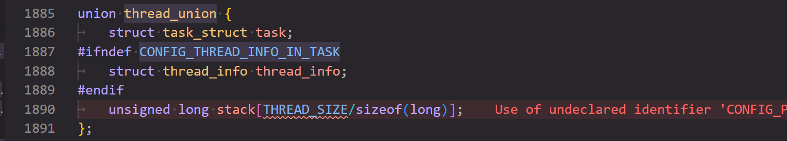

对于所有内核开发者来说，Linux Kernel 都是一座绕不过去的大山，因此我决定系统性的学习一下 RV Linux，同时为了给编译比赛打好基础，我同时也会学习 riscv 体系结构相关知识。

学习的参考资料：
 - Linux Kernel v6.12 源码

- *[Unstanding the Linux Kernel](https://sazikk.top/assets/figures/pdf/UnderStanding%20The%20Linux%20Kernel%203rd%20Edition.pdf)* 深入浅出的介绍了 Linux Kernel 乃至大多数 OS 设计和运行上的主要规律以及具体架构，但是由于其仍然基于 2.x 版本的老内核，所以阅读重点会放在其中更通用化的知识上。值得一提的是这本书有中译本，叫《深入理解 Linux 内核》，推荐和英文版本对照着阅读。

- **《奔跑吧 Linux 内核》** 第二版 卷一/二 基于 5.x 版本的内核，内容更加新，为系统性的阅读源码提供了很好的切入点以及补充。

- **《RISC-V 体系结构编程与实践》** 详细描述了 RISC-V 体系结构设计，对于理解学习 RV 内核以及编写 RV 平台编译器等都很有帮助。

在学习笔记中，我会以源码分析为基础，结合参考书和自己的理解，记录一些重要的概念和知识点，并给出一些自己的思考。

## 一、中断和异常

### 异步中断和同步中断

#### 同步和异步的区别

同步和异步的区别在于其是否符合时钟周期，同步中断只有在 CPU 完成一条指令后才会抛出，也一般由 CPU 主动抛出，如系统调用、page fault 等；而异步中断则随时可能出现，一般由外部设备触发，如时钟中断，键盘输入、网络数据报到达等。

在 RISC-V 中，所有例外被明确划分为了中断（interrupt）和异常 （exception）。

**中断**是外部异步事件引起的处理器控制流改变：
1. 与当前执行的指令无关
2. 来自处理器外部或内部定时器
3. 可以被屏蔽或延迟处理
4. 由 interrupt code 标识（`mcause` `scause` 的最高位为 1 即为 interrupt）

**异常**是指令执行过程中产生的同步事件：
1. 直接由特定指令的执行引起
2. 必须立即处理
3. 不可被屏蔽
4. 仅由 exception code 标识 （`mcause` `scause` 的剩余位）

这里比较有意思的一点是时钟中断属于异步中断，因为尽管很多时候时钟中断依赖于 CPU 内部的计时器（有时候也会独立在板子上），但是计时器是独立于 CPU 的主要部分而独立运行的， CPU 所依赖的时钟信号往往也远高于计时器频率（他们都来源于主晶振），所以时钟中断事实上是异步中断，他也可以被屏蔽，通过设置中断标志位的方式。

在 riscv 中，无论是 S 态的还是 M 态的时钟中断都由 M 态寄存器 `mtime` 和 `mtimecmp` 控制，`mtimecmp` 是下一个期望的时钟中断点，当 `mtime` > `mtimecmp` 时，中断被抛出。

以上部分内容主要需要在 Soc 设计中注意，对于内核开发者了解一下就够了（

#### RISC-V 中断委托机制

为什么 S 态的时钟中断和 M 态寄存器有关？这就涉及到了一个很有意思的概念：**中断委托**。

默认情况下，发生**所有异常**（不论在什么权限模式下）的时候，控制权都会被移交到 M 模式的异常处理程序。但是 Unix 系统中的大多数例外都应该进行 S 模式下的系统调用。M 模式的异常处理程序可以将异常重新导向 S 模式，但这些额外的操作会减慢大多数异常的处理速度。因此， RISC-V 提供了一种异常委托机制。通过该机制可以选择性地将中断和同步异常交给 S 模式处理，而完全绕过 M 模式。

中断委托机制的实现依托于 M 态 CSR 寄存器 `mideleg` （Machine Interrupt Delegation，机器中断委托）。在 `mideleg` 中置位，就可以把对应位数的 Exception Code 的异常委托给 S 态处理，触发时直接跳转到 S 态的异常处理代码，并且受 `sstatus` 的 `SIE` 位以及 `sie` 寄存器控制。比如 S 态时钟中断的 Exception Code 是 5 ，那么要委托它就需要把 `mideleg` 的第五位置位，即 `mideleg[5] = 1`。

## 二、进程

### 进程描述符

进程描述符即 PCB ，是 Linux 内核里进程的一个抽象实体，拥有进程的全部资源，PCB 以及对 PCB 的管理和操作几乎占了内核最基本功能的半壁江山，非常的重要。

在 v6.12 kernel 中，PCB 的具象形式是结构体 `task_struct`，位于 `include/linux/sched.h` 的 line 778：


下面把直接这个结构体称为 PCB。

#### 关于 `thread_info`

这是 PCB 里的第一个结构体（算上条件编译）， `thread_info` 结构体储存了线程相关的主要核心信息，有两种储存方式，与编译选项 `CONFIG_THREAD_INFO_IN_TASK` 有关：

1. **`CONFIG_THREAD_INFO_IN_TASK = false`** 。第一种方式是经典做法，将 `thread_info` 储存在进程对应的内核栈中，PCB 中的 void 指针 `*stack` 就指向进程的内核栈。内核定义了一个 `thread_union` 的联合体，联合体的作用就是 `thread_info` 和 `stack` 共用一块内存区域，而这里的 `THREAD_SIZE/sizeof(long)` 就是内核栈的大小，与架构相关，ARM64 定义 `THREAD_SIZE` 的大小为 16K。



这里的 `void*` 很有意思值得一提，这是一个通用指针类型，可以指向任何数据类型，在 kernel 中非常常用，但是使用 void 指针需要解析指针一方对于指针的解析绝对正确，否则会引发完全不可控的内存问题，需要非常谨慎。

2. **`CONFIG_THREAD_INFO_IN_TASK = true`** 。第二种做法是把 `thread_info` 保存在 PCB 的第一位，就像上图所展示的那样，必须保存在第一位是为了可以通过 PCB 的基地址直接访问， `current_thread_info()` 函数被用来获取 `thread_info` 的位置，而他的实现是基于 PCB 指针的转换，这是一个历史问题。ARM64 便使用这种方法。

从上图中可以看出，内核有一个新的大幅改动，即把 `task_struct` 也储存在了 `thread_union` 中，这样内核栈和 PCB 就共用一块内存区域了。在过去，当启用编译选项 `CONFIG_ARCH_TASK_STRUCT_ON_STACK` 时， `task_struct` 才会和内核栈处于 `thread_union` 中，现在它变成了一个 default 的 feature。

关于为什么做出这个改动还有待我进一步挖掘，具体可以参考这个[commit](https://git.kernel.org/pub/scm/linux/kernel/git/torvalds/linux.git/commit/?id=0500871f21b237b2bea2d9db405eadf78e5aab05)，这个 commit 将 `task_struct` 以编译选项 `CONFIG_ARCH_TASK_STRUCT_ON_STACK` 的形式引入了内核栈的 union 中。


#### 重要的核心或通用成员

PCB 包含了进程的核心要素，所以包含了很多简单而关键的成员:

```c
unsigned int      __state;         // 进程状态，如 TASK_RUNNING 表示正在运行
unsigned int      saved_state;     // 保存自旋锁等待者的状态，当进程因为等待自旋锁而睡眠时，用于保存其原始状态

randomized_struct_fields_start    // 一个标记，从这里开始的字段将被随机化，只有调度关键项才应该在这个标记上方

void              *stack;          // 内核栈指针
refcount_t        usage;           // 引用计数
unsigned int      flags;           // 进程的一些标志，如 PF_KTHREAD 表示进程是内核线程
unsigned int      ptrace;          // 调试标志
```

#### 进程状态

基于源码总结归纳了进程所有可能的状态，并给出了对应的宏定义：

```c
/* Used in tsk->__state: */   基本运行状态
#define TASK_RUNNING			0x00000000  // 正在运行或准备运行
#define TASK_INTERRUPTIBLE		0x00000001  // 可中断的睡眠状态，可以被信号唤醒
#define TASK_UNINTERRUPTIBLE		0x00000002  // 不可中断的睡眠状态，不响应信号
#define __TASK_STOPPED			0x00000004  // 进程被停止执行，如收到 SIGSTOP 信号
#define __TASK_TRACED			0x00000008  // 进程被调试器跟踪
/* Used in tsk->exit_state: */   退出状态
#define EXIT_DEAD			0x00000010  // 进程已经完全死亡
#define EXIT_ZOMBIE			0x00000020  // 僵尸进程，等待父进程回收
#define EXIT_TRACE			(EXIT_ZOMBIE | EXIT_DEAD) // 结合了 ZOMBIE 和 DEAD 状态，用于跟踪
/* Used in tsk->__state again: */   其他状态标志
#define TASK_PARKED			0x00000040  // 进程被暂停
#define TASK_DEAD			0x00000080  // 进程正在死亡
#define TASK_WAKEKILL			0x00000100  // 唤醒以响应致命信号
#define TASK_WAKING			0x00000200  // 进程正在被唤醒
#define TASK_NOLOAD			0x00000400  // 不计入系统负载
#define TASK_NEW			0x00000800  // 新创建的进程
#define TASK_RTLOCK_WAIT		0x00001000  // 等待实时互斥锁
#define TASK_FREEZABLE			0x00002000  // 可以被冻结（用于休眠）
#define __TASK_FREEZABLE_UNSAFE	       (0x00004000 * IS_ENABLED(CONFIG_LOCKDEP))  // 不安全的可冻结状态
#define TASK_FROZEN			0x00008000  // 已被冻结
#define TASK_STATE_MAX			0x00010000  // 状态最大值

#define TASK_ANY			(TASK_STATE_MAX-1)  // 任意状态

#define TASK_FREEZABLE_UNSAFE		(TASK_FREEZABLE | __TASK_FREEZABLE_UNSAFE)  // 可冻结且不安全的状态

/* 方便 set_current_state 使用： */
#define TASK_KILLABLE			(TASK_WAKEKILL | TASK_UNINTERRUPTIBLE)  // 可被致命信号唤醒的不可中断睡眠
#define TASK_STOPPED			(TASK_WAKEKILL | __TASK_STOPPED)  // 可被唤醒的停止状态
#define TASK_TRACED			__TASK_TRACED  // 进程被调试器跟踪

#define TASK_IDLE			(TASK_UNINTERRUPTIBLE | TASK_NOLOAD)  // 空闲任务（不可中断且不计入负载）

/* 方便 wake_up() 使用： */
#define TASK_NORMAL			(TASK_INTERRUPTIBLE | TASK_UNINTERRUPTIBLE)  // 普通任务状态（可中断或不可中断）

/* 方便 get_task_state() 使用： */
#define TASK_REPORT			(TASK_RUNNING | TASK_INTERRUPTIBLE | \
					 TASK_UNINTERRUPTIBLE | __TASK_STOPPED | \
					 __TASK_TRACED | EXIT_DEAD | EXIT_ZOMBIE | \
					 TASK_PARKED)  // 用于进程状态报告的组合掩码
```


### 进程调度

#### 进程调度函数 `switch_to()`

kernel 中进程调度的核心函数是 `switch_to()`，这个函数直接进行了进程切换的操作：

```c
// include/asm-generic/switch_to.h

extern struct task_struct *__switch_to(struct task_struct *,
				       struct task_struct *);

#define switch_to(prev, next, last)					\
	do {								\
		((last) = __switch_to((prev), (next)));			\
	} while (0)

```

这里有一个很有意思的点，就是为什么 `switch_to()` 需要三个参数？原因参见《chaos 开发日志》，当时我调进程切换调崩溃了（

需要三个参数的关键点在于：**当一个进程恢复执行时，它会从它之前调用 `switch_to()` 的下一条指令继续执行。** 切换到一个进程之后，他需要确切的知道上一个正在运行的进程是什么，从而进行一些可能的资源清理，同时这也有助于调试和追踪进程切换。

对于 kernel 来说，比较典型的情况是从内核线程（kernel thread）切换到用户进程时，因为内核线程没有用户态地址空间，所以他会借用上一个进程的地址空间，因此从内核线程切换到用户进程时需要对内核线程所占用的上一个进程的地址空间进行必要的清理。对于 x86 架构，使用浮点寄存器后也会需要类似的清理。


## GNU 汇编器

### 编译流程

#### 两次重定位

GCC 的编译流程主要分为四个阶段：预处理、编译、汇编和链接。他们的流程如下：


这个过程老生常谈，不过其中代码发生的两次重定位比较有意思。第一次重定位发生在汇编时，主要是处理汇编中的局部符号引用，计算一个临时的相对地址，对齐各个段并记录重定位信息；第二次重定位发生在链接时，会分配最终的地址，处理重定位信息，并解析所有符号引用生成最后的可执行文件。

有两次重定位的原因，是因为编译器在编译成可重定位目标文件的时候仅仅局限于单个文件，并不知道符号的最终地址，只能临时进行局部的重定位，而链接时需要包括多个文件与外部库，因此可以将符号重定位到最终位置。

### ELF 文件

#### ELF 可执行文件

Linux 中应用程序常用的可执行文件格式是 ELF 文件，其中常见的段包括：


可以通过 `readelf` 命令了解一个 ELF 文件的组成，获取段数量、各个段入口地址等等。使用这个命令还可以看到魔法：


好吧其实叫魔数，魔数存放在 ELF header 的一个固定位置，往往被用来校验 ELF 文件的合法性，如加载器将 ELF 文件加载到内存之前，通常会查看该位置的值是否正确，来快速确认被加载的文件是不是一个 ELF 。

ELF 文件中并不是所有内容都是执行必须的，有许多与执行无直接关系的信息（如调试信息等），可以通过 `objcopy` 工具来清除，这样往往能大幅减小 ELF 文件的体积，只留下必要的执行代码和数据。如 `objcopy --strip-all` 会去除所有符号表、调试段等信息。

#### 其他 ELF 文件

实际上除了可执行文件之外，ELF 文件还有许多常见的种类，比如可重定位文件 (.o)，共享目标文件 (.so)，核心转储文件 (Core Dump) 等。他们的主要区别在于包含各个段的类型以及权限。

说到权限，有一个膜法操作可以执行没有执行权限的二进制可执行文件，就是使用 loader 直接加载：

```bash
/lib64/ld-linux-x86-64.so.2 ./binary
```

不过这种方法只能用于动态链接的文件，毕竟 `/lib64/ld-linux-x86-64.so.2` 就是动态链接器。对于脚本语言也可以用对应的解释器这么做，比如 py 和 shell，不过原理上存在区别，脚本语言应该是解释器先读取脚本内容再执行，因此只需要读权限就行。