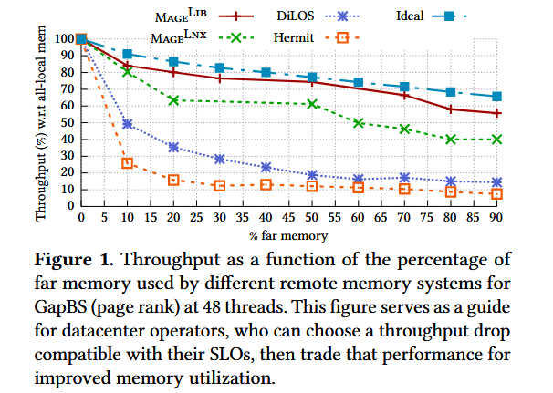
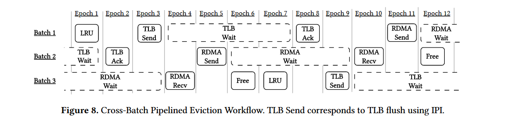
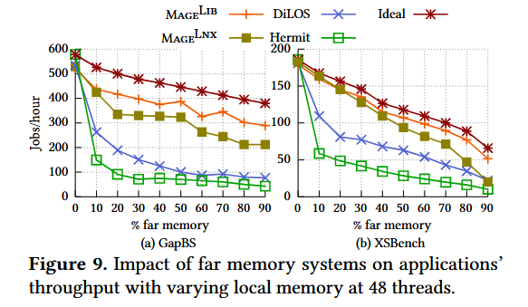
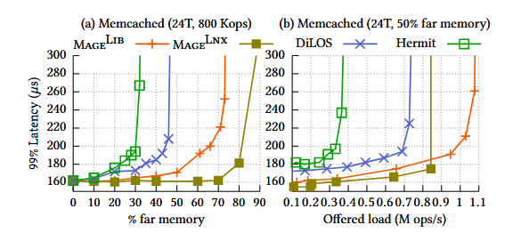

**Scalable Far Memory: Balancing Faults and Evictions**
>Yueyang Pan (EPFL), Yash Lala (Yale University), Musa Unal (EPFL), Yujie Ren (EPFL), Seung-seob Lee (Yale University), Abhishek Bhattacharjee (Yale University), Anurag Khandelwal (Yale University), Sanidhya Kashyap (EPFL)

## 背景

基于分页的 far memory 系统可以让应用程序透明的访存，但是目前的 SOTA far memory 系统（Hermit、DiLOS）无法应对较大规模的情况，这会使他们不适用于一些既需要远程内存支持规模又随线程数量增长的计算密集应用，比如 GapBS。

## 挑战和问题

在目前的系统中，主要的性能瓶颈在于 Fault-in Path（page-fault 换入远程页面）和 Eviction Path（本地内存不足换出页面到远端），以下称为 FP 和 EP：

1. 随着线程的增加，为了维护多个核的 TLB 一致性带来的大量 IPI 造成了严重的性能问题，需要想办法避免或者摊薄开销。
2. Hermit 和 DiLOS 都采用了了统一的 LRU 数据结构，在线程规模扩大的时候带来了严重的争用问题。
3. 随着线程数的增加，现在的内存分配器会带来严重的尾延迟问题。
> Hermit 会受到 Linux 原有的 vma 锁的影响，DiLOS 则是因为其物理内存分配器由一个睡眠锁控制。
4. 由于线程数量增加，原本的异步 EP 会退化成同步 EP（换出速度跟不上），造成灾难性的性能下降。

## 主要贡献

作者提出了 far memory 系统设计的三条准则，并且在 Linux kernel 和一个 lib OS 中实现了这三条准则，使批处理应用程序的吞吐量提高了最多 4.2 倍，延迟敏感应用 memcached 的尾延迟降低了 94.5%。

## 设计与实现

作者团队针对问题提出了三条设计准则：

### 一、总是使用异步解耦的方式进行 EP

这条准则要求总是执行异步的的 EP 操作，这也就相应的对系统支持的 EP 吞吐量提出了要求。作者团队提出了 EP 操作的解耦，也就是分配固定核心进行 EP，相较于 Hermit 的 32 个动态 eviction 线程，Mage 通过计算证明 4 个固定的 eviction 线程就足够了（足以跑满 200G 网卡）。

### 二、跨批次的流水执行

Mage 的 eviction 线程将多个页面失效请求打包到一次 tlb shootdown 处理，也就是整合到一次 IPI，同时，各个 eviction 线程也会以 batch 为单位处理 IPI，并引入了流水线操作以摊薄等待成本，尽可能的减少通信次数和总等待时间。

### 三、扩展性优先

Mage 为了保证应用规模的可扩展性牺牲了一定的准确性。Mage 为 4 个 eviction 线程各自设置了单独的 LRU 队列，以避免全局 LRU 的争用问题，但这势必损失一定的准确性。每个 LRU 队列均匀的管理一部分 cpu 核，当应用访问一个被驱逐的内存页时，会根据当前运行 CPU ID 的哈希值来决定插入到哪个 eviction 线程的 LRU list

这里存在一个问题，原文提到 4 个 eviction 线程之间存在负载均衡，但是 LRU 这种工作似乎不太能转移或者窃取，文中的机制我也不太理解，存在疑问。
> To balance  the load, each thread begins scanning at a different list index  and proceeds through the lists in a round-robin fashion for  subsequent eviction cycles. If a thread finds its current list  empty, it moves to the next list in its round-robin sequence.

除了三条准则之外，Mage还进行了一些优化：

1. 引入一个 per-CPU 的空闲页缓存，FP 上需要分配内存时会优先从 CPU 本地的空闲页缓存中进行分配来加速内存分配操作。当一个 CPU 的本地空闲页缓存不足时，Mage 会异步的把全局空闲页链表中的页补充进去
2. 把 far memory 到本地做了一个直接映射，省掉了 swap entry 的开销。

## 效果评估

### 硬件环境：

2台服务器，Intel Xeon Gold 6348（56核/512GB内存）
200 Gbps RDMA连接（Mellanox BlueField-2 DPU）
Ubuntu 22.04 + Linux 5.14
### 系统配置：

VM1：运行应用程序，可配置本地内存配额
VM2：远程内存池
使用QEMU/KVM虚拟化
关闭频率缩放、AutoNUMA、超线程、透明大页
### 对比系统：

$Mage^{Lib}$、$Mage^{Lnx}$、Hermit、DiLOS
各分配 4 个专用驱逐线程（最优配置）

**特殊说明：**

Hermit 在裸机运行（虚拟化兼容性问题）
DPU 配置为 NIC 模式

### Throughput-bound Applications

对于吞吐量导向的应用程序（GapBs、 XSBench），Mage 表现显著优于当前 SOTA：

这里的 Ideal 的计算方式是看每个应用有多少 page fault，然后测试硬件每次访问远端内存的时延，所以 ideal case 的性能就是加上 page fault 数目乘访问远端内存的时延除以线程数。

### Latency-sensitive Applications

